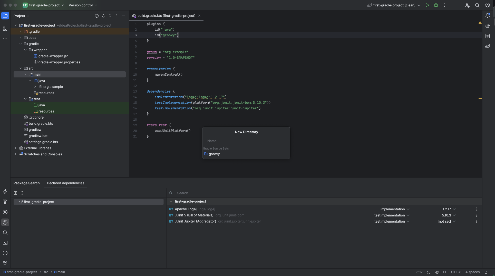

Gradle has the concept of [source sets](https://docs.gradle.org/current/dsl/org.gradle.api.tasks.SourceSet.html) for where your code and test sources live.

Some Gradle plugins come with default source sets, for example the Java plugin has a "main" source set where the default location is `src/main/java`. IntelliJ IDEA has automatically created the source set directories for the `java` plugin for this project, we can see:

- `src/main/java`
- `src/main/resources`
- `src/test/java`
- `src/test/resources`

Try adding a new plugin which has its own source sets, e.g. `groovy`.

```groovy
plugins {
    id 'java'
    id 'groovy'
}
```

Remember to reload the build file's changes with <kbd>⌘⇧I</kbd> (macOS) / <kbd>Ctrl+Shift+O</kbd> (Windows/Linux).

IntelliJ IDEA is aware of the plugin's source sets and their directories. Go to the [project window](https://www.jetbrains.com/help/idea/project-tool-window.html) and create a new directory in the "main" folder, using <kbd>⌘N</kbd> (macOS) / <kbd>Alt+Insert</kbd> (Windows/Linux) and selecting "Directory".



IntelliJ IDEA suggests a folder called "groovy" from the list of Gradle source sets. This is coloured blue as it's known to be a source set for production code.

Now we're more familiar with how our Gradle project is structured and how the build.gradle file works, let's look at how to set or change the project's [groupID and version](https://maven.apache.org/guides/mini/guide-naming-conventions.html).
