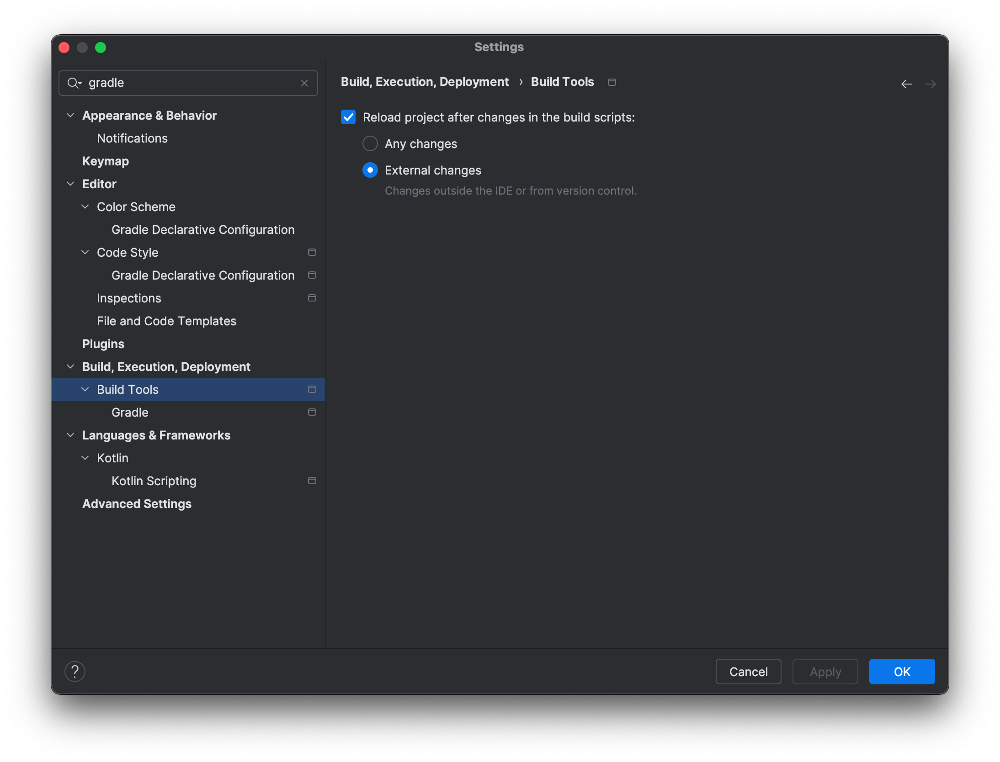
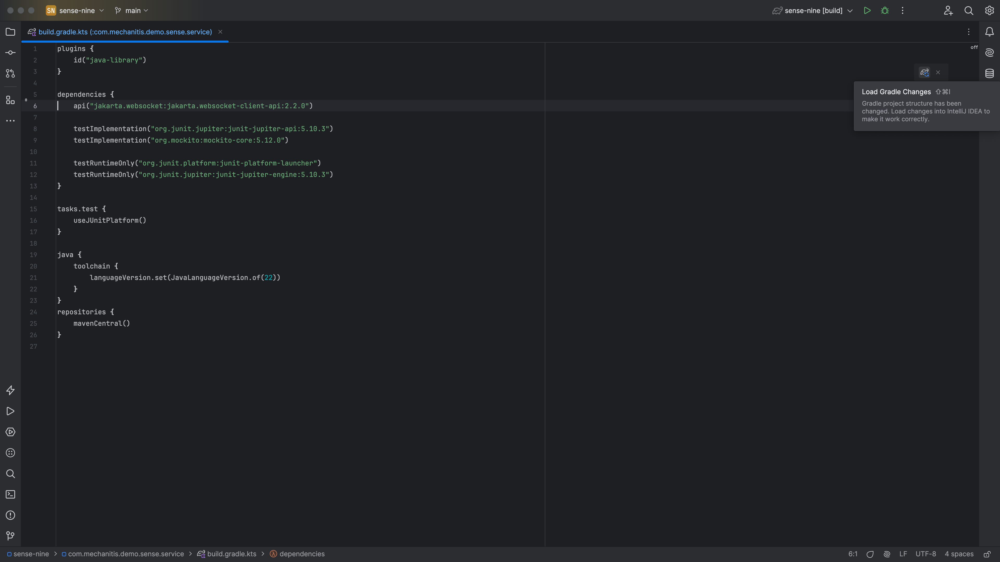
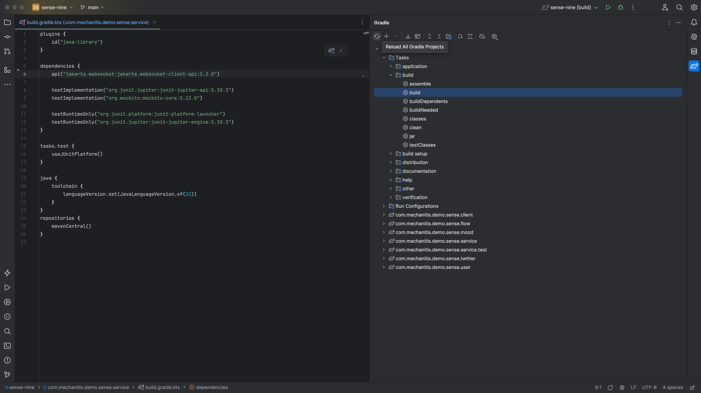

We saw that IntelliJ IDEA usually shows us when the Gradle build file or settings have changed, and that we need to trigger a reload of the Gradle settings so IntelliJ IDEA can use them. We can [configure the settings](https://www.jetbrains.com/help/idea/jetgradle-tool-window.html) for how IntelliJ IDEA syncs with Gradle by pressing the settings icon in the [Gradle tool window](https://www.jetbrains.com/help/idea/jetgradle-tool-window.html), and selecting **Auto-Reload Settings**.

We can set IntelliJ IDEA to automatically reload the project after "Any changes" in the build script files, so changes are automatically reloaded. Alternatively, we can have the project automatically reload only after those changes are made by an external system, for example getting updated files from version control. By default, the "External Changes" setting is selected. This prevents the project being reloaded after every small change, and puts us, the developer, in charge of when we want to reload our changes.

We could choose not to reload after any changes, to give us total control, but since we may not always know if a reload is required, selecting External Changes makes sure that at least those changes are automatically applied by IntelliJ IDEA.

As we saw earlier, when we do make changes to a build file, we can reload those changes by using <kbd>⌘⇧I</kbd> (macOS) / <kbd>Ctrl+Shift+O</kbd> (Windows/Linux).

Sometimes we want to force a reload of the whole project, so that IntelliJ IDEA uses the Gradle settings to set up and build the project. This can be particularly useful after a large batch of external changes, or if the project is not behaving the way we expect.

Sometimes it's useful to do a reload followed by a [full rebuild](https://www.jetbrains.com/help/idea/compiling-applications.html?keymap=primary_windows#rebuild_project), by going to **Build | Rebuild Project**. This is a good way to make sure the whole project is fully synced and building correctly.

Next, let's look at some more useful Gradle settings in IntelliJ IDEA.
