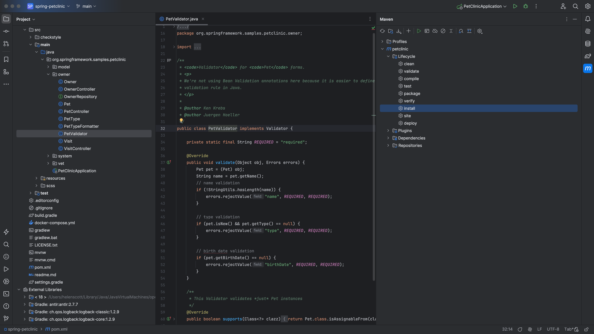
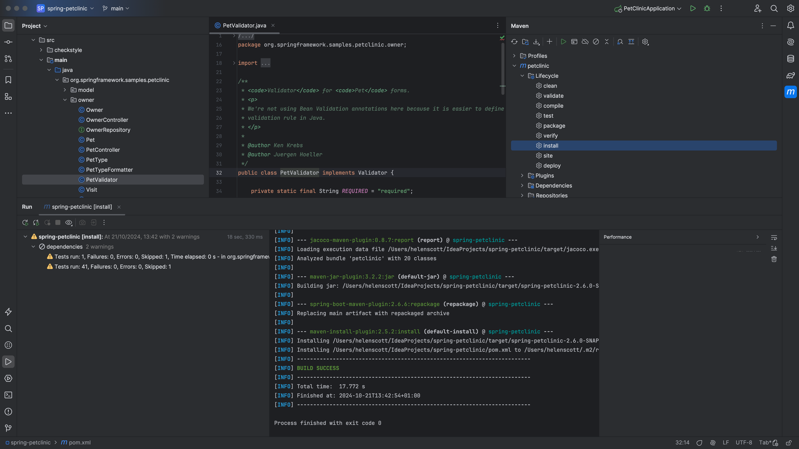
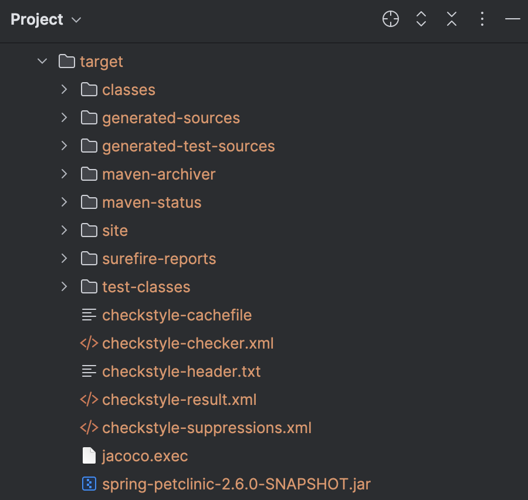
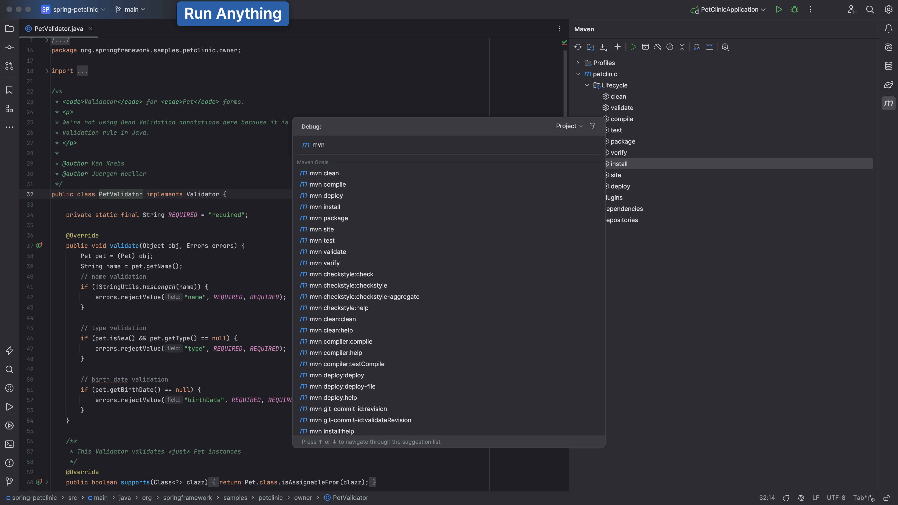
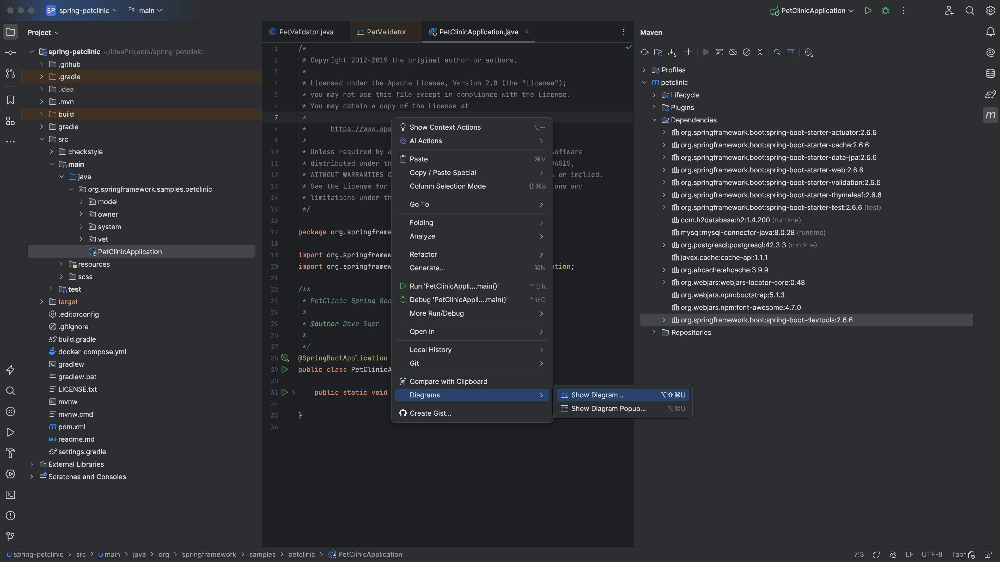

You can use <kbd>⌘E</kbd> (macOS) / <kbd>Ctrl+E</kbd> (Windows/Linux) again to navigate to the Maven window, and here we can see the dependencies of this project.

This window lists the goals and lifecycle phases. We can run any of these by double-clicking on them, and we can see the familiar results of running a Maven phase in the run window, including dependencies being downloaded and tests being run.

If the build was successful like the one in the screenshot above, you'll see Maven creates a target directory with all the generated code and other output.

You can also run Maven goals via **Run Anything** <kbd>⌃⌃</kbd> (macOS) / <kbd>Ctrl+Ctrl<kbd/> (Windows/Linux)).

You can choose to enable or disable one or more [profiles from the Maven Window](https://www.jetbrains.com/help/idea/work-with-maven-profiles.html) when you're running any of the Maven goals or phases.

There are a number of things you can do with your project from the Maven window, be sure to take a look at all the icons to see what they can do.

Everything we've looked at so far has been in the free Community Edition of IntelliJ IDEA. IntelliJ Ultimate has some extra features. One which may be particularly useful in understanding your Maven project is seeing the Dependencies as a diagram.

This can give you an idea of which dependencies are directly imported by your application, and which are transitive. You can change the visibility of a dependency or exclude it, via the diagram.

You can also filter which ones to show, if the diagram is too big to see easily.
