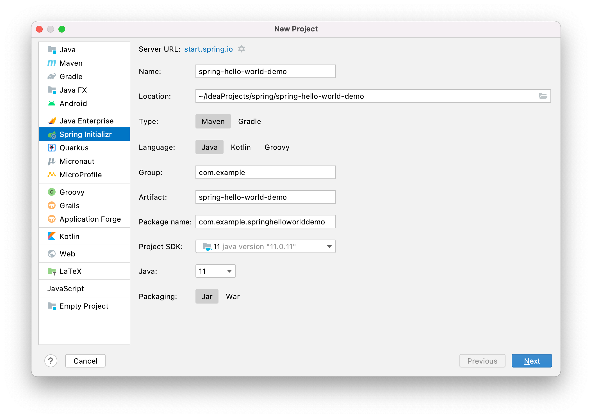
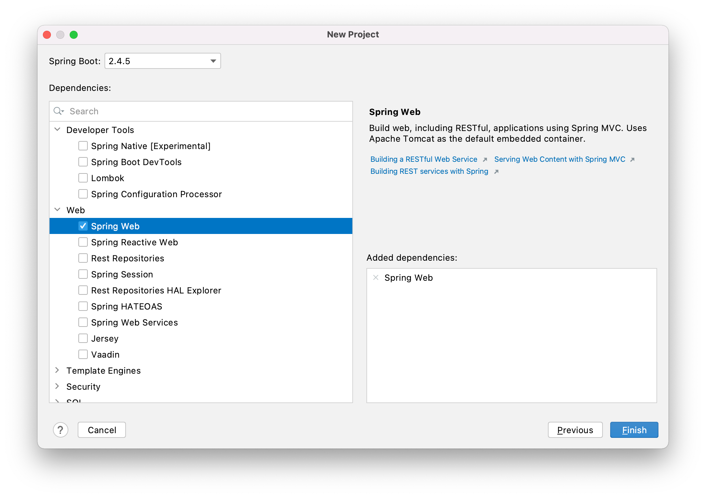

## Create your Spring Project

We'll use IntelliJ IDEA Ultimate for this tutorial because we want to create a new project using Spring Initializr. This functionality is only available with IntelliJ IDEA Ultimate. This tutorial is based off [Building an Application with Spring Boot](https://spring.io/guides/gs/spring-boot/).

1. If you're in an IntelliJ IDEA project already, select **File** > **Project**. Alternatively click the **New Project** button on the Welcome screen.

2. Select **Spring Initializr** on the left-hand side and then enter the following options:

| Field Name   | What you should enter                                                                                                                                                                                                                       |
| ------------ | ------------------------------------------------------------------------------------------------------------------------------------------------------------------------------------------------------------------------------------------- |
| Name         | Give your project a helpful name such as `HelloWorld`.                                                                                                                                                                                      |
| Location     | This will be the default IntelliJ IDEA location, you can change it if you want to.                                                                                                                                                          |
| Type         | This demo uses the [Maven build system](https://maven.apache.org/what-is-maven.html) so please select that option. If you want to use the [Gradle build system](https://gradle.org/), then please let us know and we'll add it to our list. |
| Language     | This demo uses Java.                                                                                                                                                                                                                        |
| Group        | This forms part of your package name, you can change it if you want to.                                                                                                                                                                     |
| Artifact     | This is the name given to any artifacts produced, it will be derived from the Name you used so you don't need to change it.                                                                                                                 |
| Package Name | This is a concatenation of your Group and Name so you don't need to change it.                                                                                                                                                              |
| Project SDK  | This is the version of Java SDK that your project will be compiled against. This demo uses Java 11.                                                                                                                                         |
| Java         | This is the Language Level for your project which determines coding assistance provided in the editor. Again this demo using Java 11.                                                                                                       |
| Packaging    | We will use JAR for this demo because we're not going to run it on an application server. To do the latter you would need to select WAR                                                                                                     |

Your page should look similar to this:

Click **Next**.

3. The next page is where you can configure your Spring Initializr project and add the required dependencies. We're going to keep it really simple for this project as we just want to serve the string "Hello World" locally in our browser. Let's start typing in _Web_ and see what options we get. This will show you all dependencies that relate to _Web_ development, we want the first one, **Spring Web**. Alternatively, you can expand the Web node (second from the top) and select **Spring Web**. That's all you need to do here.

One thing to note here is that it's really easy to add dependencies to your Spring project once you have created it. You should only ever add what you know you'll need at this step. It's easier to add dependencies at a later date than it is to remove dependencies that you may, or may not, be relying on at a future date!

Your page should look like this, depending on how you searched for **Spring Web**:

Click **Finish**.

That's all we have to do to get our basic Spring project set up in IntelliJ IDEA. In the next step we'll take a look at what has been automatically created for you, and most importantly, why.
