Oh, we all love to code. Get started, jump right in, make a web app -- pixels on the screen! So much winning!

Hmm, crap, something went wrong. Let me do a `console.log`. Or another, then restart. Or 20 more. Oops, I checked it in.
HELP!

There is a better way to develop: the debugger. Instead of "reaching" for the debugger when you have a problem: _always
be debugging_. Then, there's no "reaching."

Let's take a look at WebStorm's glorious, joyful debugger, and how we can use it -- including with HTMX. And if you
would like a video walkthrough, here's our [March livestream](https://www.youtube.com/watch?v=gFcR8J90S8c) with Carson
Gross from [HTMX](https://www.htmx.org/).

<iframe width="560" height="315" src="https://www.youtube.com/embed/gFcR8J90S8c?si=Fwq9XoLvMi-qiJlh" title="YouTube video player" frameborder="0" allow="accelerometer; autoplay; clipboard-write; encrypted-media; gyroscope; picture-in-picture; web-share" allowfullscreen></iframe>

## Creating a JS Debug run configuration

We will begin with something very simple: a static HTML page with some JavaScript. We want to poke around in the code,
while it is executing.

In this case, the execution is in an event handler, running in JavaScript, in Chrome. But we want to keep the tooling
experience of staying in our IDE, close to where we are coding.

Set a breakpoint in the event handler by clicking in the gutter on the line. Then, right click in the HTML and
choose `Debug 'index.html'`.

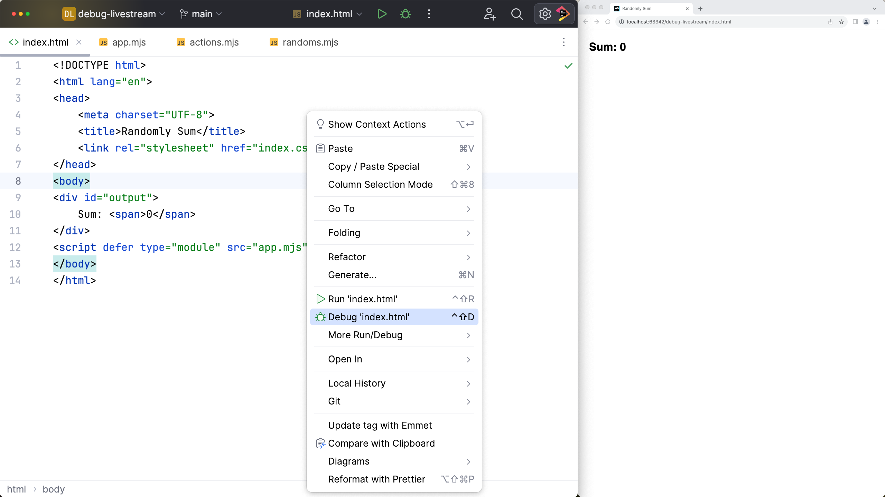

WebStorm fires up an HTTP server and opens a private Chrome profile session at that URL. It then
instruments the Chrome devtools protocol to set breakpoints and stop execution.

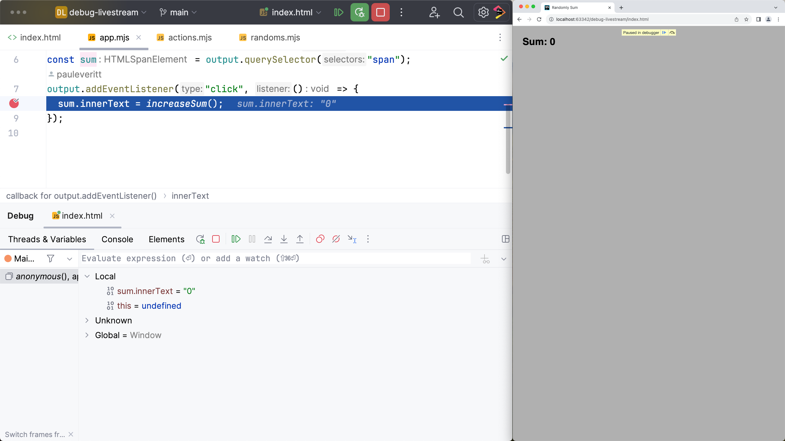

Along the way, WebStorm created a `JavaScript Debug` run configuration, pointed at that URL. As a bonus, this debug
server has a hot reloading protocol. As you make changes, the page reloads.

## Node.js debug config

Modern JavaScript has tooling in Node.js. With this, you can execute JavaScript _without a browser._ This can give a
much-better developer experience.

WebStorm makes this easy. Set a breakpoint in a JavaScript file, then right-click to debug it. Execution happens in
the `Node.js` JavaScript engine's debugger.

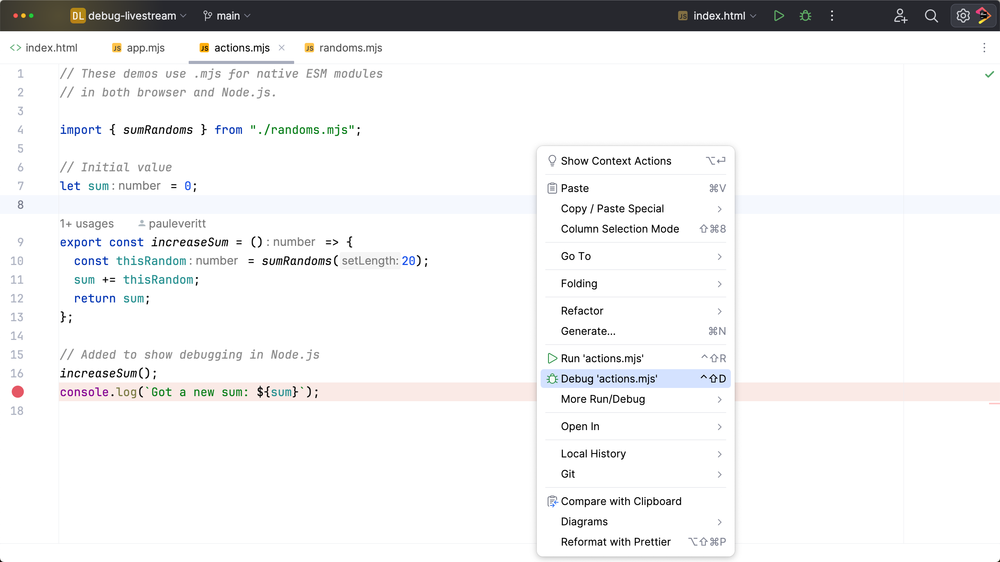

This creates a `Node.js` run configuration type.

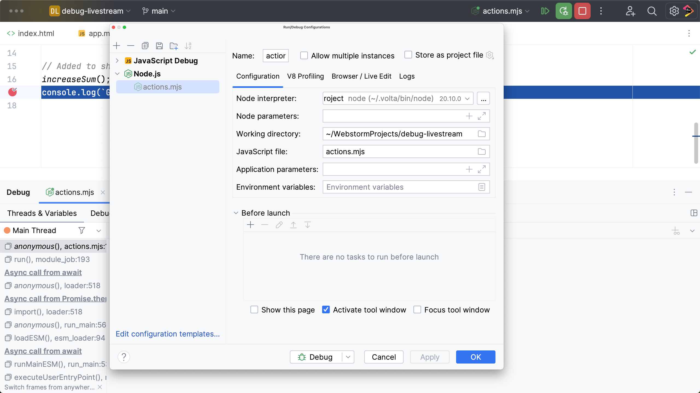

## Debug under Chrome

Let's see debugging in action, first in the Chrome engine. We are executing code that has a `console.log` statement. (
Boooo!) When WebStorm instruments Chrome, it receives those log statements and sends output to the IDE's console.

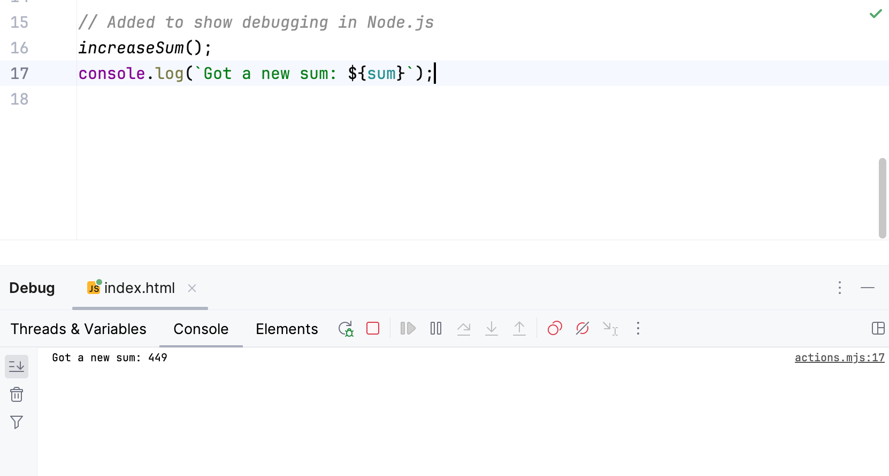

We previously saw execution stopping at the breakpoint. You can inspect the variables at that stage of the execution in
the dedicated window.

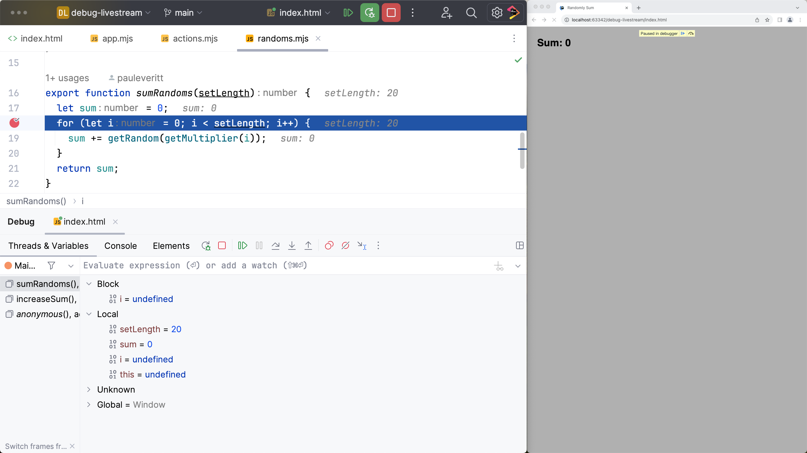

Want more screen real estate? You can also hide that window and instead, use the pseudo-comments at the end of lines to
see values.

You can also go back up the stack frames, to see what _called_ that function, and what was the state at the point of
calling. This is very helpful, especially when working with libraries and frameworks.

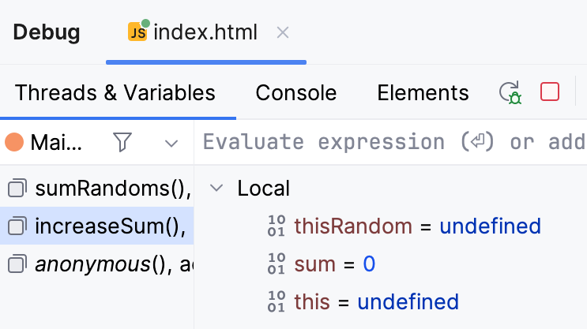

Clicking the `Resume` button (or using the keybinding) continues execution.

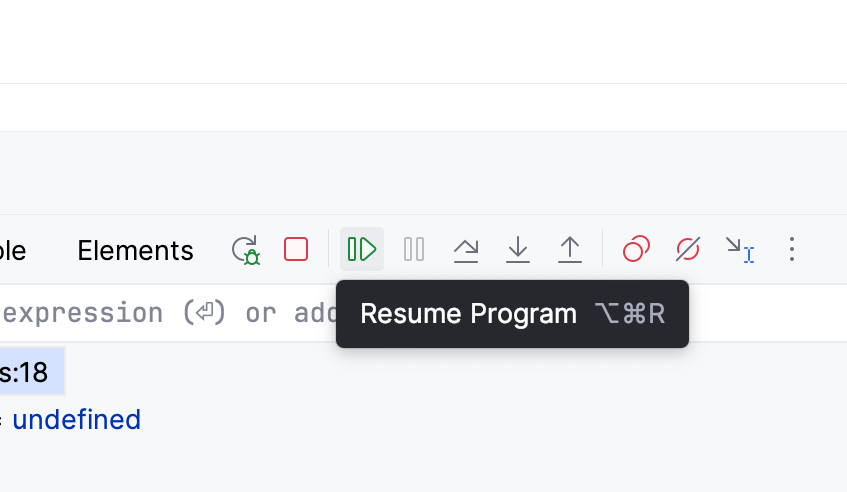

While you _can_ get this functionality in Chrome's debugger, it's nice to stay in the tool where you are editing the
lines that are being debugged. And obviously: WebStorm's debugger is _powerful_.

## Productive breakpoints

You stop execution on a line by setting a breakpoint. But you can do much more than just stop. Let's see some breakpoint
features.

When you first get excited, and set breakpoints all over the place, you'll lose track of them. `View Breakpoints` makes
it easy to list them all, as well as edit or delete them.

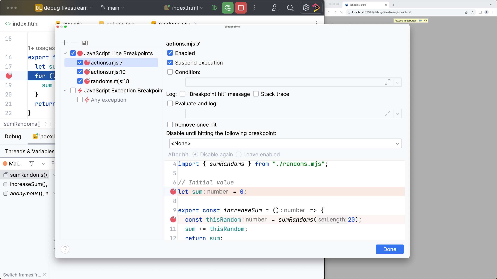

When something goes wrong, you set a breakpoint to start debugging. Wouldn't it be cool if you could set a breakpoint
that said "stop whenever something goes wrong?" `JavaScript Exception Breakpoints` let you do just that.

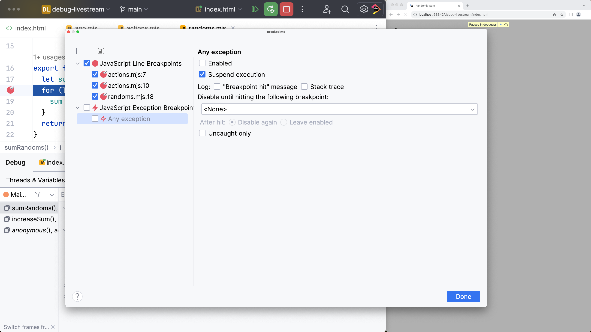

Let's say you have a dodgy line in a loop, or a function that gets called a lot. You set a breakpoint, but then you have
to click `Resume` a hundred times until you're in the right context. _Conditional_ breakpoints let you stop only when an
expression is true.

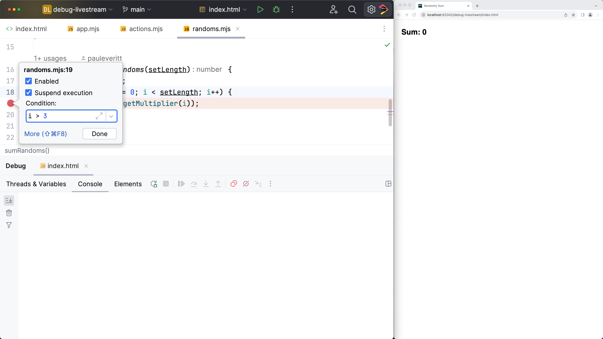

As hinted by the knobs in the edit breakpoint dialog, breakpoints have lots of other features, such as logging.

## Working with the debugger

Figuring out your solution usually doesn't happen just by stopping and looking. You need to poke around.

We saw above how you can inspect your variables at a line of execution. But you can also execute code to do "what-if",
without editing your file. You can use `Evaluate Expression` in the `Threads & Variables` pane. The result is displayed
with the variables.

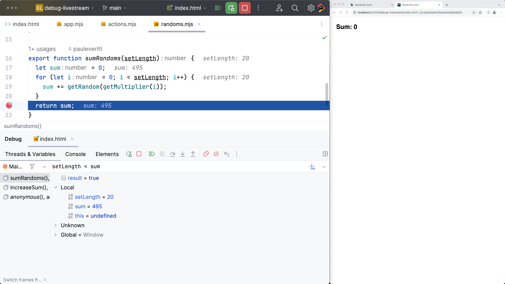

If you like command-lines instead of GUIs, use the `Console`. You can still have autocomplete while typing.

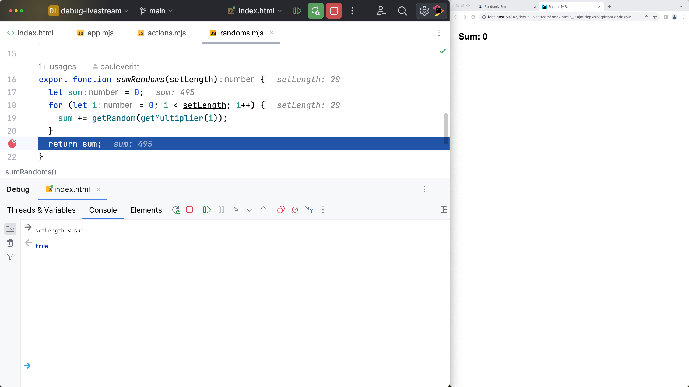

If you find yourself repeatedly typing an expression, then re-running the debugger: give "watches" a try. You type an
expression, and see the output, at that breakpoint. For example, click the icon to add the expression above as a watch.
When you run the debugger again, it is displayed:

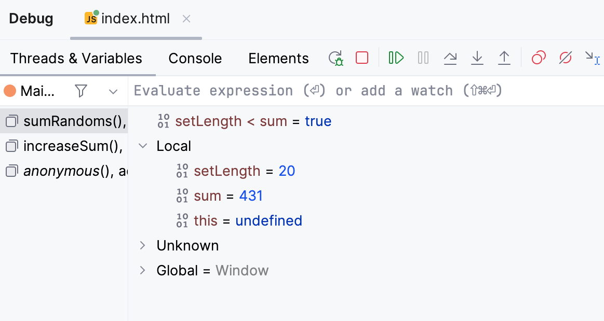

Even better: add
an [inline watch](https://www.jetbrains.com/help/webstorm/examining-suspended-program.html#inline-watch). Remember those
psuedo-comments? Click on them to pop up an inlay panel where you can add a watch.

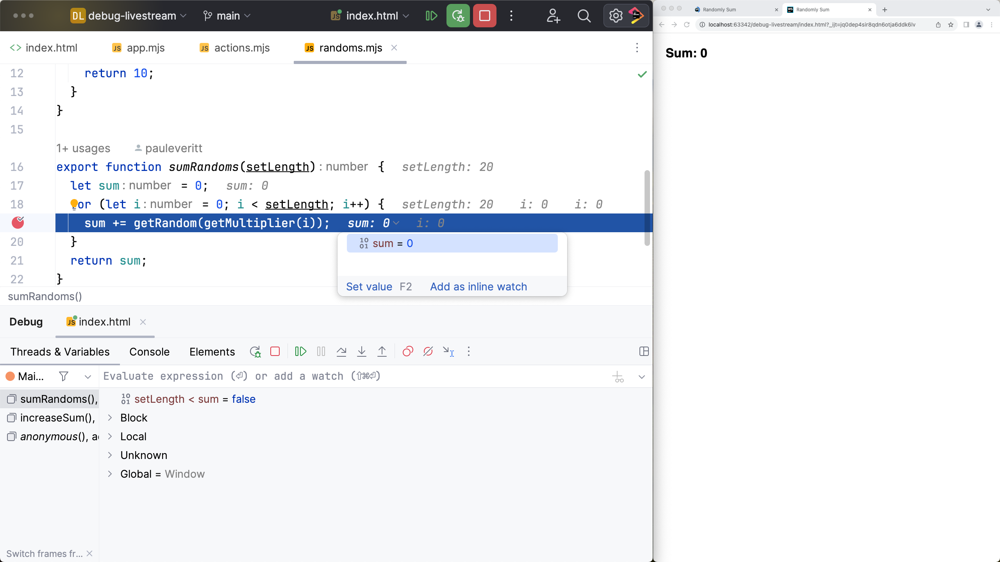

Perhaps the problem lies in the execution _after_ the breakpoint's line. _Stepping_ walks through code. You can step
over lines, into a function called on a line, and many other ways of stepping.

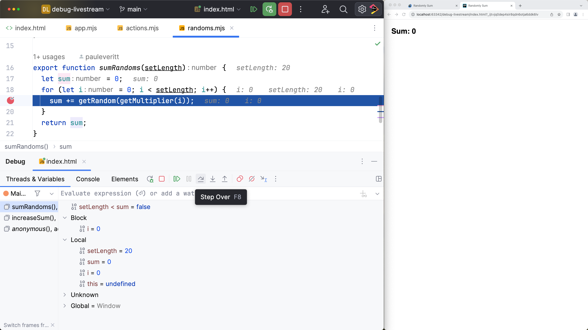

Maybe you want to jump 8 lines down. You could set another breakpoint, but soon you'll have breakpoint explosion.
Instead, use `Run to Cursor`.

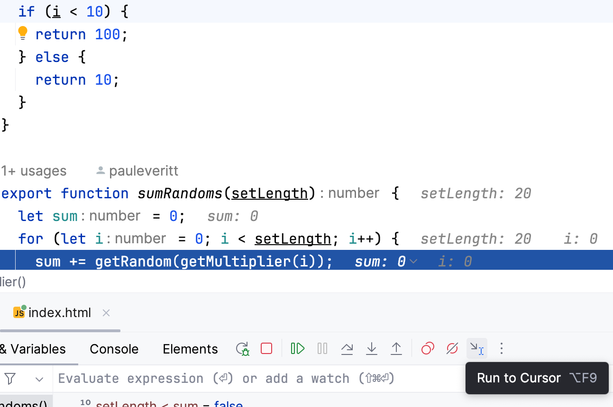

This power will quickly become second-nature and your productivity will soar. But only if you reach first for the
debugger. Remember: Always Be Debugging!

## See this in Node.js debugger

WebStorm's debugger experience hides the choice of engine. You can use Chrome's JS engine or Node.js, and it will feel
similar. For example, stepping through code feels exactly the same:

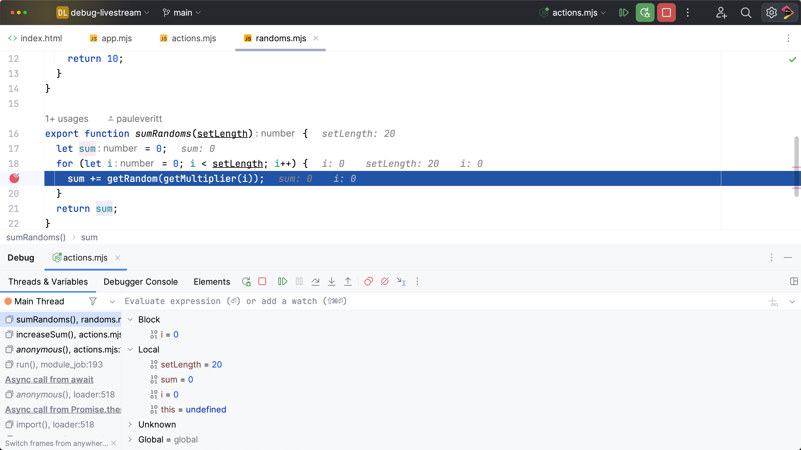

## Using HTMX with debugging

That's debugging in demo programs. How might it help in web development? Let's look at 3 scenarios. We'll start with
developing an [HTMX](https://htmx.org/) -- specifically, the [Click to Edit](https://htmx.org/examples/click-to-edit/)
example.

This URL doesn't come from some local file or server. We'll create a `JavaScript Debug` run configuration by hand,
pointing it at the URL.

When we click the `Debug` button for this run configuration, WebStorm launches a private Chrome instance and against
starts controlling it with its devtools protocol. Let's start by finding `demo.js`. It isn't in our local files, but the
debug tool lists it.

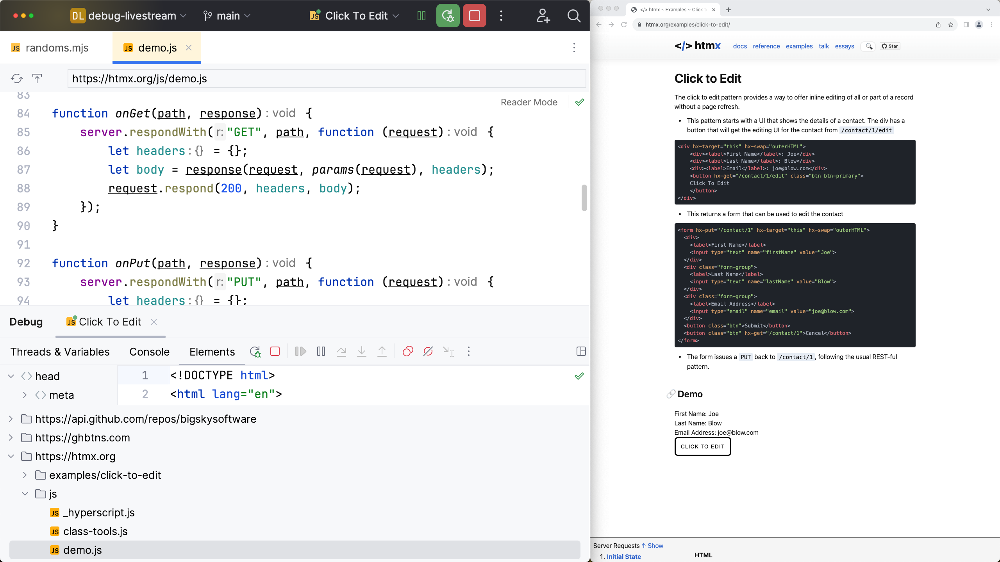

We'll set a breakpoint on line 86. Now when you click the button in the demo, the event handler is fired, and WebStorm
stops execution on that line -- but in the WebStorm editor.

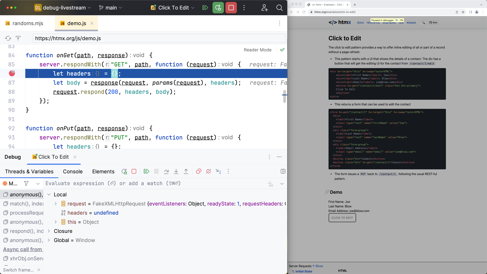

From there we can do all our normal things, such as stepping over and into code.

## Debugging with HTMX tests

What if you are an HTMX contributor and want to debug a change you're working on? The HTMX code base has a bunch of
Mocha tests.

As mentioned in the docs, first run `npx serve`. Then, right-click on `test/index.html` and choose `Debug 'index.html'`.
This will create a `JavaScript Debug` run configuration and debug the Mocha test page in Chrome.

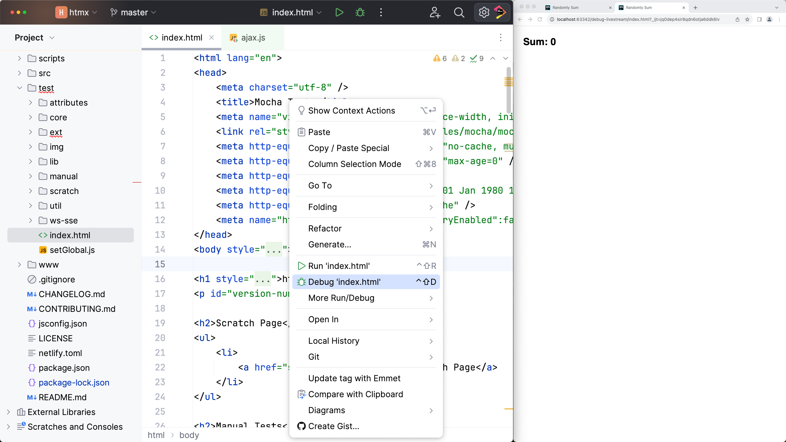

That page has a bunch of tests. We'd like to poke around in `test/core/ajax.js` and set a breakpoint in the first test.
When we click the `Debug` button again, execution stops there and we can poke around.

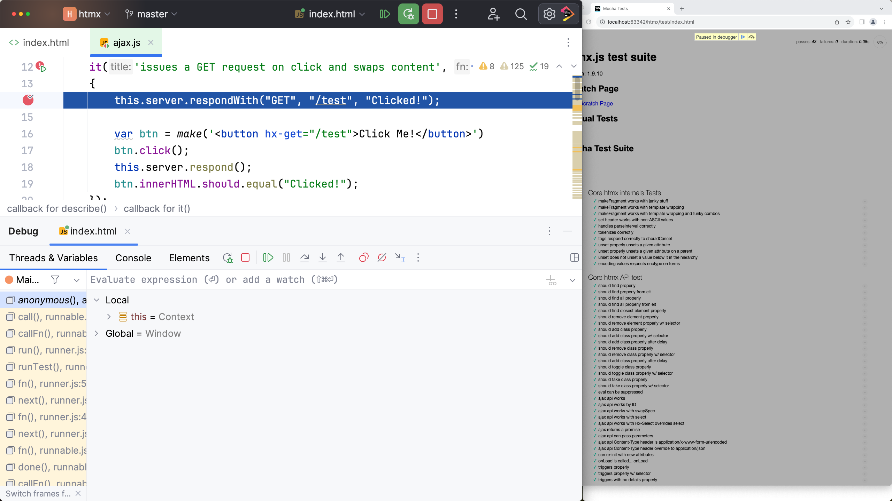

## Debugging + unit tests == bliss

We just saw web development by executing code through a web page and event handlers. This is "end-to-end". But modern
development is about isolated components:

- Smaller units
- Executed directly
- Executed in Node.js
- Perhaps with a fake browser
- Called from a test runner

Thinking in terms of tests can be a very joyful developer experience, especially combined with debugging. As an example,
this article is published in the [JetBrains Guide](https://github.com/JetBrains/guide), a 11ty-generated site that uses
components and testing. When coding
the [Heading component](https://github.com/JetBrains/guide/blob/main/_includes/heading/Heading.11ty.tsx) we can execute
the code, under the Node.js debugger, from
a [test](https://github.com/JetBrains/guide/blob/main/_includes/heading/Heading.test.tsx).

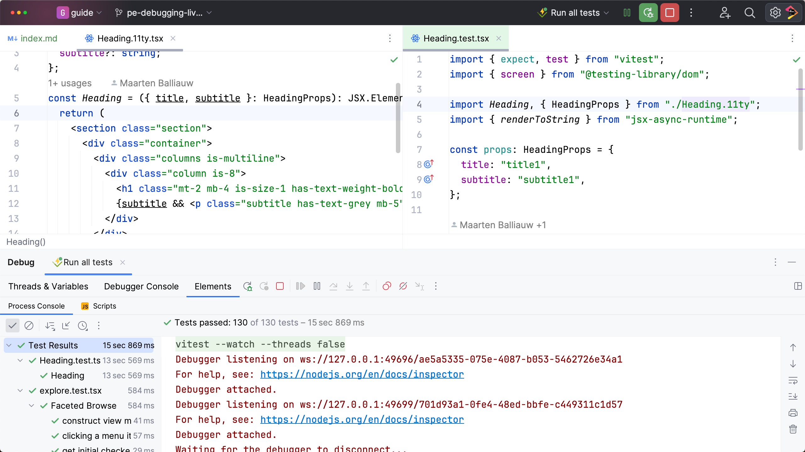

In fact, we can _continuously_ run all tests, under Vitest's watch mode. It has super-fast turnaround, even under the
debugger. When we want to poke around -- just set a breakpoint and press space on that line.

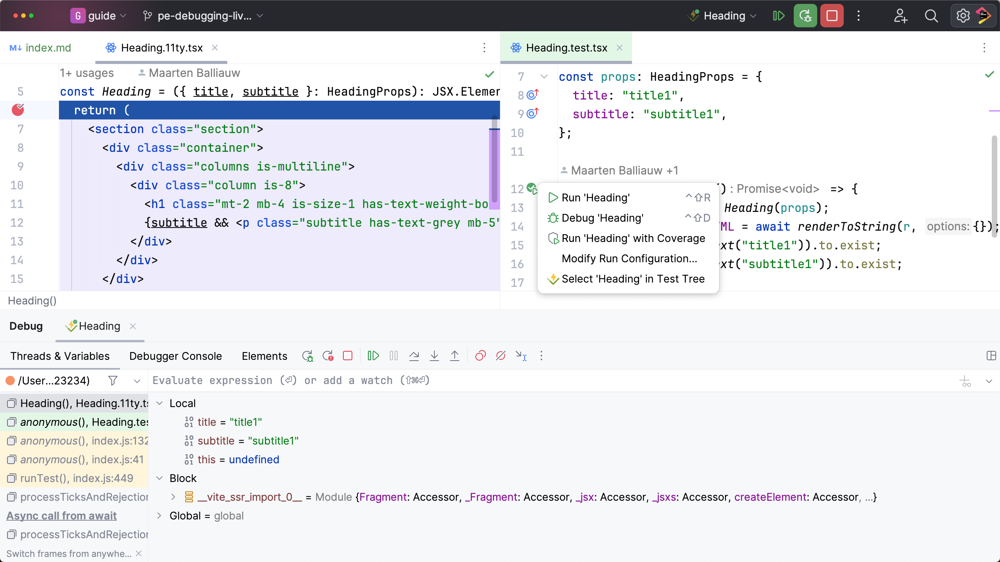

As a personal preference, I frequently hide the debugger tool window and just let the inlay information tell me what I
need to know.

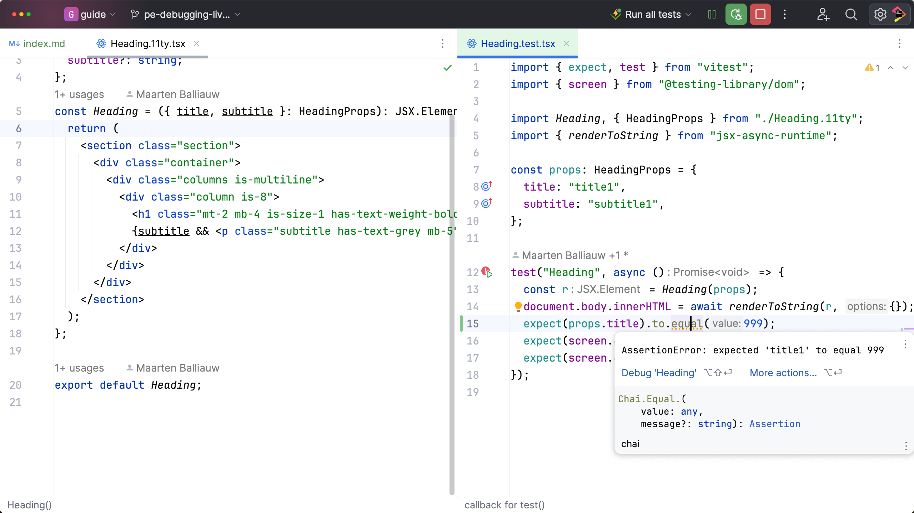

## Conclusion

WebStorm's debugger is friendly yet super-powerful. It's been around a LONG time, so it's very mature and stable. But
it's also under active development. Since much of its machinery comes from the IntelliJ Platform, it gains from having
all of our IDEs contributing to it. For example, my colleague Khalid Abuhakmeh wrote a
cool [Rider debugger blog post](https://blog.jetbrains.com/dotnet/2024/01/29/12-debugging-techniques-in-jetbrains-rider-you-should-know-about/)
with some tips that apply to all our IDEs.

Give debugging a try. See if you can adopt "Always Be Debugging" and just run stuff under the debugger, whenever you
might be tempted to regular-run it. This makes it easy to step into debugging -- as you're already there!
