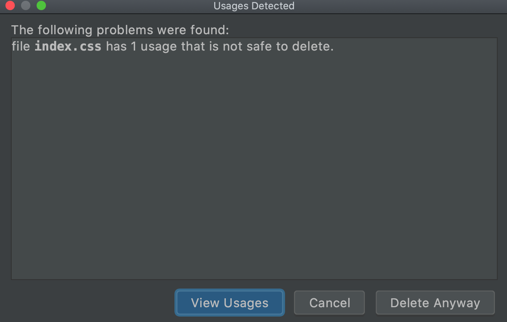
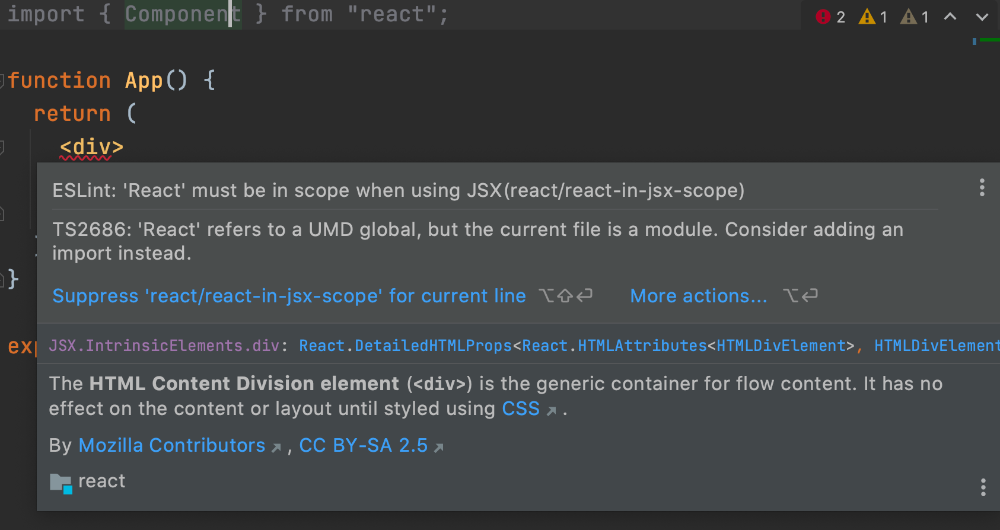
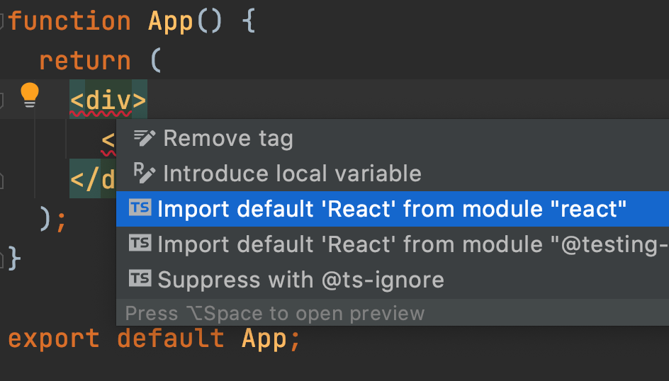
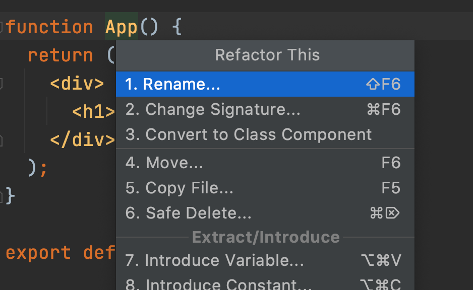

In our [previous step](../project_setup/) we generated a project then
took a look around. We'll use that step as the starting point and do
some cleaning up:

- Use the IDE to reformat code

- Strip out unneeded "Hello World" artifacts to simplify our starting point

Along the way we'll show some IDE features in action.

## Code

The finished code for this tutorial step is
[in the repository](https://github.com/jetbrains/guide/tree/main/site/javascript/demos/tutorials/react_typescript_tdd/project_cleanup).

## Reformatting Code

We currently have the test runner script running.
If you have it running via `npm run-script test` in a terminal window, terminate that process with <kbd>⌃C</kbd> (macOS) / <kbd>Ctrl+C<kbd/> (Windows/Linux) or the equivalent.
If you ran it in the IDE, close that tool window (and click `Terminate` on the dialog.)

With the IDE, reformatting code is simple.
In fact, it's something you will do constantly.
You currently have `App.tsx` open.
Let's use the `Reformat Code` action <kbd>⌘⌥L</kbd> (macOS) / <kbd>Ctrl+Alt+L</kbd> (Windows/Linux) to set everything to proper indentation.

Let's do the same for the `App.test.tsx` file.
Open it and do the same `Reformat Code` operation there as well.

## Code Formatting with Prettier

This is a...complicated topic.

In the world of React, ESLint has become very popular and `create-react-app` comes with ESLint preconfigured.
TSLint was once popular for TypeScript projects, but they joined forces with Microsoft's TypeScript team and ESLint to combine the effort into ESLint.
`create-react-app  --template typescript` generates a project with this new TypeScript-friendly ESLint.

The [Prettier project](https://prettier.io) is a similar, but slightly different tool...it's a _code formatter_ more than a linter.
It's gotten very popular and [our IDEs now have first-class support](https://www.jetbrains.com/help/webstorm/prettier.html#prettier_before_you_start).
Let's setup Prettier as our code formatter, replacing the IDE's built-in code formatting.
In fact, you can setup Prettier to work with ESLint.
Let's do so, following the [Formatting Code Automatically](https://create-react-app.dev/docs/setting-up-your-editor/) instructions in the `create-react-app` docs, albeit without the pre-commit part.

We'll start by adding some dev dependencies.
Enter the following in the terminal:

```bash
npm install --save-dev --save-exact prettier
```

Next, in the IDE's Settings/Preferences, visit `Languages and Frameworks | JavaScript | Prettier`, and use the `On code reformatting`.
Note that you could, instead, select the checkbox to only run Prettier when saving files.

Once finished, invoke `Reformat Code` action <kbd>⌘⌥L</kbd> (macOS) / <kbd>Ctrl+Alt+L</kbd> (Windows/Linux) again in both `App.test.tsx` and `App.tsx`.
You'll see a Prettier-default code format: for example, single quotes changed to double quotes.

## Clean Up, Clean Up

In `App.tsx`, let's do some steps to make a simpler starting point for the rest of the series.
First, change the `App` function to return a lot less markup:

```javascript
function App() {
	return (
		<div>
			<h1>Hello React</h1>
		</div>
	);
}
```

In the IDE, you can quickly generate markup using [Emmet](/tags/emmet/).
Highlight the existing `div` to replace and enter `div>h1<enter>Hello React`:


We have an ESLint `Unused import` error on line 2, which we can see by hovering over the gray squiggly line: `Unused import logo from "./logo.svg"`

We could stop what we're doing, move to that line, and delete it.
But the IDE makes this easy with the `Optimize Imports` action <kbd>⌃⌥O</kbd> (macOS) / <kbd>Ctrl+Alt+O<kbd/> (Windows/Linux).
Invoke that and remove the unused import.

While you're at it:

- Delete the `import './App.css';` line

- Delete the `logo.svg` and `App.css` files

With the IDE, when you do a delete, you're actually doing a "Safe Delete", with the option to look for places in the project where you might have used it.
Give it a try by starting the delete process on `index.css`. The IDE will warn you:



## More IDE Goodies

We're talking about cleanup. Let's look at some other ways the IDE can do our janitorial work.

Let's say you were in a file and were writing something like `function App` and hadn't imported React yet.
Simulate this by changing the first line to the following -- meaning, remove the `React` import:

```typescript
import { Component } from "react";
```

The IDE tells you about the error, with a red squiggly on the `<div>` in the JSX.



Click on the red squiggly, then `Alt-Enter` and choose `Import default 'React' from module "react"`.
The IDE generates the proper import:



Once finished, invoke `Optimize Imports` (`Ctrl-Alt-O` for Win/Linux and macOS) to get rid of the `Component` import.

Let's say I wanted to rename `App`.
Where is it being used?
Right-click on the `App` symbol, then choose `Find Usages`.
A window pops up.
Turns out it's being used in a lot of places.
Double-click on the usage in `index.tsx`.
The IDE opens the file, moves to the line, and puts the cursor in the right spot.

How about the other direction...you're sitting on the usage and want to go to the definition?
Use `Cmd-B` to jump to the function that defines `App`.

We could now start the process of renaming by visiting all the usages.
Bleh.
Can't we let the IDE do it for me?
Click on `App` in `function App` and hit `Ctrl-T`, then choose `Rename` to Refactor Rename the function to `MyApp`:



In the tool window showing you the consequences, choose `Do Refactor`.

Oh no, that's not what I wanted!
Do I have to do another refactor?
Nope.
The IDE did all those operations in one editor transaction.
Just use Undo and say `Ok` on the dialog.
Everything is back where it was.
