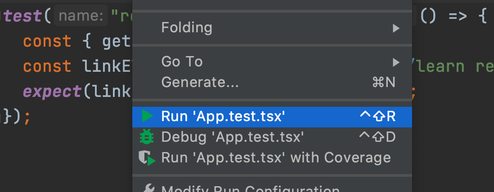
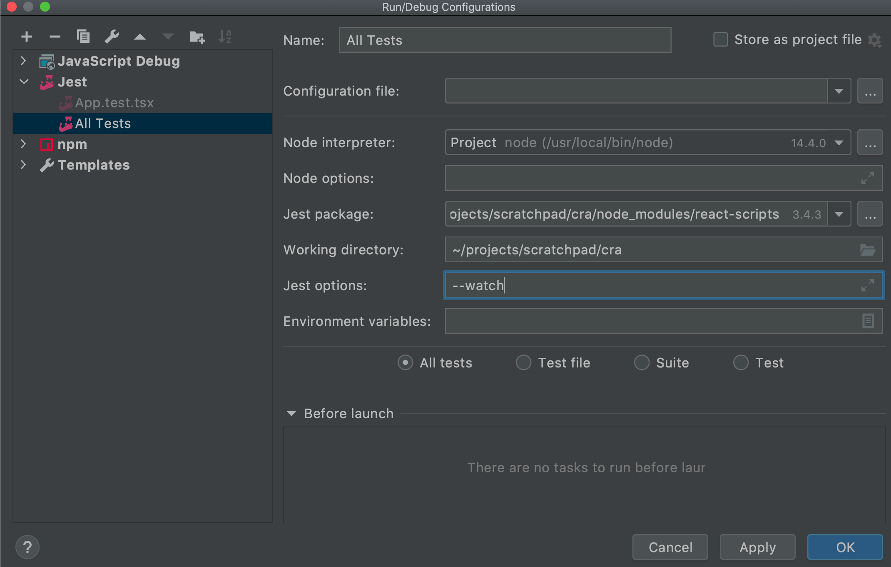
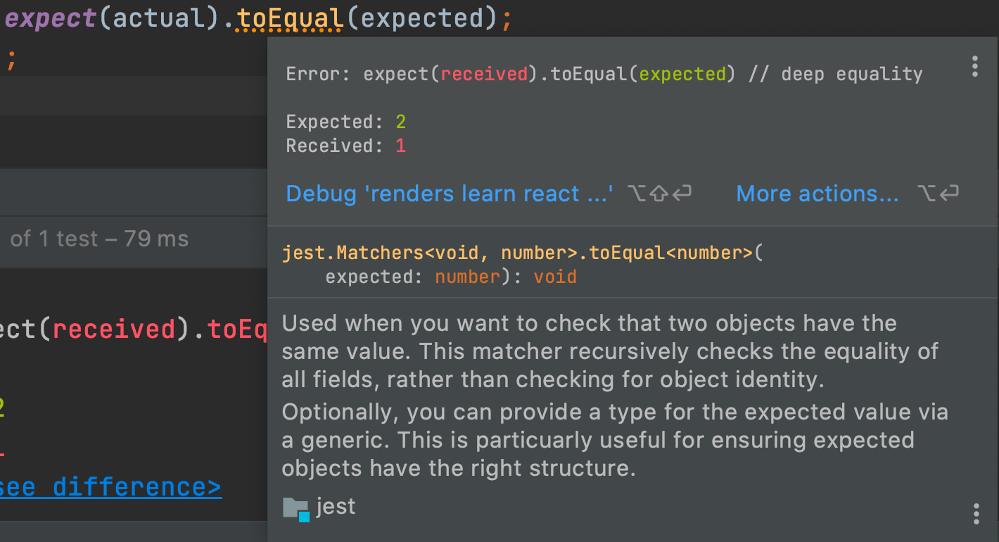
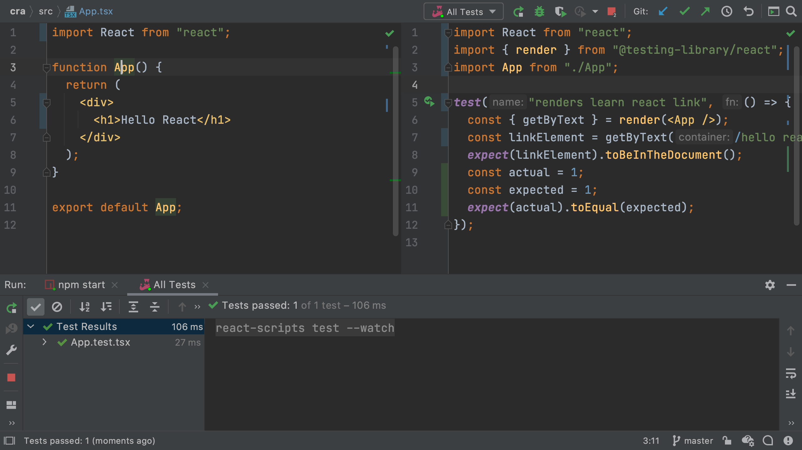
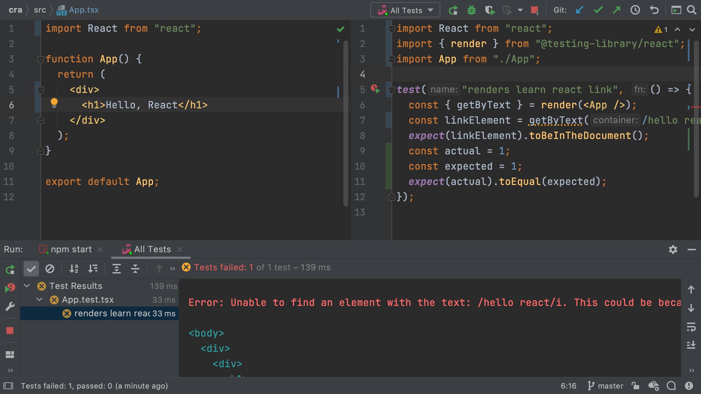

We briefly saw the [Jest](/tags/jest/) test runner in [Project Setup](../project_setup/).
We modified an existing test but didn't dive into testing.

In this tutorial step we start the process of test driven development.
After this step, we'll develop first in our Jest tests.
Then, only at the end of development, we will look at the app in the browser.

## Code

The finished code for this tutorial step is
[in the repository](https://github.com/jetbrains/guide/tree/main/sites/webstorm-guide/demos/tutorials/react_typescript_tdd/testing).

## Pretty Jest

Previously we ran our Jest tests as a generic npm run script, in the IDE's `npm` run tool window.
However, JetBrains IDEs have a dedicated run configuration type for Jest.
It's a fantastic, visual way to do testing.

Let's switch to using that Jest run configuration, starting with the easy way.
Open `App.test.tsx`, right-click in the editor body, and choose `Run 'App.test.tsx'`:



Instead of the `npm` tool window output, we get a new tool window, focused on showing test output.
And the test output tells us...our test failed!


Which is to be expected...in the previous cleanup step, we completely changed the markup.

Let's fix the test, but first, setup an easier way to run Jest.

## Easier Jest

This tutorial series talks about test-driven development (TDD), which implies running your tests frequently.
When you forget to run your tests, you might be off-track for a long time.
Let's setup Jest to re-run whenever anything changes by making a _permanent_ run configuration in the IDE.

Select `Run | Edit Configurations`, click `+`, and click on `Jest`.
Accept the default `Name:` of `All Tests`. The only real field you need to supply is `Jest options:`.
For that, enter `--watch`.
This tells Jest to watch and re-run tests when a file has changed (thus speeding up testing.)



Save that run configuration and run it by clicking the green play button in the toolbar.
Now, change line 7 -- the `getByText` call -- to `getByText(/hello react/i)`.
As soon as you save, the tests re-run, showing the test now passes:


This small change -- having tests run on changes -- can help get into the flow of test-driven development (TDD).

As a note, `getByText` is part of the [Testing Library](https://testing-library.com) package, a set of utilities that encourage good testing practices.
`Testing Library` has great support for React and thus is bundled in `create-react-app`.

## Fail Faster

Let's see a little TDD in action.
Open `src/App.test.tsx`.
We're going to show the cycle of fail-fix in action.
Define two constants, then compare them with a simple Jest assertion:

```typescript {5,6,7}
test("renders learn react link", () => {
	const { getByText } = render(<App />);
	const linkElement = getByText(/hello react/i);
	expect(linkElement).toBeInTheDocument();
	const actual = 1;
	const expected = 2;
	expect(actual).toEqual(expected);
});
```

As we saw before, when you save this, Jest re-runs your tests.
This test now fails, and the IDE's tool window presents the test results in a very convenient UI.
For example, you can jump directly to the line of the failing test, even if the file isn't currently open.


Even if the test tool window isn't open, you still get information about the test results:

- A red gutter icon
- A red line in the scroll bar
- Integration into the scrolling "problems" panel in the top right
- A squiggly under the place that failed

In fact, you get a hover inlay with plenty of information:



Let's fix the test by changing `expected` to `1` then save.
The Jest watcher spots the change, re-runs the test, and shows that all tests pass.

## TDD Basics

JavaScript development is usually a bunch of switching between the editor, the browser, the browser console, and a terminal window, with the build tools displaying messages. Let's use a better flow.
Let's stay _in the IDE_ to focus on our code, and observe our code through tests instead of a browser reload.

First, let's get our code and our tests side-by-side.
Use `Find Action` (`Shift-Ctrl-A` Win/Linux, macOS `Shift-Cmd-A`) and type in `Split Right`.
This gives us a left and right side editor without needing tabs.
On the left, open `App.tsx` and keep `App.test.tsx` on the right.
We can now see `function App` alongside our tests.
If you need more room, close the Project tool window.



With our code and tests visible, let's make a change in our code.
Replace `Hello React` with `Hello, React` -- adding a comma -- and then save.
A few moments later you will see that the test failed:



Congratulations, you just did TDD!
You made a change that caused a test to fail, and thus, the tests helped you code with confidence.
Change the text back by _removing the comma_ in `function App`.
When you save, the test passes.
Not only that...you changed your component without ever looking at nor reloading a browser.

As a final cleanup, remove the last three lines of the test -- `const`, `const`, and `expect`.
Your test code should now like this:

```typescript
import React from "react";
import { render } from "@testing-library/react";
import App from "./App";

test("renders learn react link", () => {
	const { getByText } = render(<App />);
	const linkElement = getByText(/hello react/i);
	expect(linkElement).toBeInTheDocument();
});
```

## See Also

- [Running Unit Tests on Jest](https://www.jetbrains.com/help/webstorm/running-unit-tests-on-jest.html)

- [Run/Debug Configurations for Jest](https://www.jetbrains.com/help/webstorm/run-debug-configuration-jest.html)

- [WebStorm Help Topics for Jest](https://blog.jetbrains.com/webstorm/tag/jest/)
