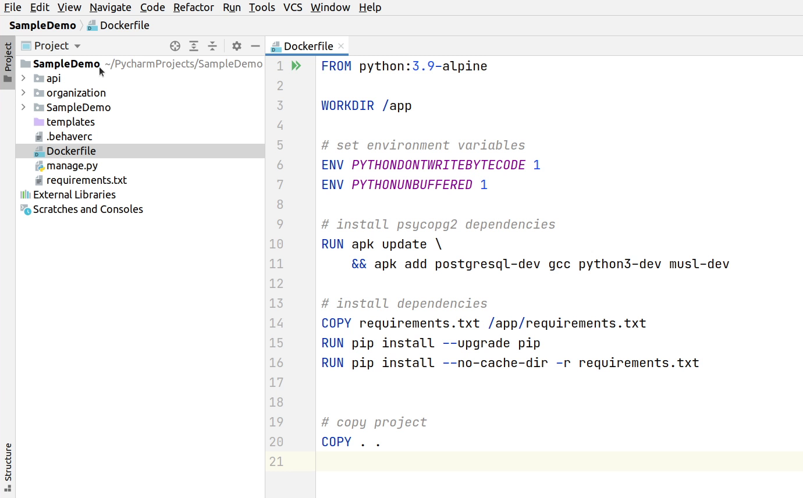
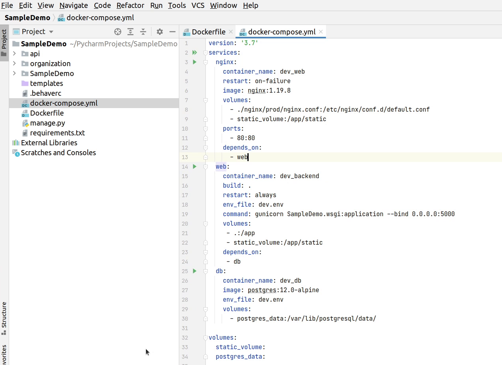
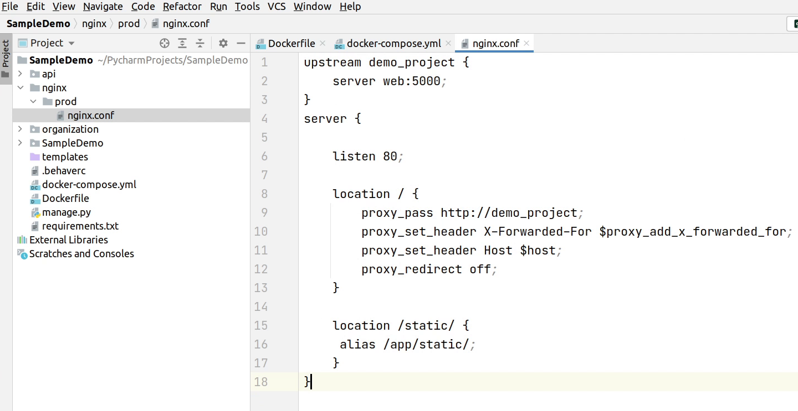
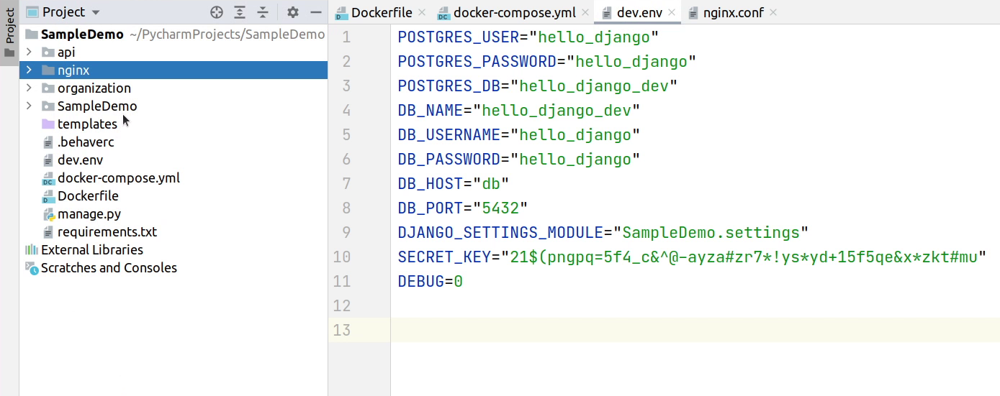
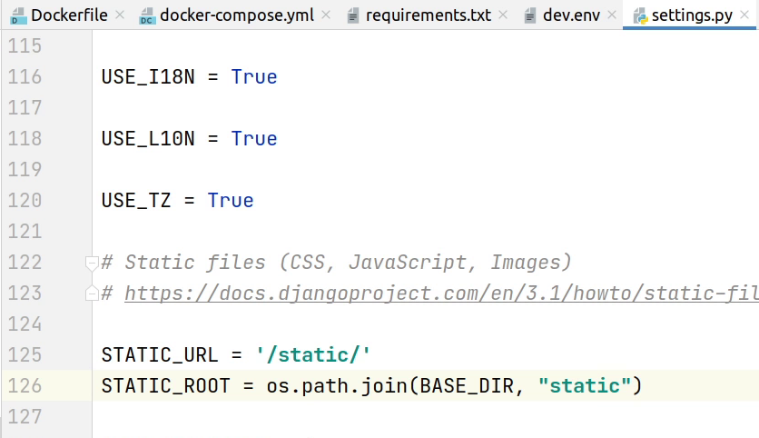
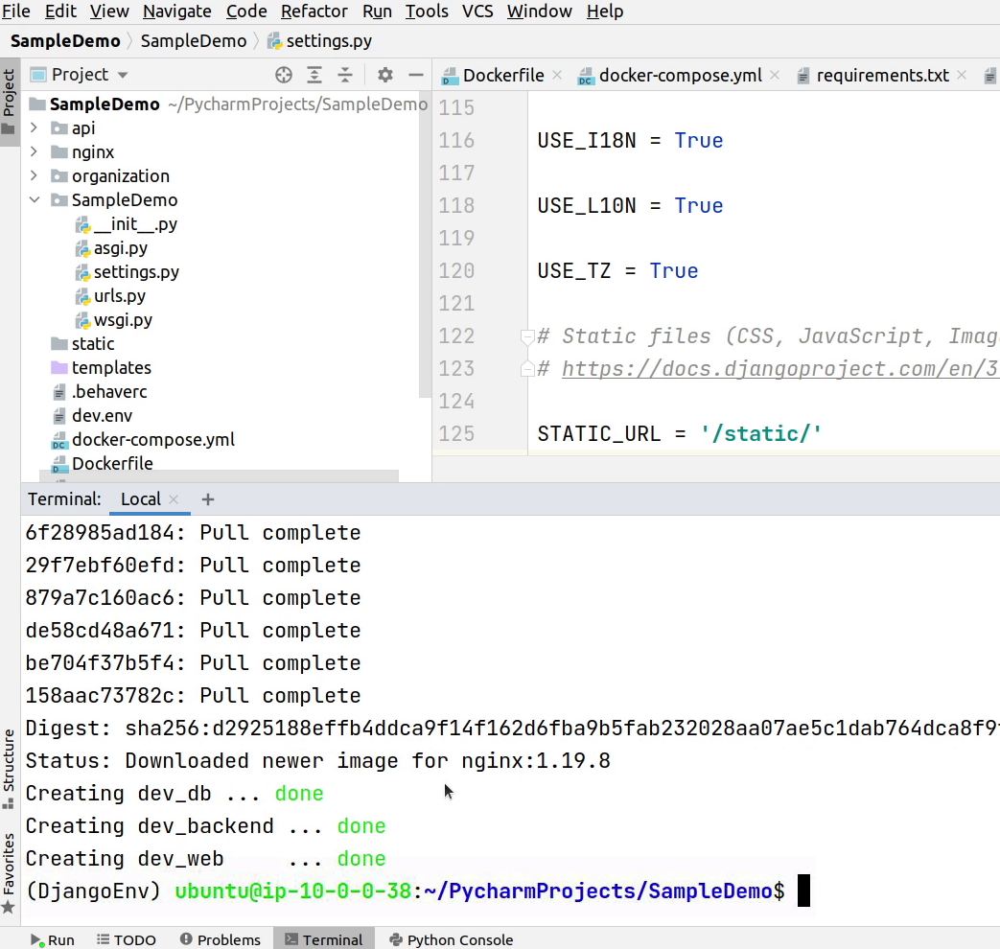
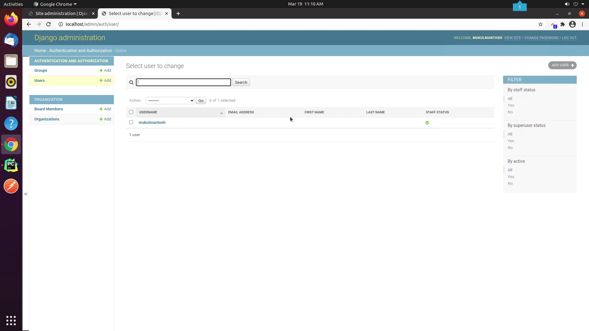

Hello everyone, welcome to the Django tutorial series. In this tutorial step, we are going to deploy our application inside a Docker Container. 

[Docker](https://www.docker.com/) is an open
platform for developing, shipping, and running applications. It lets you separate your applications from your infrastructure, so you can deliver software quickly. With Docker, 
you can manage your infrastructure in the same way you manage your applications.

When it comes to Docker, testing, and CI/CD pipelines -- these are subjects of their own, each requiring a dedicated course to understand the topics and get into the depth of it.

We will be doing a sneak peek into Docker, and I will show you how it makes our life easy.

If you are interested to take your knowledge to the next level then get your hands on [Kubernetes](https://kubernetes.io/). It is an open-source system for 
automating deployment, scaling, and management of containerized applications.


For this tutorial we will be focusing on using Docker.


# Dockerfile

I am going to create a [Dockerfile](https://docs.docker.com/develop/develop-images/dockerfile_best-practices/) in the project root. A Dockerfile 
is a text document that contains all the commands a user could call on the command line to assemble an image.



The final Dockerfile is going to look this.

```dockerfile
FROM python:3.9-alpine

WORKDIR /app

# set environment variables
ENV PYTHONDONTWRITEBYTECODE 1
ENV PYTHONUNBUFFERED 1

# install psycopg2 dependencies
RUN apk update \
    && apk add postgresql-dev gcc python3-dev musl-dev

# install dependencies
COPY requirements.txt /app/requirements.txt
RUN pip install --upgrade pip
RUN pip install --no-cache-dir -r requirements.txt


# copy project
COPY . .
```
We will be using the Python 3.9 alpine image which will be pulled from [DockerHub](https://hub.docker.com/). DockerHub is a service
provided by Docker for finding and sharing container images with your team. You can store public/private images 
in DockerHub, or you can go for AWS ECR (Elastic Container Registry).

You may have observed that we are using the alpine image. One of the easiest steps to optimize your docker images is to use
smaller base images. Alpine is a lightweight linux distribution designed for security and resource efficiency. 

Next, I will be performing certain operations like :
 - Setting up environment variables
 - Installing Postgres
 - Copying  ```requirements.txt``` to our app path 
 - Upgrading pip & installing python packages from our ```requirements.txt``` 
 - Copying the entire project.


# Docker Compose

I will be creating a new file called ```docker-compose.yml``` file. According to Docker: [Compose](https://docs.docker.com/compose/) is a
tool for defining and running multi-container Docker applications. With Compose, 
you use a YAML file to configure your application's services. Then, with a single command, you create 
and start all the services from your configuration.

The compose file describes the services that make your app. As you can see the below image, there are 3 services : **nginx**, **web**, **db**.

The compose file also describes which Docker images these services use, how they link together, and any volumes
that might need to be mounted inside the containers. Finally, the compose file also describes which ports these
services expose.



The final version is going to look like this :

```yaml
version: '3.7'
services:
  nginx:
    container_name: dev_web
    restart: on-failure
    image: nginx:1.19.8
    volumes:
      - ./nginx/prod/nginx.conf:/etc/nginx/conf.d/default.conf
      - static_volume:/app/static
    ports:
      - 80:80
    depends_on:
      - web
  web:
    container_name: dev_backend
    build: .
    restart: always
    env_file: dev.env
    command: gunicorn SampleDemo.wsgi:application --bind 0.0.0.0:5000
    volumes:
     - .:/app
     - static_volume:/app/static
    depends_on:
     - db
  db:
    container_name: dev_db
    image: postgres:12.0-alpine
    env_file: dev.env
    volumes:
      - postgres_data:/var/lib/postgresql/data/

volumes:
  static_volume:
  postgres_data:
```

 - **nginx** : NGINX is open source software for web serving, reverse proxying, caching, load balancing, media streaming, and more. [Igor Sysoev](https://en.wikipedia.org/wiki/Igor_Sysoev) originally wrote NGINX to solve the C10K problem, a term coined in 1999 to describe the difficulty that existing web servers experienced in handling large numbers (the 10K) of concurrent connections.

 - **web**: Under the web section we are going to run our Django application through Gunicorn. Gunicorn is a Python WSGI HTTP Server for UNIX. It's a pre-fork worker model. The Gunicorn server is broadly compatible with various web frameworks, simply implemented, light on server resources, and fairly speedy.  If you are using Django 3 then you can also go ahead with an ASGI server like Uvicorn which is based on uvloop and httptools, with an emphasis on speed.

 - **db**: The db section is self-explanatory. We are going to use [PostgreSQL](https://www.postgresql.org/) as our datastore.


Moving to the next topic, I will be creating a NGINX configuration file to proxy requests to our backend application. As you
can see on the compose file at line number 8, we are mapping between a local path and the container path.




As shown in the configuration below, nginx is going proxy request to upstream server 
running on port 5000 which is pointing to our backend app.

```
upstream demo_project {
    server web:5000;
}
server {

    listen 80;

    location / {
        proxy_pass http://demo_project;
        proxy_set_header X-Forwarded-For $proxy_add_x_forwarded_for;
        proxy_set_header Host $host;
        proxy_redirect off;
    }

    location /static/ {
     alias /app/static/;
    }
}
```

We are now done with the configuration. Let’s now create an environment file and name it as ```dev.env```

For your reference please check on line number 18 in the compose file. You can see that the environment variables are being picked from the ```dev.env``` file.



Make sure to typecast your **DJANGO_SECRET_KEY** to iInteger.


Install the **[gunicorn](https://pypi.org/project/gunicorn/)** package and update your ```requirements.txt``` file.

```
pip install gunicorn
```

You can see the below image, at line number 126 make sure to add **STATIC_ROOT** in your **settings.py** file



# Docker Build

We have completed our setup. Let's initiate the build process.

I will type the command : 

```bash
sudo docker-compose up -d  --build
```

To know more about docker build, please visit the official [documentation](https://docs.docker.com/engine/reference/commandline/build/).

This command is going to build and run our containers in the background. I haven’t added docker into the sudo group, so I need
to mention it in the beginning of the command.

As you can see the images are not present in our local machine, so it will pull those official images from the DockerHub. 


Our containers have been successfully created. As you can see on the screen, it’s up and running. 



Let me execute the basic common commands.

 - ```python manage.py collectstatic``` --> This command (collects up all your static files from each of your app folders (including the static
   files for the admin app) and from any other folders you specify in **settings.py**, and copies them into **STATIC_ROOT**.

 - ```python manage.py migrate``` --> Run database migration
   
 - ```python manage.py createsuperuser``` --> Next, I will create a superuser by running the command, but before that, make sure to migrate the tables in the database.


```bash
sudo docker-compose exec web python manage.py collectstatic
sudo docker-compose exec web python manage.py migrate
sudo docker-compose exec web python manage.py createsuperuser
```

As we are using NGINX, that means it's running on default port 80. We don’t need to mention it explicitly. 

- Open the url ```http://localhost/admin``` and provide your credentials which you recently created.



Great ! Our application is successfully running inside a container. I hope you got a basic understanding of how we are running
our application inside Docker. I know you must have a lot of doubts, but as I said in the beginning this is not a Docker course. If you
want to know the ins and outs of Docker then I recommend checking out DevOps courses available on the 
internet focusing on Docker & Kubernetes.

In the upcoming video I will give a short walk-through of deploying our docker images in AWS ECR also
known as Elastic Container Registry via GitHub Actions.


