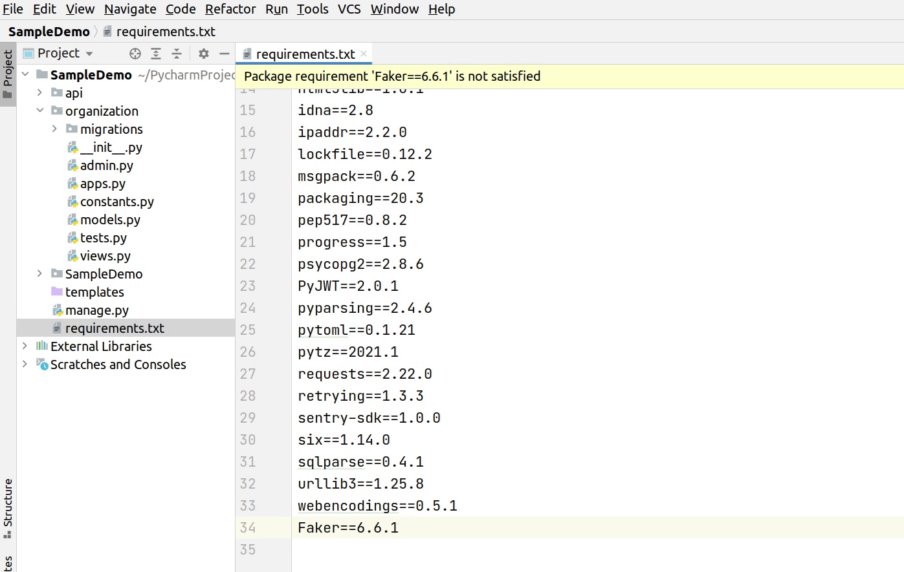
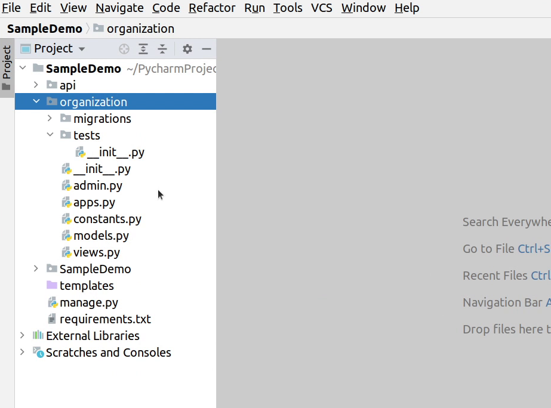
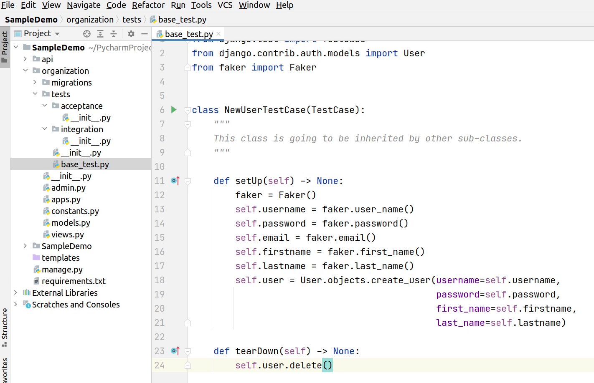
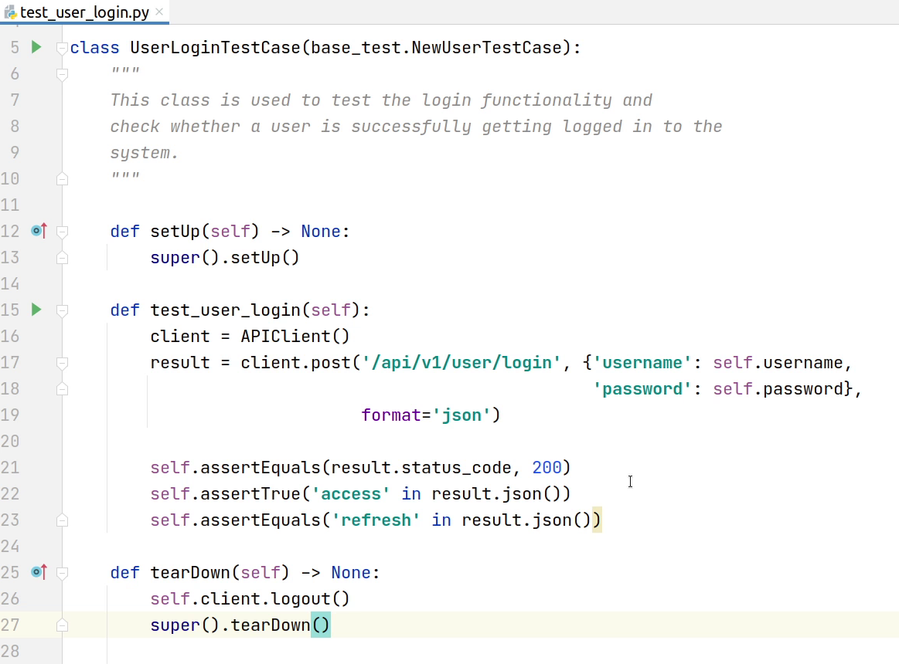
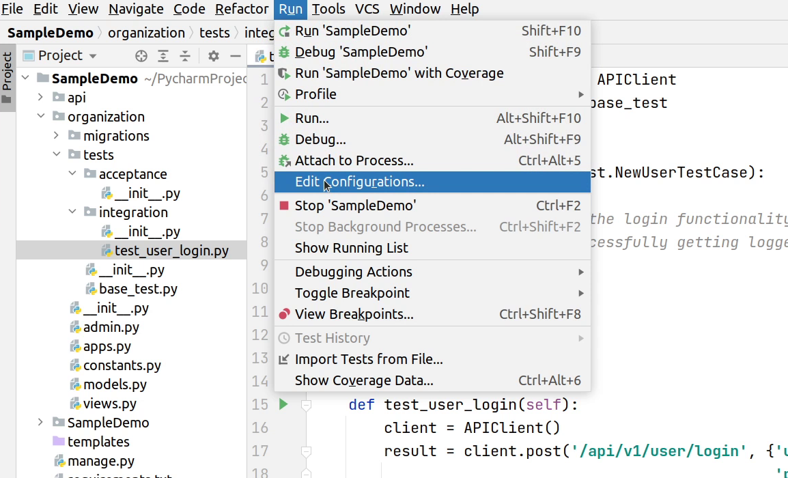
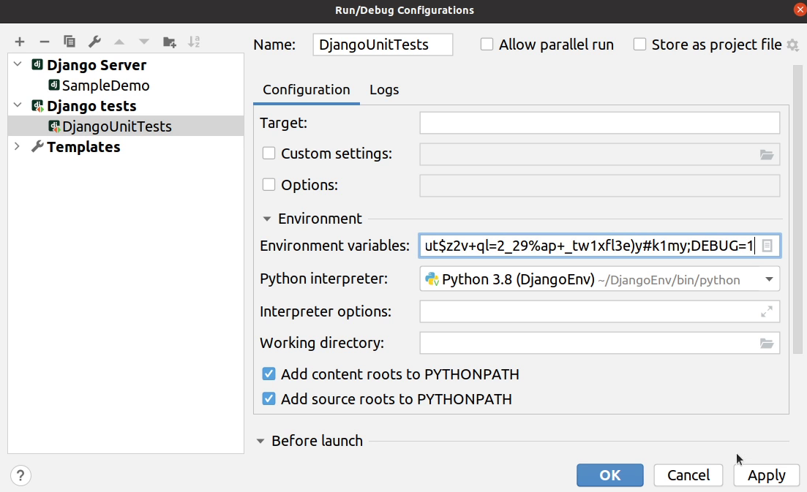
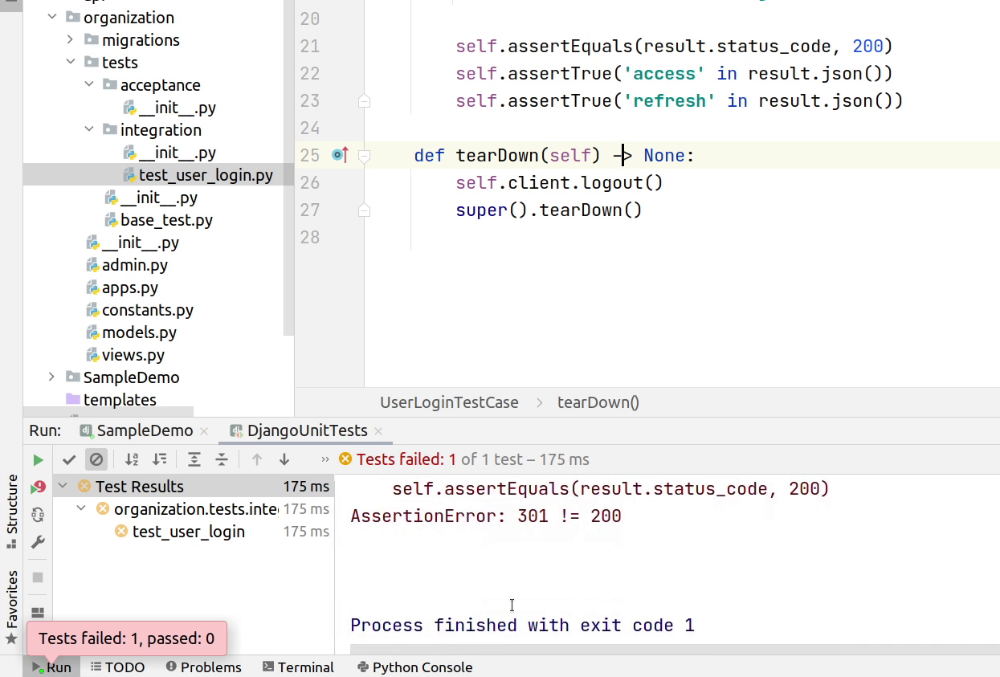
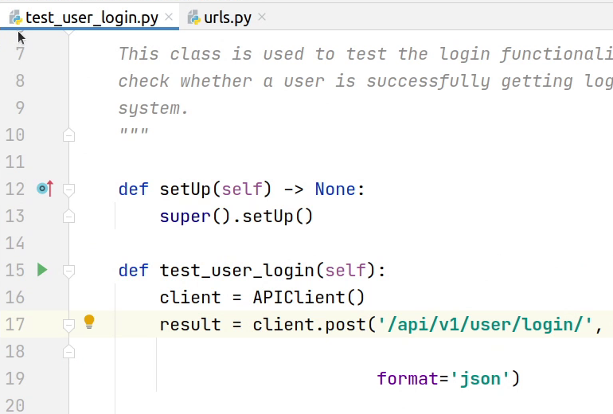

Hello everyone, welcome to the Django tutorial series. In this tutorial we are going to focus on Unit Tests.

Unit testing ensures that all code meets quality standards before it's deployed. It saves time and money,
and helps developers write better code, more efficiently.

# Installing Package

For this tutorial, we will be using **[Faker](https://pypi.org/project/Faker/)**. Faker is a python package that generates
fake data. You can also use the **[model-bakery](https://pypi.org/project/model-bakery/)** package which offers you a smart way to
create fixtures for testing in Django.

# Let's begin testing

I will create a **tests** folder under our **organizations**. We don't require the base **tests.py** file, so I will
remove it.

Next, I will create two more packages under tests and name it as integration and acceptance. We will focus on acceptance testing in our next tutorial.

I will be setting up a new user in our **base_test.py** file which is going to be re-used by other test classes.

You can see in our setUp method we are creating a new user by using the faker library. I haven’t used the email field:
it’s optional and in the tearDown method we will be removing the user object from the database.

Our base test is complete. Let’s create a new test for the login module under integration.

First we are going to do the necessary imports like the **APIClient** and **base_test**.

I will create a new class **UserLoginTestCase** which inherits the base class **NewUserTestCase**.

You might be thinking why I created an **integration** directory.

According to Wikipedia : <em>Integration testing is the phase in
software testing in which individual software modules are combined and tested as a group</em>.

In our case we are dependent upon the **NewUserTestCase**, which needs to inherited and finally it's going to create a new user
in our system. Indirectly, we are setting up a fixture. According to <em>Wikipedia : A software test fixture sets up a
system for the software testing process by initializing it, thereby satisfying any preconditions the system may have.</em>

If there is a user in our system then only we can
proceed with login that means a new user needs to be registered successfully in the platform and after that only
we can perform a test in the Login API.

Moving ahead, in the **setUp** method, I will be calling the `setUp` method defined in our
base class through `super()`. The super function is used to give access to methods
and properties of a parent or sibling class.

In our **test_user_login** function, I will pass username & password to our login api and
will check in response that I receive a 200 status code along-with access and refresh tokens
present in the response body.

Okay, the implementation is done. Let’s move forward and configure our test settings.

I will click on **Run** and then **Edit Configurations**.

I will click on the **plus (+)** button and add Django tests. Make sure to replicate the environment variables from the Django server.

I will click on **Apply** and then **OK**.

Everything is done, Now I will click **Run** ⇒ **Run ‘DjangoUnitTests’**

Our test case has failed: we received a 301 permanent redirect http response.

I forgot to add forward slash in the login url `/api/v1/user/login/` at line number 17.

I am going to try once again.

Yes, the test case has successfully passed.

Let’s move ahead and complete other test scenarios, just follow along-with me. I would recommend watching the video because
I will be doing same kind of operations for other test cases.

In case you want to save more time, the source code is available on [Github](https://github.com/mukulmantosh/SampleDemo).

If you have completed implementing all the test cases, then you can observe the below image, that's going to be our final output.

In the upcoming tutorial step we will be focusing on writing acceptance tests using python bdd framework.
