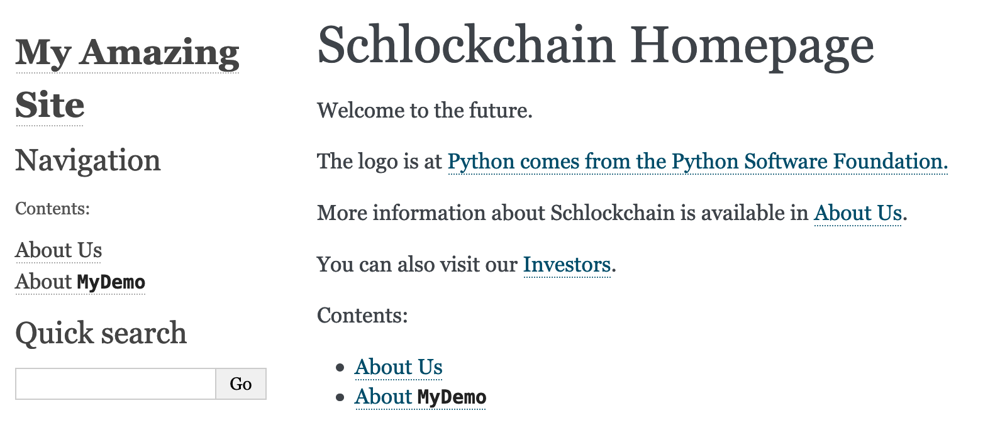
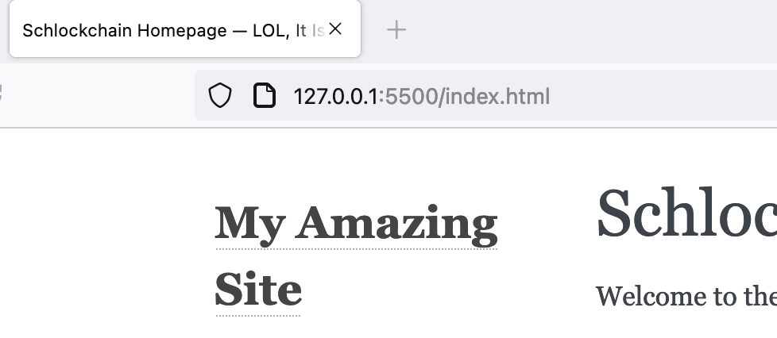
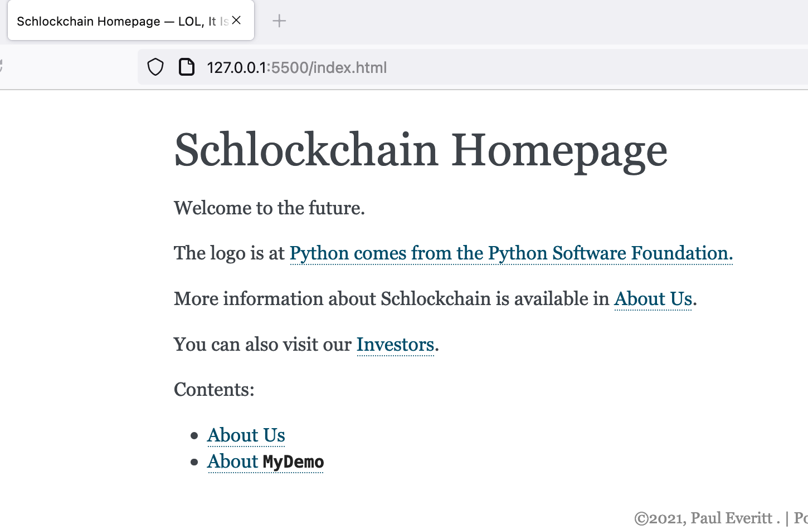
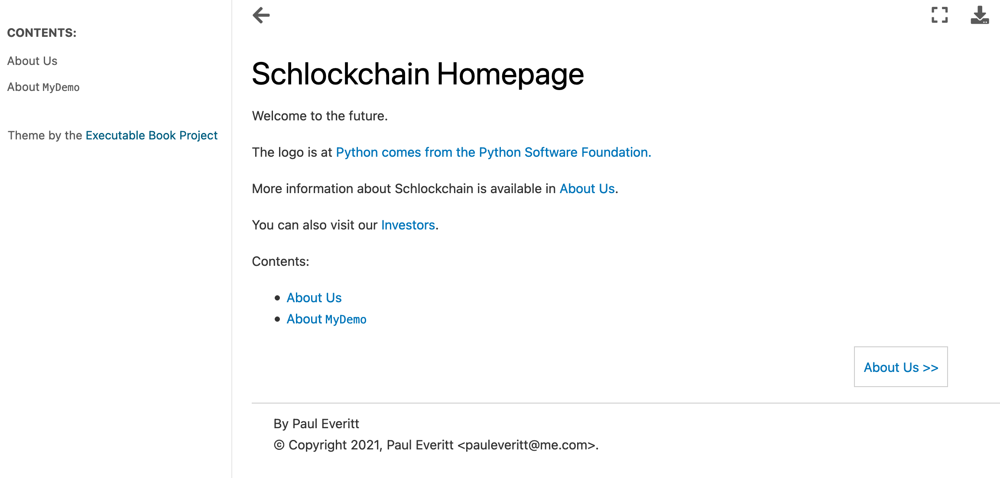
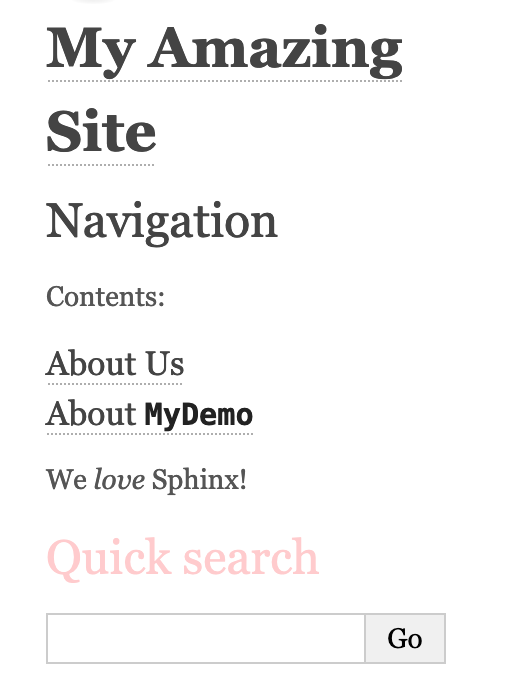

Static websites are about providing your own, custom site experience.
Sphinx has a good customization story, albeit with caveats.
Let's look at some customizations.

## Simple Customizing In `conf.py`

Sphinx's configuration file in `conf.py` provides a [configuration system](https://www.sphinx-doc.org/en/master/usage/configuration.html) based around a Python file named (by convention) `conf.py`.

In our first example, let's change the project's title to `My Amazing Site`.
Open `conf.py` and set the following:

```python
project = "My Amazing Site"
```

When the site regenerates, you'll see the left sidebar now has `My Amazing Site`:



There's more though to the story.
Add a line after that with:

```python
project = "My Amazing Site"
html_title = "LOL, It Is A Nice Site"
```

The heading in the left column doesn't change, but we now see `LOL` in the tab title, meaning the HTML `<title>` (and in other places.)



Why?
The configuration file can also have [options specific to HTML output](https://www.sphinx-doc.org/en/master/usage/configuration.html#options-for-html-output).
Remember, Sphinx can generate an HTML website from your content, but it can also generate PDF, etc.

As that page shows, Sphinx has many configuration values, in many layers.
It can get confusing, as some of the names are "magical": you have to remember to remove a prefix when using them in templating or code.

## Sidebars

Websites have structures that repeat across pages, perhaps differing on some kinds of pages.
In Sphinx these [are called sidebars](https://www.sphinx-doc.org/en/master/usage/configuration.html#confval-html_sidebars) and are quite customizable.

These are the defaults, but add them anyway at the end of `conf.py`:

```python
html_sidebars = {
  '**': [
    "about.html",
    "navigation.html",
    "relations.html",
    "searchbox.html",
    "donate.html",
  ]
}
```

These are the [sidebars available for the Alabaster theme](https://alabaster.readthedocs.io/en/latest/installation.html#installation) which is bundled as the default theme in Sphinx.

Now try commenting those all out:

```python
html_sidebars = {
  '**': [
    # 'about.html',
    # 'navigation.html',
    # 'relations.html',
    # 'searchbox.html',
    # 'donate.html',
  ]
}
```

When you visit the page, the entire left column has now disappeared:



`html_sidebars` has accumulated some cruft over the years, as [noted in its docs](https://www.sphinx-doc.org/en/master/usage/configuration.html#confval-html_sidebars).
It's somewhat understandable: Sphinx is quite old, and new ideas have emerged while old ideas needed to still be supported.

Before proceeding, reset the sidebars:

```python
html_sidebars = {
  '**': [
    "about.html",
    "navigation.html",
    "relations.html",
    "searchbox.html",
    "donate.html",
  ]
}
```

## Switch Themes

As mentioned above, Alabaster is bundled as the default theme.
Sphinx, though, lets you use a different theme.
Let's use the [Sphinx Book Theme](https://sphinx-book-theme.readthedocs.io/en/latest/) from the same folks that make MyST.

Themes are just normal Python packages, so start by installing the package.
We do our usual dance -- first add the package to `requirements.txt`:

```
sphinx
livereload
myst-parser
sphinx-autodoc-typehints
sphinx-book-theme
```

Then update from our dependencies:

```bash
pip install -r requirements.txt
```

Just because it is installed doesn't mean our website is using it.
To select a theme to use, edit the following value in `conf.py`:

```python
html_theme = "sphinx_book_theme"
```

When you restart, you'll notice that Sphinx complained.
It seems this theme doesn't support the same default `html_sidebar` values.
Per the [Sphinx Book Theme](https://sphinx-book-theme.readthedocs.io/en/latest/configure.html#control-the-left-sidebar-items) docs on sidebars, we'll use their bundled sidebars:

```python
html_sidebars = {
    "**": ["sbt-sidebar-nav.html", "sbt-sidebar-footer.html"]
}
```

We now see a new layout and style:



This theme has many [configuration options](https://sphinx-book-theme.readthedocs.io/en/latest/configure.html).
This is true for many of the [themes available for Sphinx](https://sphinx-themes.org).

There are many ways to [customize and even write your own themes](https://www.sphinx-doc.org/en/master/development/theming.html).
Be warned, however: this particularly an area where you will be confronted by the long years that Sphinx has been popular.

Let's finish this section out by switching back to Alabaster and its default sidebars.
Our `conf.py` should now look like this:

```python
import os
import sys

sys.path.insert(0, os.path.abspath("."))

project = "My Amazing Site"
html_title = "LOL, It Is A Nice Site"
html_theme = "alabaster"
copyright = "2021, Paul Everitt <pauleveritt@me.com>"
author = "Paul Everitt <pauleveritt@me.com>"
extensions = [
    "sphinx.ext.intersphinx",
    "myst_parser",
    "sphinx.ext.autodoc",
    "sphinx.ext.napoleon",
    "sphinx_autodoc_typehints",
]
exclude_patterns = ["_build", "Thumbs.db", ".DS_Store", ".venv"]
html_static_path = ["_static"]
templates_path = ["_templates"]
myst_enable_extensions = [
    "colon_fence",
]
intersphinx_mapping = {
    "sphinx": ("https://www.sphinx-doc.org/en/master/", None),
}
myst_url_schemes = ["http", "https", ]
html_sidebars = {
  '**': [
    "about.html",
    "navigation.html",
    "relations.html",
    "searchbox.html",
    "donate.html",
  ]
}
```

## Logos

Websites have logos.
Sphinx provides a configuration knob for logos.
Let's see it in action.

To start, download the SVG version of the Python logo and put it in the special `_static` folder in the same directory as `conf.py`:

```bash
cd _static
wget https://www.python.org/static/community_logos/python-logo-generic.svg
cd ..
```

Now edit `conf.py` and add that filename as the value for the logo:

```python
html_logo = "_static/python-logo-generic.svg"
```

Our sidebar should now have a Python logo at the top:


`html_logo` is explained [in more depth in the Sphinx docs](https://www.sphinx-doc.org/en/master/usage/configuration.html#confval-html_logo).

## Custom CSS

It's quite easy to get your own CSS injected into the site.
Not just CSS, but "templated" CSS.

Start by adding a file at `_static/custom.css`:

```css
body {
  font-size: xx-large;
}
```

When you save...nothing happens.
Because we haven't told Sphinx to add this to the [list of CSS files that Sphinx returns](https://www.sphinx-doc.org/en/master/usage/configuration.html#confval-html_css_files):

```python
html_css_files = ["custom.css"]
```

So far, so good, and fairly typically.
But Sphinx also allows *templated* CSS, where your CSS files are actually processed by Jinja2.
To say this file is a template, rename it to end in `_t`, meaning `_static/custom.css_t`.

Everything works the same at this point: `custom.css` is the actual name that is generated.
But change `custom.css_t` to use Jinja2 to get a color from the Alabaster theme:

```css
#searchbox #searchlabel {
    color: {{ theme_pink_1 }};
}
```

## Custom Templates

We've customized images and logos.
How about templates?
You may have noticed the `_templates` directory.
Let's put that to use by adding a sidebar.

First, add a file at `_templates/luv_sphinx.html` containing:

```html
<p>We <em>love</em> Sphinx!</p>
```

Next, we tell Sphinx which sidebars we want, *in the order we want*, including our new template.
We'll also specify where Sphinx should look for templates:

```python
templates_path = ["_templates"]
html_sidebars = {
  '**': [
    "about.html",
    "navigation.html",
    "relations.html",
    "luv_sphinx.html",
    "searchbox.html",
    "donate.html",
  ]
}
```

We'll now see that box appear, above the (now-pink) searchbox:



We can also override an existing sidebar simply by putting a file with the same name, in our site's `_templates` directory.

What's available inside the template?
The Sphinx docs [cover this](https://www.sphinx-doc.org/en/master/templating.html) but let's do a quick example in `luv_sphinx.html`:

```
<p>We <em>love</em> Sphinx for {{project}}!</p>
```

If your page doesn't update, it's because Sphinx isn't rebuilding on changes to templates there.
Edit `index.md` and save, and you'll see the sidebar updated with the value of `project`.
