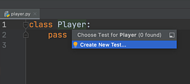
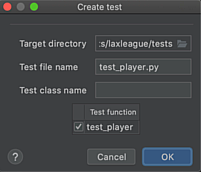
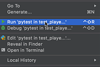
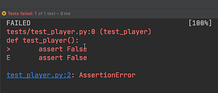
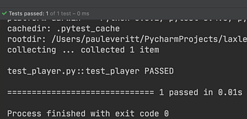

Getting started with pytest is quite easy.
Let's write a test with a simple assert, then show the various ways to run this test.

# First Test

We want to make and run a test for our `Player` class before we do too much implementation.
PyCharm can help us make the test.
Click somewhere in the `Player` and invoke `Navigate | Go To Test` (`Ctrl-Shift-T` Win/Linux, `Shift-Cmd-T` macOS):



Tell it to create a new test.
You will then get a dialog asking for more information.
PyCharm should spot that you created a `tests` directory, so accept its defaults and click `OK`:



PyCharm will add two files to `tests`: an empty `tests/__init__.py` (which can be helpful to `pytest` later) and `tests/test_player.py`.
PyCharm then opens the new test file at `tests/test_player.py`:

```python

```

As mentioned in the previous step, `pytest` recommends placing your tests outside the source code directory.
This explains why PyCharm chose `tests` as the location.

This Python `pytest` file has one function, `test_player`. 
In `pytest`, tests [are discovered](https://docs.pytest.org/en/latest/goodpractices.html#conventions-for-python-test-discovery) by default in filenames starting with `test_` and functions/methods with that same prefix.

# Running Your Test

Now that we have a test -- albeit simple -- let's see what it looks like to *run* it. 
Right-click in the middle of the editor and choose `Run 'pytest in test_player.py'`:



Yay, our first test runs -- and fails! 
Sure, small victory -- but small victories can help get us into the TDD flow.

## Warning

Don't see `pytest` in the context menu as a way to run your tests?
You probably didn't configure `pytest` as the test framework in the `Python Integrated Tools` section of the PyCharm's project settings. 
It should configure automatically, though, if your environment has `pytest` when you first open in PyCharm (or have it set globally.)

PyCharm opens a new run tool window in the bottom of the screen.
This tool window is customized for visualizing tests and their results:




The test runner tool window lists the tests (organized by hierarchy) on the left and the test output on the right. 
It also has buttons for operations (e.g. re-run tests) and configuration (e.g. only show passing tests.)

Let's change the assertion to make the test pass:

```python

```

In the tool window, click the green arrow to re-run your tests. 
The results look much different now:



# Many Ways to Run Tests

As you learn "visual testing", you will start to master different ways to run tests. 
These different ways will reflect your personal style (e.g.mouse vs. keyboard) or different contexts (e.g. "I just want to run the tests on this one test class.")

Here is a (non-exhaustive) list of ways that I run tests:

- *Ctrl-R*. 
My most frequent fave. 
Re-runs the tests using the currently-selected run configuration. 
We'll use this for the rest of the tutorial.

- *Specific test or suite*. 
Right-click in a test function or file.

- *Green arrow*. Click on green arrows in toolbar, gutter, tool window.

- *Right-click*. Context menu in editor, tab, tool window, project tool folder.

- *Permanent run configuration*.
All of the approaches above create *temporary* run configurations. 
I also make *permanent* run configurations for my top-level folders under `tests` such as `unit`.

# Test the Construction of an Instance

Lacrosse teams have, of course, players. 
We are first implementing a `Player` class and writing tests as we implement features.
This is known as "test-driven development" (TDD).

We previously made a placeholder file at `src/laxleague/player.py`.
Open that file and change the class to have a docstring:

```python

```

These tutorials are all about getting into the "flow". 
Lots of times I resist: I'm tired, the problem I'm about to tackle is daunting, or I have a lot on my mind.

As a self-hack, I write the simplest-possible test, just to see if the thing can be constructed. 
It is of modest value: it can later help show if a refactoring changed things.
Let's change our first test to see if we can construct an instance:

```python

```

We aren't asserting anything about the instance.
Simply: the import works, it's callable, and can be called.

Remember that PyCharm can help you [generate the import of `Player` as you type](../../../tips/generate-imports-while-typing/). 
You don't need to stop your flow, go to the top, and write the import. 
Instead, type `Pla` and hit `Ctrl-Space-Space` to autocomplete *and* add the import line at the top, in the correctly-sorted location, combined with any existing import of the module.

# Re-Running

Let's run everything in the file (currently one test) by again right-clicking in the editor and choosing `Run 'pytest in test_player.py'`.
Our test passes again:


