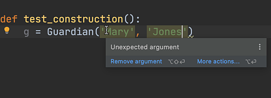
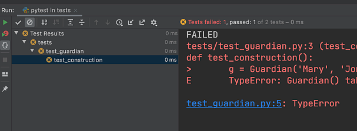

Players have parents, also known as guardians.
Let's make a module for a `Guardian` class.
This time let's do it with a bit of test-driven development (TDD) and show how to get PyCharm into a good "flow" for TDD.

# Starter Tests

First, create `src/laxleague/guardian.py` with an empty class:

```python

```

Why do we make an empty placeholder class?
To let PyCharm generate the test for us.
Use `Navigate | Go To Test` (`Ctrl-Shift-T` Win/Linux, `Shift-Cmd-T` macOS) as explained in the last step to help generate `tests/test_guardian.py`.

In that file, change the first test to `test_construction` to "get me into the flow", letting PyCharm generate the import:

```python

```

Run the test by right-clicking in the editor _outside any block_ and choosing to run it with `pytest` (bigger target area than the tab.)

Yay, the test passes.
Let's switch to running _all_ of our tests.
In the project tool window, right-click on `tests` and choose `Run 'pytest in tests'`.
The test runner now shows a tab with `pytest in tests`, with 2 tests passing:


Not a major victory, but allows us to start inching forward:

# TDD Flow

Now let's get ourselves into a TDD flow.
We'd like to easily look at the code we are writing and the tests we providing against that code.
I like both visible, with my code on the left and the tests on the right.

Invoke `Find Action` with Cmd-Shift-A and search for `Split Vertically`.
On the left, open `guardian.py` and on the right, make sure `test_guardian.py` is still open.
While we're at it, collapse the project tool window, turn off the toolbars and navigation bars, and tabs.

The run tool window stays on the bottom (though on wide monitors I put it on the right):


There, that has a nice feel to it.
Room to focus.

Now that our code is setup, let's get our test running "in the flow".
Let's have our tests run, automatically, as we type.
PyCharm makes this easy and visually convenient -- it even integrates with your desktop notification system when tests are finished running and PyCharm isn't visible.

In the tool window for the test output, click on the `Toggle auto-test` icon, two icons below the green run arrow.


With autorun enabled, next click the big green run arrow again.
Now, all your tests run _automatically_ two seconds (configurable) after you stop typing.

One final point: you don't have to save changes to your code or tests.
PyCharm has an auto-save virtual filesystem thingy.

To see this autorun in action, change something in one of your `assert` statements, _without_ saving.
After two seconds, you'll see the tests re-run, automatically.

That's a nice start to a good TDD flow.
Let's write a failing test, then fix the implementation.

# The Guardian

Our `Guardian` needs a constructor that takes and stores `first_name` and a `last_name`.
Change the first test in `tests/test_guardian.py`:

```python

```

Notice that PyCharm warns you (on hovering) with 'Unexpected argument' when we supply arguments:



After two seconds, even without saving, our tests show as broken:



Of course it breaks: `Guardian` has no `__init__.py` constructor.
Since it is the _code_ we are writing tests for, the mistake is conveniently right there in our left tab.
No need to think.
Change `laxleague/guardian.py` to implement storing names on instances:

```python

```

As you are writing this, let PyCharm help you:

- First, use autocomplete to finish `__init__` and put your cursor in the right spot.

- Next, when you type your constructor arguments, use `Alt-Enter` and
  choose `Add field 'first_name' to Guardian`. PyCharm will generate the
  `self.first_name = first_name` boilerplate for you.

- Finally, if the generation is in the wrong order, use
  `Shift-Alt-Up` or down to move the line, instead of cutting and pasting.

Our test now passes but doesn't do an assertion.
Back in `test_construction`, let's show a bit about how PyCharm can help you be more productive and accurate.

First, hold down `Ctrl` and hover on the `g`.
PyCharm tells you that `g` is of inferred type `Guardian.`
Next, add an assertion:

```python
assert g.first_name == 'Mary'
```

As you type `first_name` you can see PyCharm offering you the autocomplete.
This is because PyCharm inferred the type of `Guardian`, thus speeding up your TDD.

Oops, we had poor style on that.
In my projects, I prefer a testing convention for asserts with expected on the left, meaning `expected == actual`.
While [Guido declined to designate a winner](https://mail.python.org/pipermail/python-dev/2010-December/106954.html), it seems [Kent Beck did](https://sourceforge.net/p/junit/mailman/message/3338997/), and Brian Okken's examples also use that.

You can see this problem by changing the expected value of 'Mary' to a value of 'Expected'.
PyCharm's test output now shows expected vs. actual, and `Expected` is in the wrong place.

We need to flip that, but good news: PyCharm excels at such janitorial work.
Click on the double-equal, hit `Alt-Enter`, and choose `Flip '=='`:


In fact, PyCharm will [obey a style](https://youtrack.jetbrains.com/issue/PY-27267) set by a project.
Create a `pytest.ini` file at the root:

```python

```

Let's write a test for last name, causing `test_guardian.py` to finish like the following -- including the expected/actual ordering:

```python

```

One last point: PyCharm's tool window for testing shows passing tests by default.
If you don't want to see them, and focus on failing tests instead, click on the `Show Passed` icon to the right of the green play button.
