## Prerequisites

### Installation

In this tutorial, we are going to install the Google Cloud SDK and the Google Cloud Code plugin.

I recommend following the official documentation [https://cloud.google.com/sdk/docs/install](https://cloud.google.com/sdk/docs/install)


Install the SDK for your particular operating system.

There is a wide variety of OS options to choose from:

- Linux, Debian, or Ubuntu
- RedHat, Fedora, or CentOS
- macOS
- Windows

Once you’ve installed the gcloud CLI, you can confirm it by typing the following command in the terminal: `gcloud version`.

You’ll need to install the `gke-gcloud-auth-plugin` binary. Run the following command to install the dependency:

```
gcloud components install gke-gcloud-auth-plugin
```

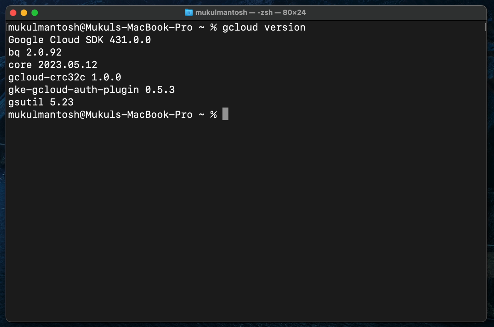

The image below shows what this looks like on a machine where the plugin is already installed.

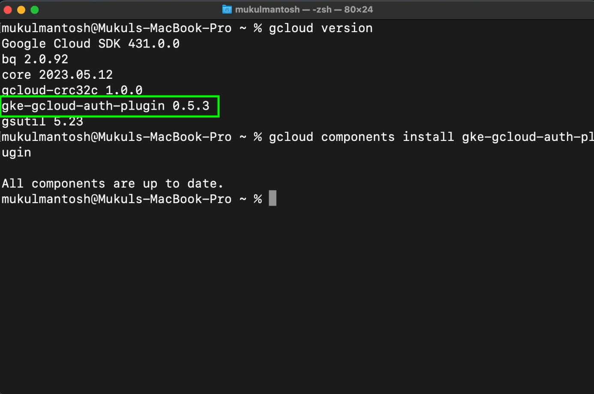

To learn more about `gke-gcloud-auth-plugin`, click the link below:

[https://cloud.google.com/blog/products/containers-kubernetes/kubectl-auth-changes-in-gke](https://cloud.google.com/blog/products/containers-kubernetes/kubectl-auth-changes-in-gke)

For this tutorial, we’ll be using [Docker Desktop](https://www.docker.com/products/docker-desktop/).

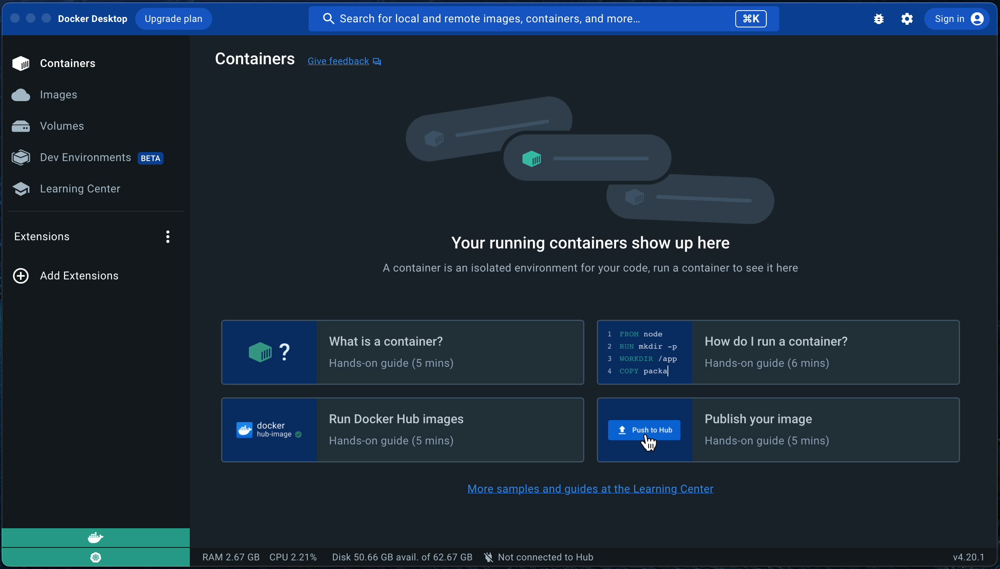

Make sure to **Enable Kubernetes**. The Kubernetes server runs locally within your Docker instance and is a single-node cluster.

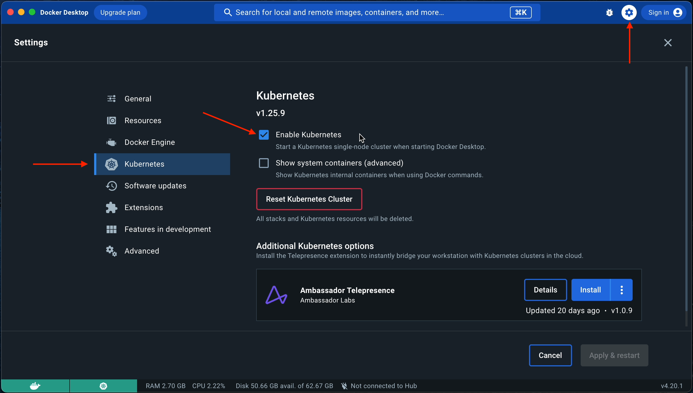

### Configuring the Google Cloud SDK with Google Project

Now that we have the Google Cloud SDK installed, we need to configure it to talk to a specific project.

For this, we’ll use the SDK’s `gcloud` utility for CLI-based Google Cloud access.

Follow the steps below to configure `gcloud` with a specific Google project.

- Step 1: Initialize the project configuration using the following command:

```
gcloud init
```

- Step 2: You’ll then see the following prompt. As I have one project already configured in my CLI, I’ll go ahead and create a new configuration by choosing the second option **(Create a new configuration)**.

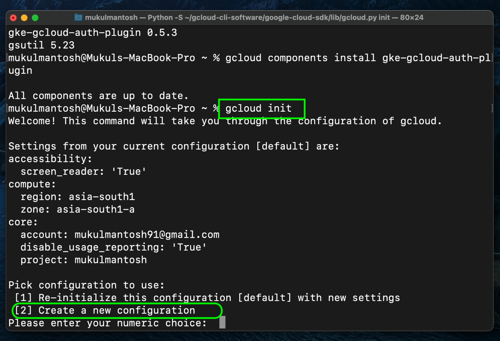

- Step 3: I’ll enter the configuration name as “jetbrains”.


- Step 4: Next, I’ll choose my Gmail account, which is the first option. Make sure you are already logged in to your Gmail account before selecting this option.


- Step 5: I’ll then select the cloud project **jetbrains-387607**, having already created such a project in the Google Cloud console.


Great! The SDK has now been successfully configured.


If you don’t know how to create a new project in Google Cloud, it’s quite simple.

Goto - [https://cloud.google.com/console](https://cloud.google.com/console)

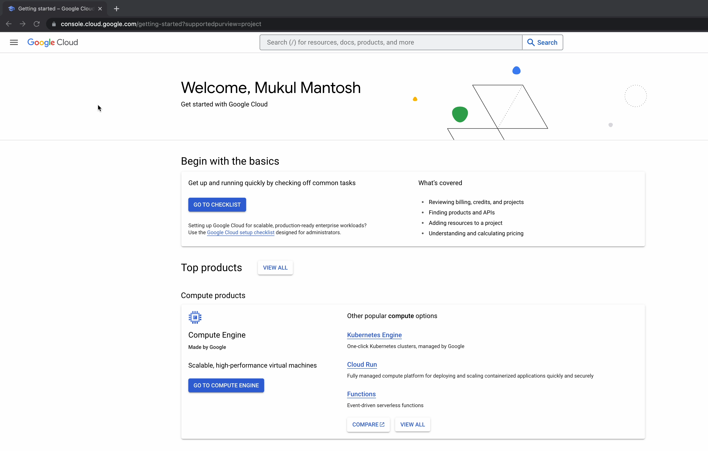

Click on the hamburger icon and hover over the Dashboard.

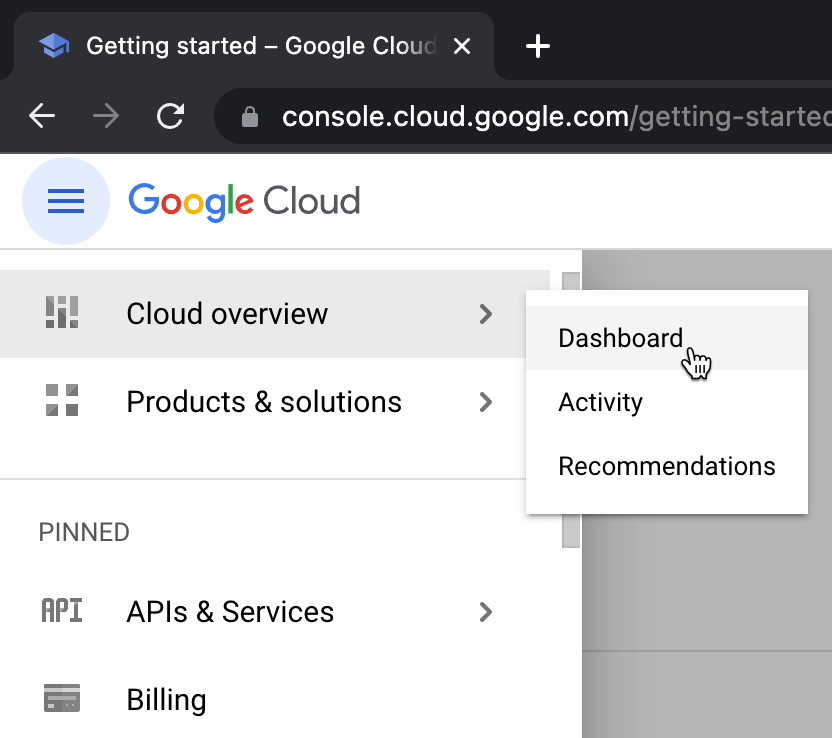

Click on **Create Project**

Provide the **Project Name**.

**Note**: For our use case, I have already created the project **“jetbrains-387607”**

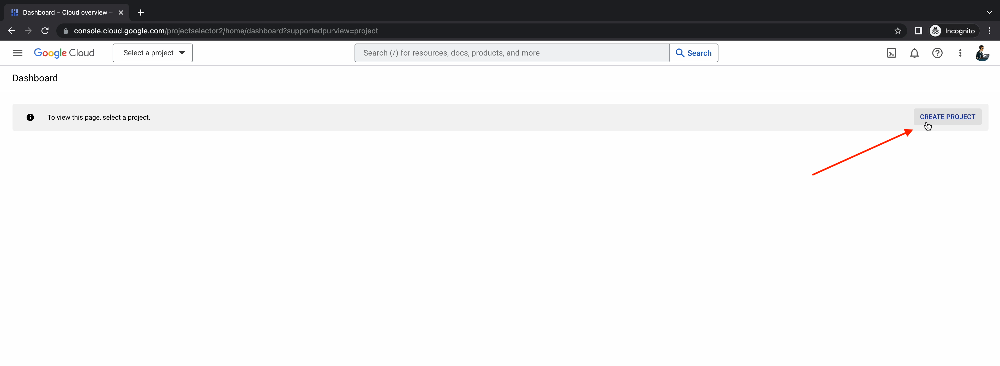
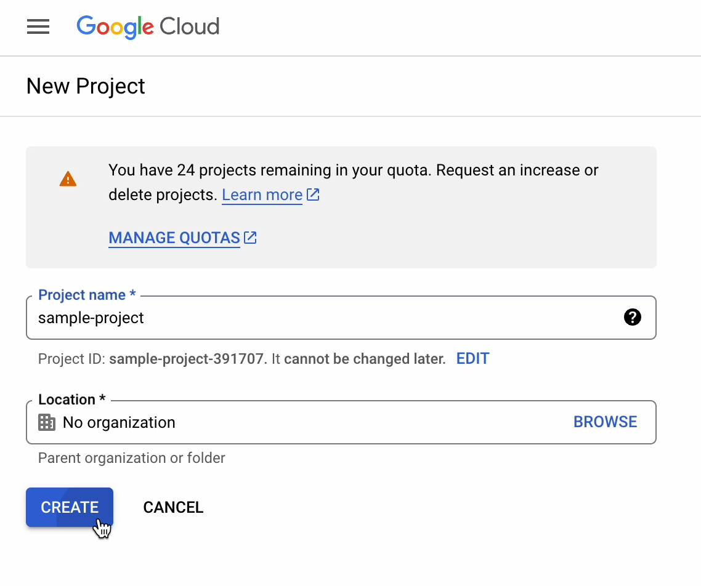

It will take a few seconds to initialize, and then your new project will be up and running.

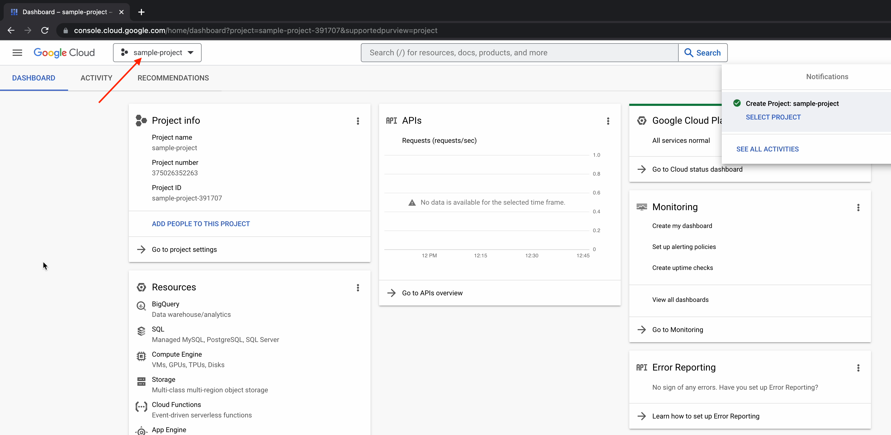

Now, let’s move to PyCharm and install the Google Cloud Code plugin.

Make sure you’ve installed the latest version of PyCharm on your machine. Give a try and [download PyCharm](https://www.jetbrains.com/pycharm/download/) right now. For this tutorial, we’re using PyCharm 2023.1.2.

### The Google Cloud Code plugin

Once you open PyCharm, click on the **Plugins** section.
Search for “Google Cloud Code” and click **Install**.


Once installation is complete, restart the IDE to ensure the changes take effect.

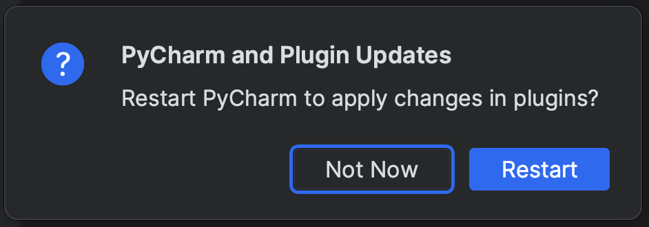

If you want to explore the different releases of Cloud Code then you can check out in [JetBrains Marketplace](https://plugins.jetbrains.com/), and search for “Cloud Code”

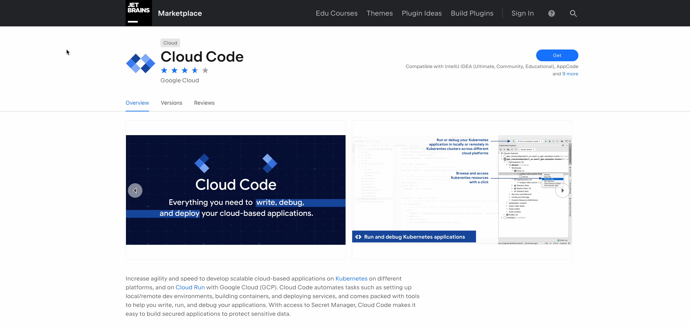

For our tutorial, we will be using **23.5.1-222** version.

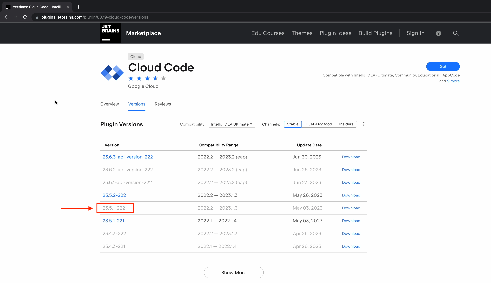

To keep abreast of the latest releases and updates made to Cloud Code, visit the following link: [https://github.com/GoogleCloudPlatform/cloud-code-intellij/releases](https://github.com/GoogleCloudPlatform/cloud-code-intellij/releases).

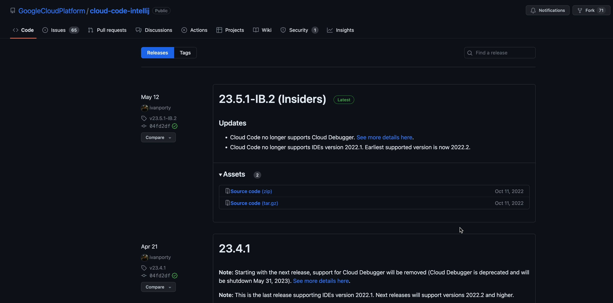
