Hello everyone! Welcome to the PyCharm FastAPI Tutorial Series.

In this tutorial we are going to set up the FastAPI project with PyCharm. We are going to use the PyCharm Professional EAP **2021.3** which includes a FastAPI project type. EAP stands for Early Access Program but very soon it will be part of the stable release.

- **Note**: Just for your information, I am running this entire project in a virtual machine through VMWare workstation which has Ubuntu 20.04 LTS

## Virtual Environment

Let’s begin. So, before going ahead we have to create a virtual environment. If you are interested you can even create a virtual environment from PyCharm itself, but I would like to go with the terminal.

```
python3 -m venv FastEnv
```


Once environment has been successfully created, we will move ahead with PyCharm.

## JetBrains Toolbox


So, for running PyCharm in my system, I normally use the [Toolbox](https://www.jetbrains.com/toolbox-app/) offered by Jetbrains.

Definitely a great tool for saving time & effort.

- Updates automatically
- Update the plugins together with IDE
- Roll back and downgrade
- Maintain multiple versions side by side
- Use different products offered by Jetbrains

I am going to use PyCharm 2021.3 EAP, because it contains the FastAPI project type.

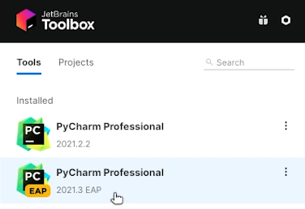

## Creating a New Project

I will click on **New Project**.

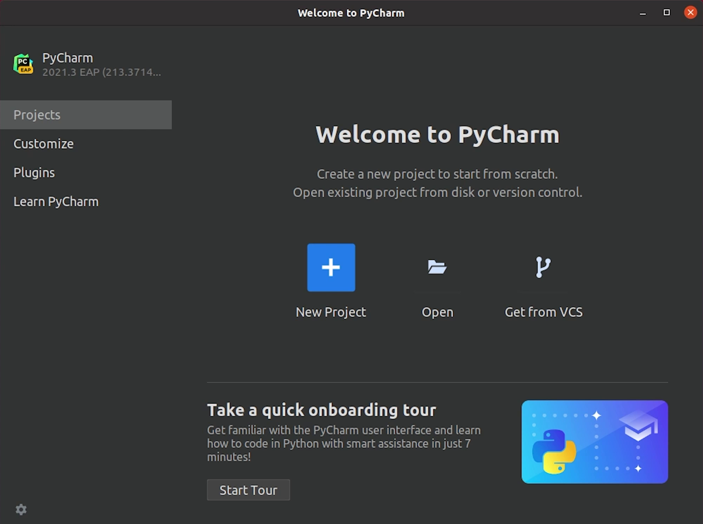

You can observe on the left side the FastAPI.

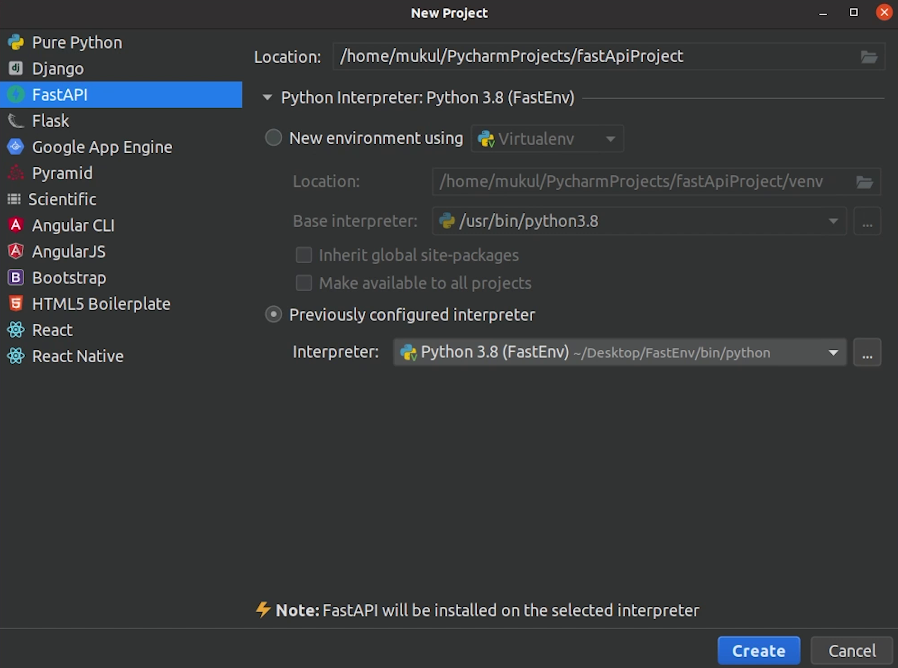

I am going to change the project location to ecommerce.

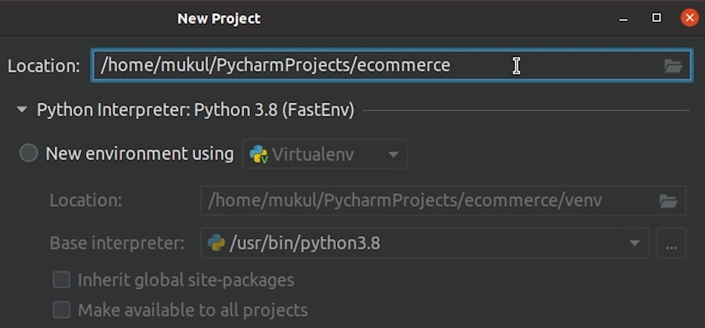

I am going to click on the previously configured interpreter. It has automatically picked up the location, this is because I have used the same environment name for a different project earlier.

There are many flavours provided by PyCharm for setting up the interpreter like Docker, remote SSH, WSL etc.


Once the interpreter has been configured, I am going to click on **Create**.

Our project got successfully bootstrapped. PyCharm has generated two files: `main.py` and `test_main.http`

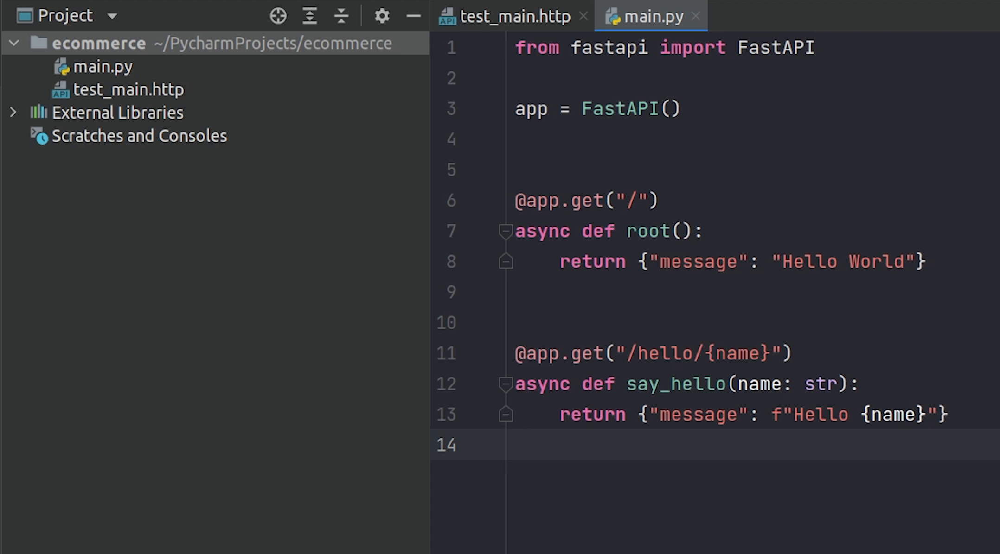

The `main.py` contains two apis : `root` and `say_hello`

The `root` is going to return a json response with a message hello world and the `say_hello` function returns a string
which accepts a parameter name from the user.

If you have observed then you can see that it took only 8 lines of code to write our first API.

The `test_main.http` contains the FastAPI endpoints where you can test your rest apis,
something similar to [Newman](https://github.com/postmanlabs/newman) CLI.

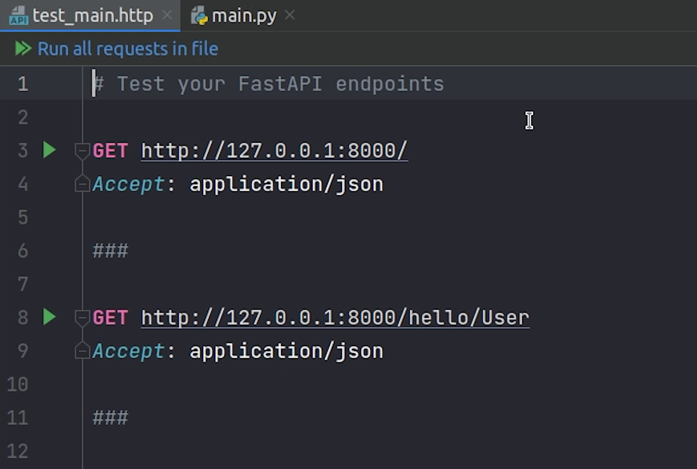

So, let’s begin by running our application. I will click on **Run** and then **Run ‘ecommerce’**.

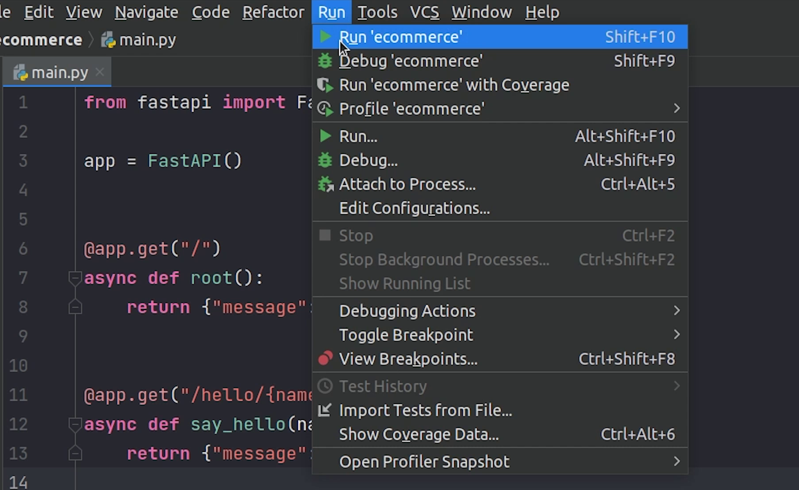

You can observe the console output, it is running successfully on localhost on port 8000.

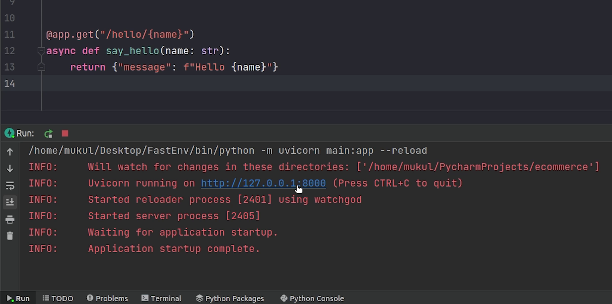

I will open the browser and check the response.

Yes, it works fine. I got the response Hello World.

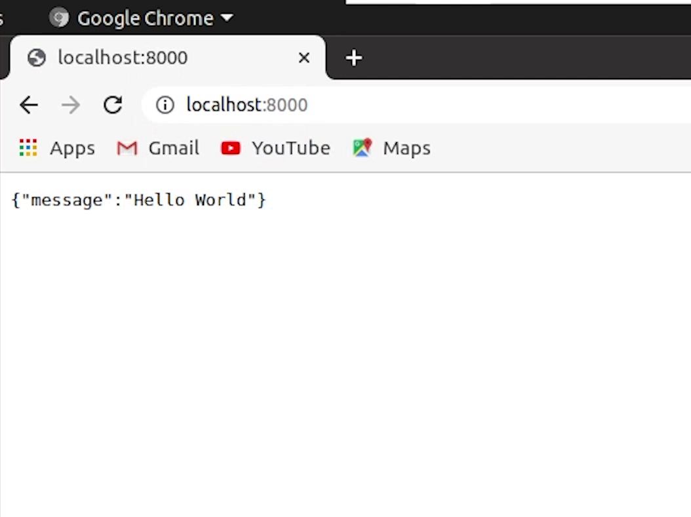

## FastAPI Docs

FastAPI also generates automatic API docs for us at path **/docs**. It uses the [OpenAPI](https://www.openapis.org/) standard for defining API.

It uses two flavours: [Swagger UI](https://swagger.io/tools/swagger-ui/) &
[ReDoc](https://github.com/Redocly/redoc).


Let me test one of our APIs. I am going to pass the **name** and click on **execute**.


And yes, it works. You can see the response message **“Hello Sample”**

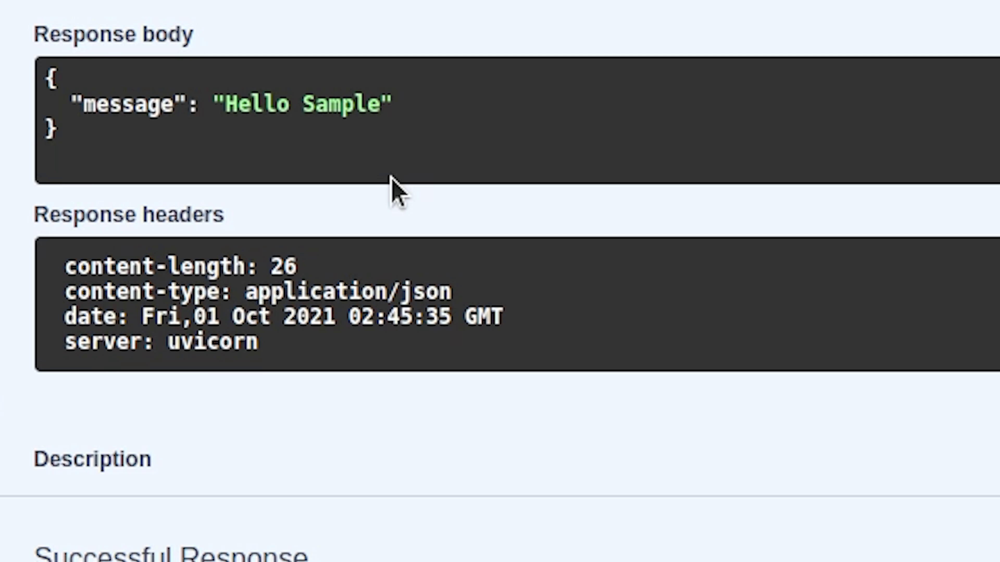

You can do a lot of things with docs, if you want to play around then definitely check the [official documentation](https://fastapi.tiangolo.com/).


I am going to provide a little more meta information to my docs like
title, description, version, etc.

Let me save it and refresh. You can see that title, description and version
have been updated.

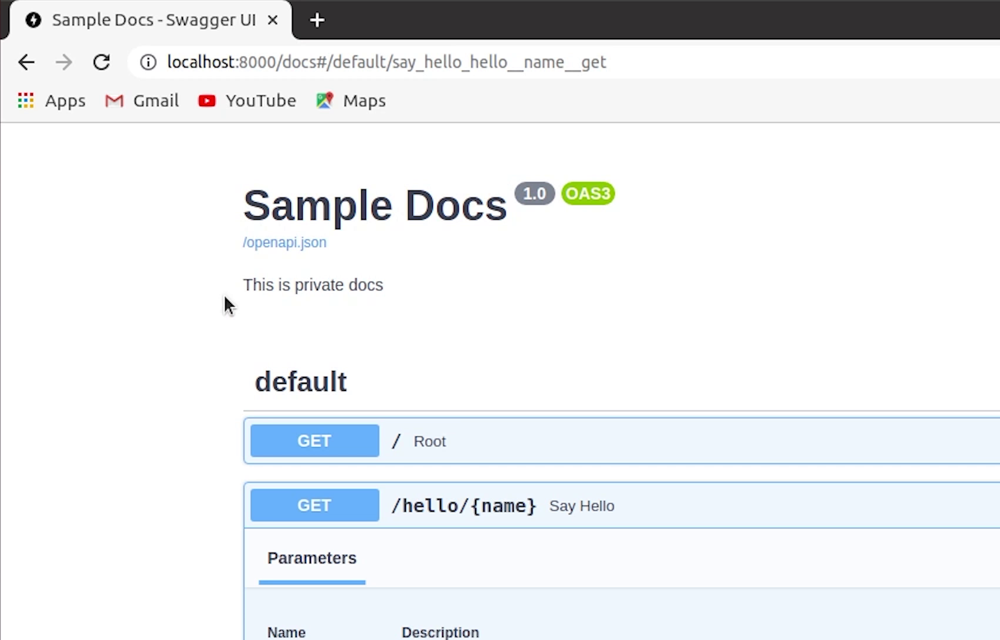

You can also disable it while your application is running in production, so you don’t want to expose docs to the outside world.

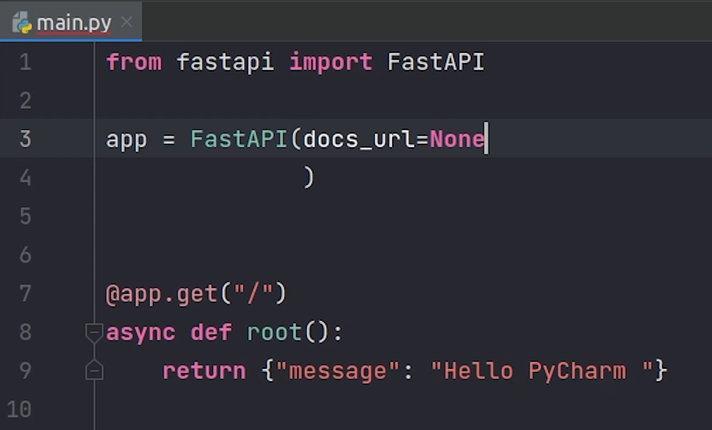

You can see now it's showing Not Found, this is really cool.

You can change path name in `docs_url` to point towards a different path name, completely up to you.

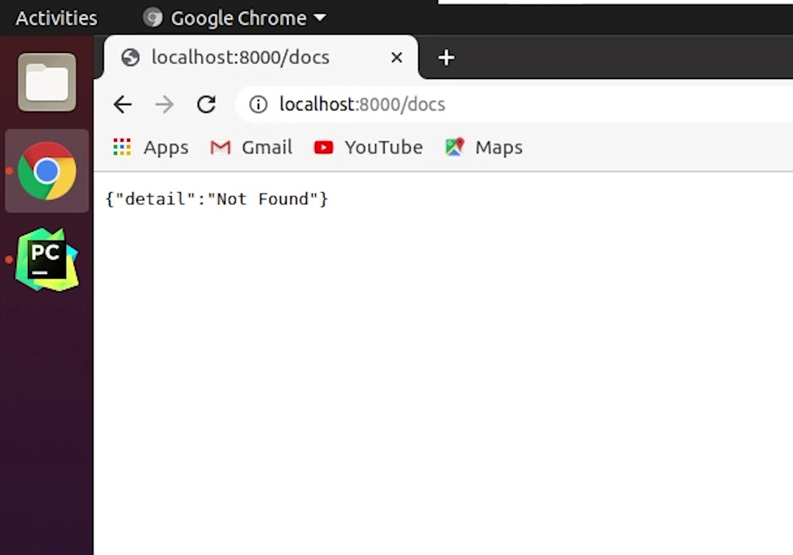

Let me show you one more interesting thing. I am going to change the name from string to integer.

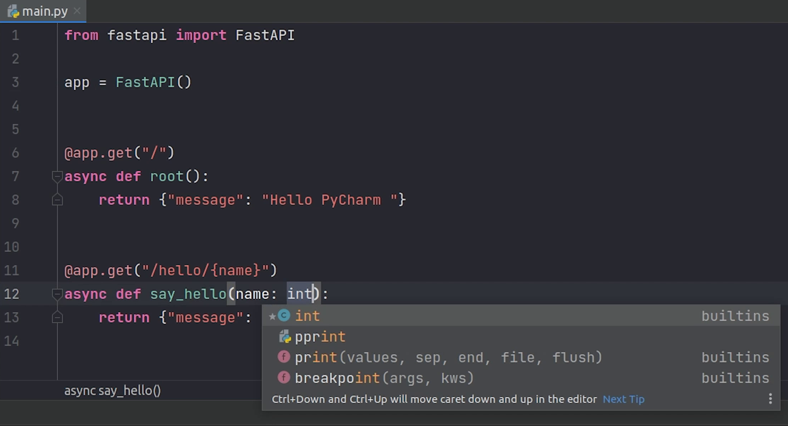

Now, you can observe in the docs that now it needs integer to be passed instead of string.

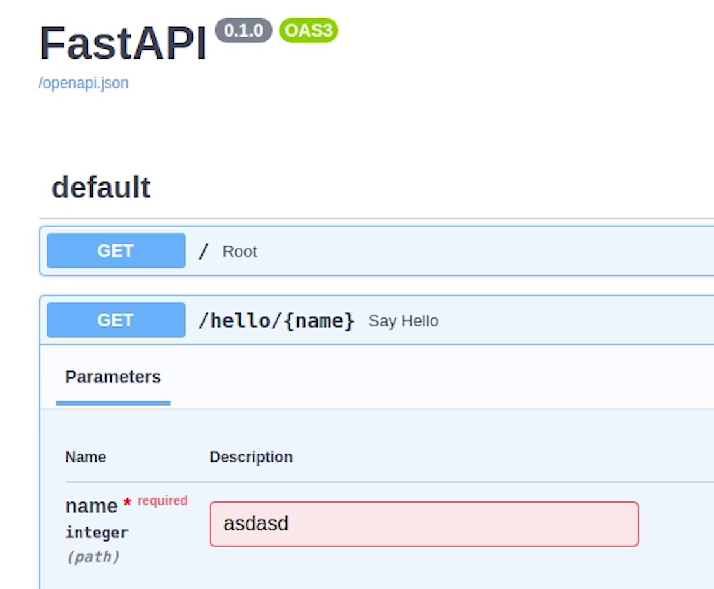

Even if I pass a string, it’s not going to accept it. You don’t even need to write a separate validation for it.

Thanks to [Pydantic](https://pydantic-docs.helpmanual.io/) &
[type-hints](https://docs.python.org/3/library/typing.html), this makes life easy.

I hope you are going to explore more amazing features provided by FastAPI.

In the next tutorial we are going to look into integrating FastAPI with Postgres along-with outlining our project.
