Hello everyone! Welcome to the PyCharm FastAPI Tutorial Series.

As you know in our previous video we completed the feature of placing the new order. But we wanted to make sure that, once the order has been placed, then we need to send an email saying that your order has been successfully completed. That’s what we are going to cover in today’s tutorial.

## AWS SES

Before moving ahead, I expect from the audience that they have experience working with AWS.

We will be using [Amazon SES](https://aws.amazon.com/ses/) also known as **Simple Email Service** along-with [Celery](https://docs.celeryproject.org/en/stable/) for task-processing and [Redis](https://docs.celeryproject.org/en/stable/) as in-memory datastore.

You can even use FastAPI [Background Tasks](https://fastapi.tiangolo.com/tutorial/background-tasks/), but if you are performing some heavy computation, then it's better to go for Celery.

For sending email, the background tasks are good enough, but we intended to use Celery.

Coming back to AWS, for our testing purpose we need to verify an email, and only after that, we will be able to send it.

Only verified email addresses can be sent under **From** & **To**.

When you apply for a production use case, you don’t need to focus on verifying email addresses. But Amazon has stringent controls of sending emails, like handling bounces and complaints and not spamming users. Amazon has a good reputation with the ISPs. Thus, if you don’t follow that carefully, then you might end up losing reputation and indeed your service might get stopped.

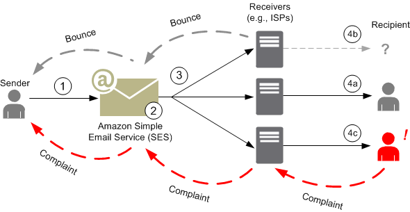
Image Credits : Amazon Web Services (AWS)

Follow the below link for more information :

- [https://docs.aws.amazon.com/ses/latest/DeveloperGuide/send-email-concepts-process.html](https://docs.aws.amazon.com/ses/latest/DeveloperGuide/send-email-concepts-process.html)
- [https://docs.aws.amazon.com/ses/latest/DeveloperGuide/success-metrics.html](https://docs.aws.amazon.com/ses/latest/DeveloperGuide/success-metrics.html)

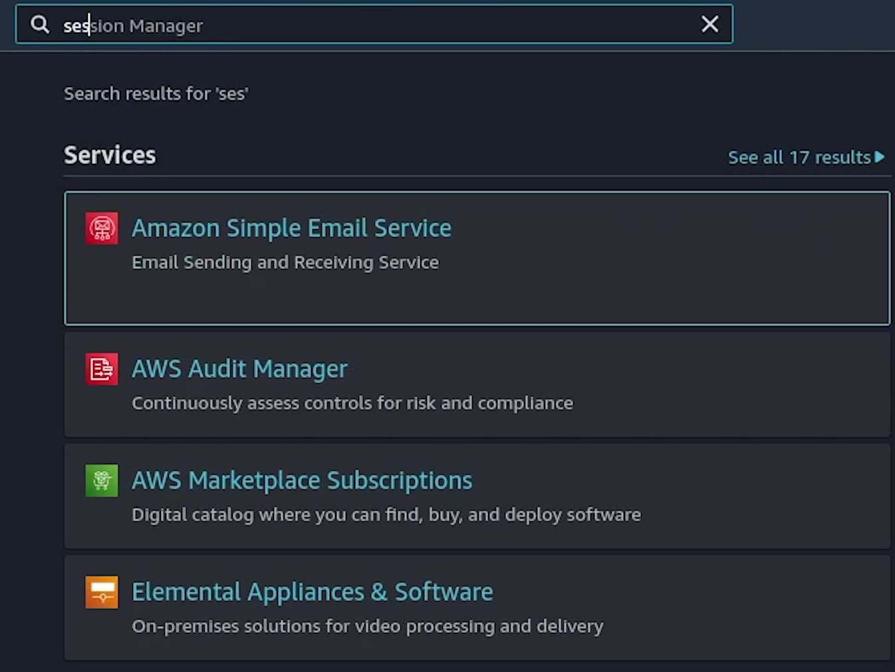

Coming back, I will be using a temporary email for verification where I will be sending emails for testing. You can also use your personal email accounts.

I will go to this website **[getnada](https://getnada.com/)**, or you can also check **[mailinator](https://www.mailinator.com/)**. They provide temporary email service.

I will provide random email address like **fastapi@boximail.com**.

Let me try to verify this.

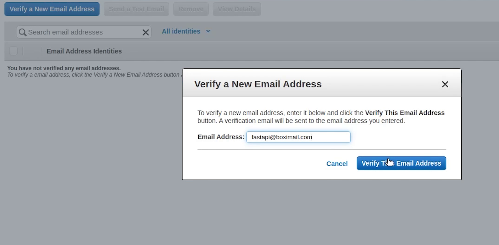


Sometimes the verification links appear immediately, but it also gets delayed sometimes. As this is a temporary email you might face issues in receiving.

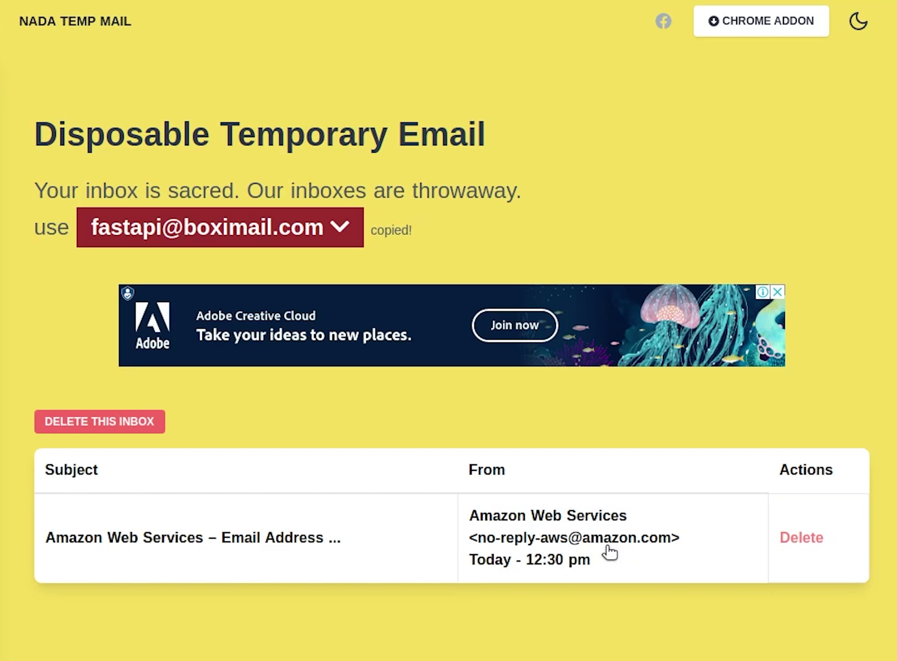

As you can see that we have received an email from AWS, let me verify it quickly.

Okay our email has been successfully verified. We can go ahead and send emails to this address.


## Installing Redis

Let’s come back to our terminal where I am going to install _Redis_.

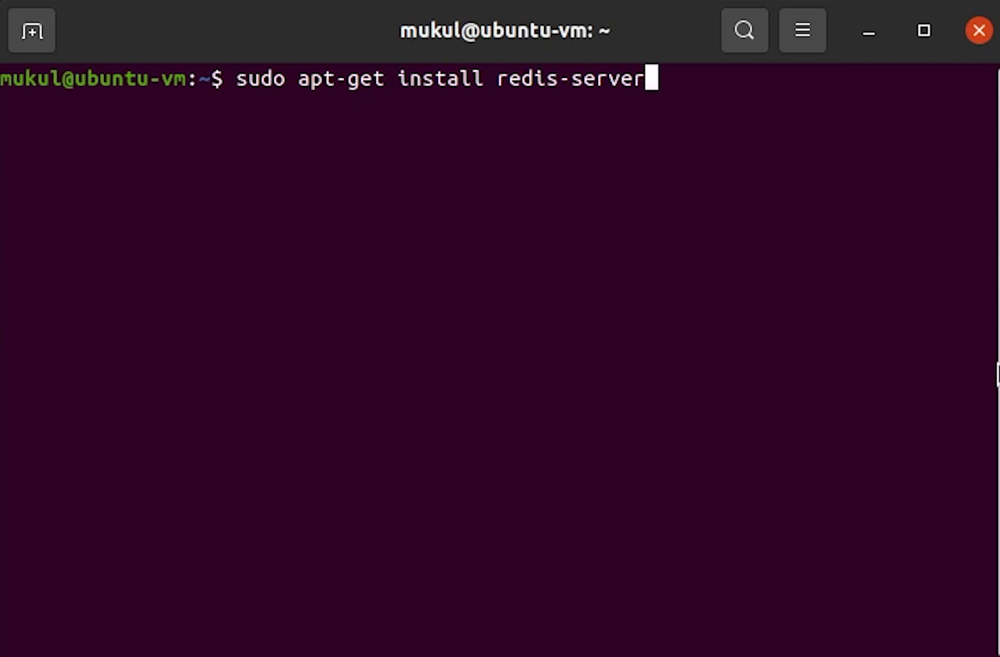

Let me check it’s working fine by running the [PING](https://redis.io/commands/PING) command.

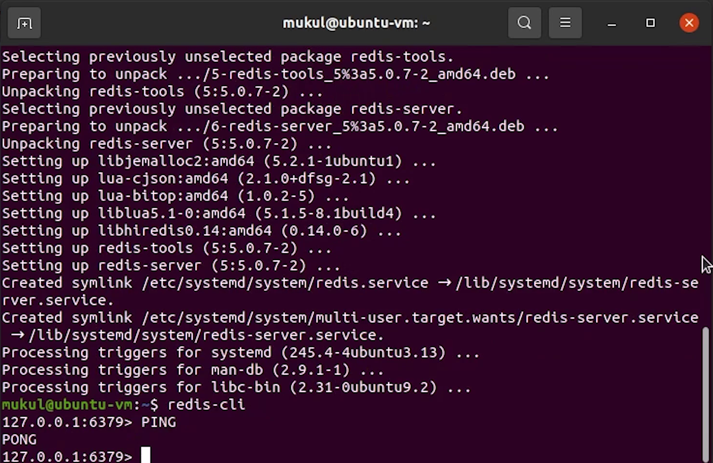

I got the reply, nice.

## Installing Celery

Next, I need to install celery.

```
pip install Celery==5.1.2
```

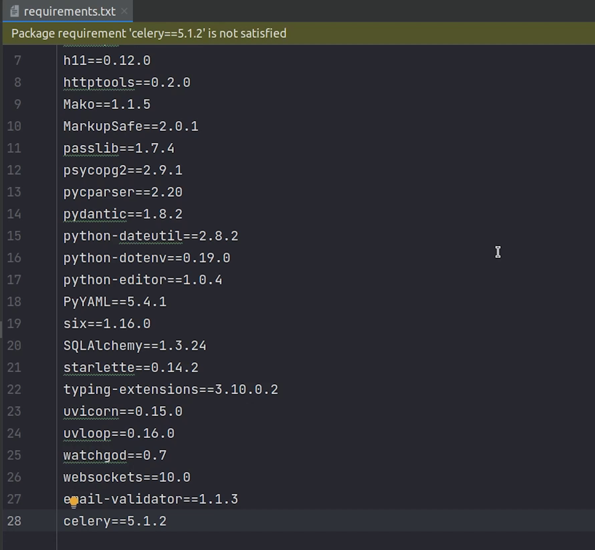

I will go to **main.py** where I will initialize Celery. I need to update the broker to point towards the redis instance.

Backend will be where all the celery results will be stored.

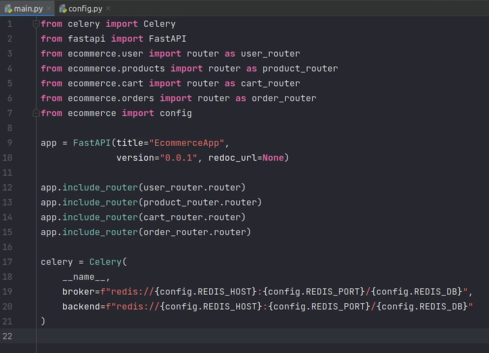

I will update the environment variables for redis in config.


Make sure to install the python redis package.

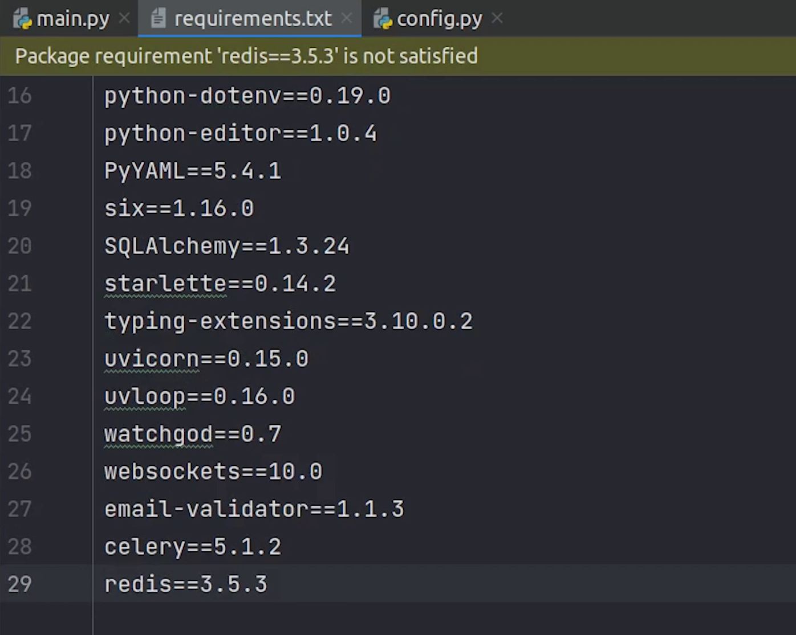

Under `celery.conf.imports` we need to add our task file

The task file will import a shared task from celery which is going to process the `send_email` function.

**main.py**

```python
celery.conf.imports = [
    'ecommerce.orders.tasks',
]
```

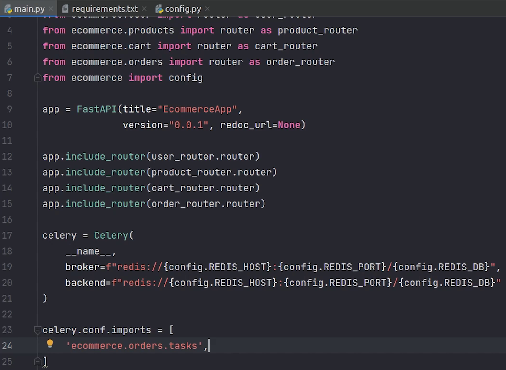


I will be writing the implementation in a while, but let’s first start the celery worker.

I will open the terminal and type:

```
celery -A main.celery worker -l info ---pool=prefork
```

- **-A** stands for application
- **-l** stands for loglevel
- **--pool** is basically the execution pool, it supports different pools like prefork, solo, eventlet and gevent.

The prefork pool implementation is based on Python’s multiprocessing. It allows your Celery worker to side-step Python’s [Global Interpreter Lock](https://docs.python.org/3/glossary.html#term-global-interpreter-lock) and fully leverage multiple processors.

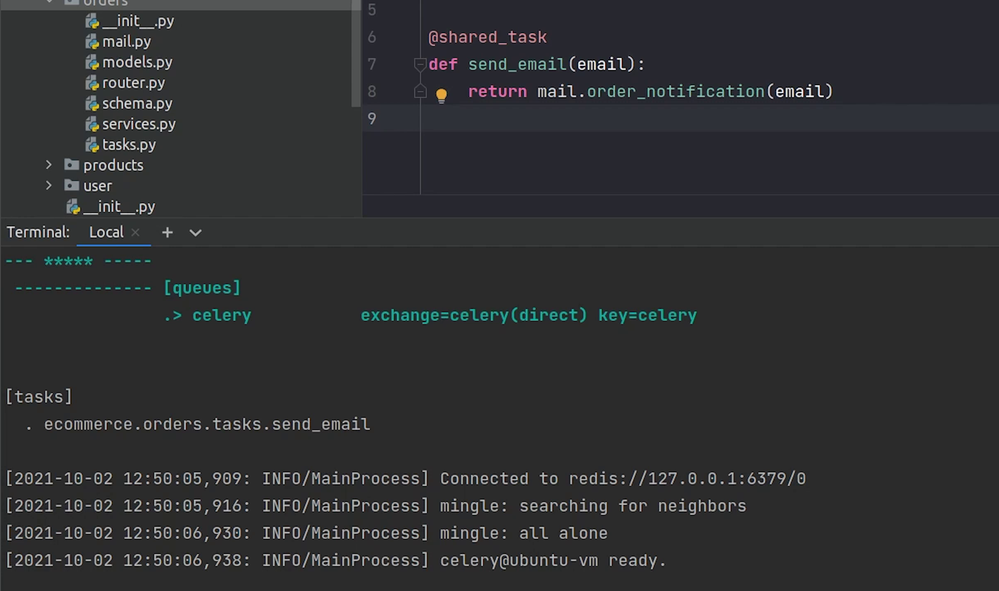

You can observe that Celery is now listening to our registered tasks `send_email`.

I need to complete the implementation for order notification.

`tasks.py`

```python
from celery import shared_task
from . import mail


@shared_task
def send_email(email):
    return mail.order_notification(email)
```

**mail.py**

You can see that the code that contains a short snippet of html code which is going to show the message of order placed successfully.

We have also defined the sender email, the one which we verified earlier along-with aws region and subject name.

Make sure you update that when you are working on it.

```python
import re

import boto3
from botocore.exceptions import ClientError


def clean_html(raw_html):
    cleaner = re.compile('<.*?>')
    clean_text = re.sub(cleaner, '', raw_html)
    return clean_text


# Replace sender@example.com with your "From" address.
# This address must be verified with Amazon SES.
SENDER = "FastAPI <changethisemailaddress@gmail.com>"

# If necessary, replace us-west-2 with the AWS Region you're using for Amazon SES.
AWS_REGION = "ap-south-1"

# The subject line for the email.
SUBJECT = "New Order Placed"

# The email body for recipients with non-HTML email clients.


# The HTML body of the email.
BODY_HTML = """<html>
<head></head>
<body>
  <h1>Order Successfully Placed !</h1>
  <p>Hi, Your new order has been successfully placed. You will receive more information shortly.</p>
</body>
</html>
            """

BODY_TEXT = clean_html(BODY_HTML)

# The character encoding for the email.
CHARSET = "UTF-8"

# Create a new SES resource and specify a region.
client = boto3.client('ses', region_name=AWS_REGION)


def order_notification(recipient):
    # Try to send the email.
    try:
        # Provide the contents of the email.
        response = client.send_email(
            Destination={
                'ToAddresses': [
                    recipient,
                ],
            },
            Message={
                'Body': {
                    'Html': {
                        'Charset': CHARSET,
                        'Data': BODY_HTML,
                    },
                    'Text': {
                        'Charset': CHARSET,
                        'Data': BODY_TEXT,
                    },
                },
                'Subject': {
                    'Charset': CHARSET,
                    'Data': SUBJECT,
                },
            },
            Source=SENDER,
            # If you are not using a configuration set, comment or delete the
            # following line
            # ConfigurationSetName=CONFIGURATION_SET,
        )
    # Display an error if something goes wrong.
    except ClientError as e:
        print(e.response['Error']['Message'])
    else:
        print("Email sent! Message ID:"),
        print(response['MessageId'])
```

The structure of sending email has been taken from the `boto3` official documentation.

References:

- [https://docs.aws.amazon.com/ses/latest/DeveloperGuide/send-using-sdk-python.html](https://docs.aws.amazon.com/ses/latest/DeveloperGuide/send-using-sdk-python.html)
- [https://boto3.amazonaws.com/v1/documentation/api/latest/guide/ses-template.html](https://boto3.amazonaws.com/v1/documentation/api/latest/guide/ses-template.html)

Make sure to install [boto3](https://boto3.amazonaws.com/v1/documentation/api/latest/guide/quickstart.html) library which is basically the Python SDK for AWS.

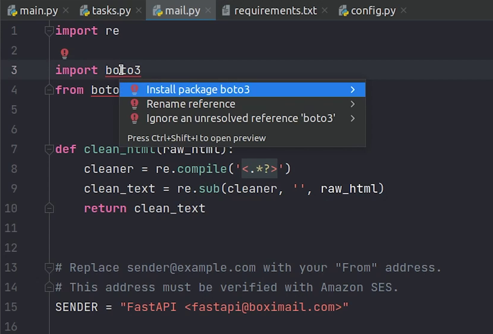

```
pip install boto3==1.18.26
```

## AWS CLI

Before moving ahead, make sure you have [AWS CLI](https://aws.amazon.com/cli/) installed on your machine.


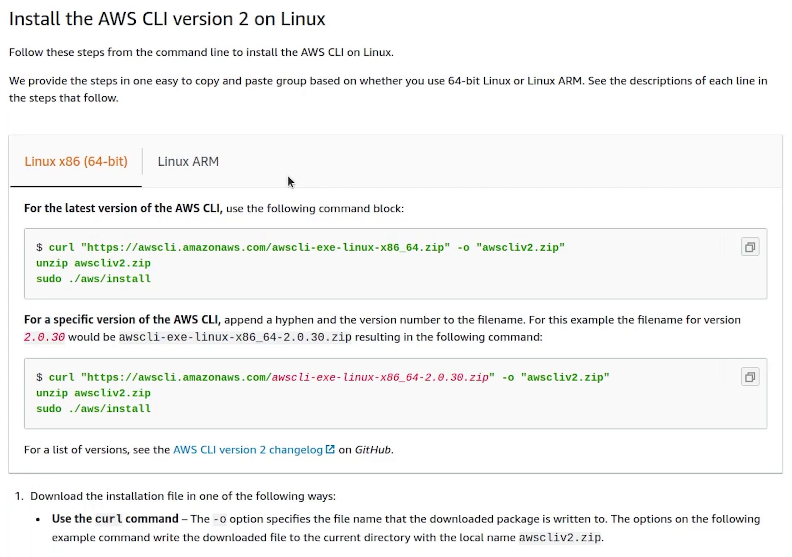

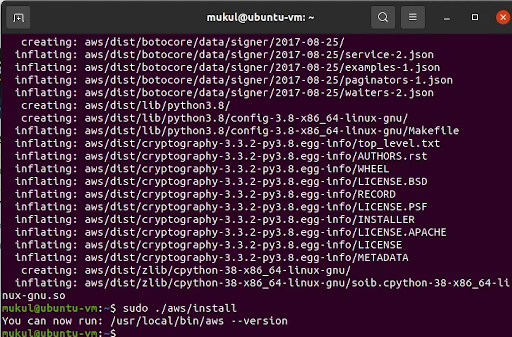

The installation process is documented in the below link.

- [https://docs.aws.amazon.com/cli/latest/userguide/getting-started-install.html](https://docs.aws.amazon.com/cli/latest/userguide/getting-started-install.html)

Once the installation is complete, we need to set up the SMTP Credentials which is required for sending emails.

I will update the _Access Key ID_ and _Secret Access Key_ in the [IAM](https://aws.amazon.com/iam/) console.

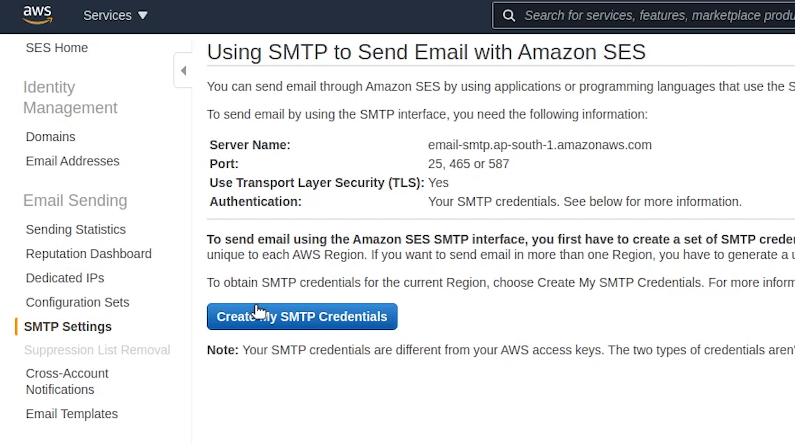


Let me now try to do a dry run by sending an email and check whether I am receiving it or not.

I will open up the Python console and import the mail function.

I will try to send to the same verified email address.


Looks like something is wrong with the access. Let me try to investigate.


I will provide full access for sending emails, but I don’t **recommend** that. It’s not a good practice, this is a tutorial we can ignore this case, but make sure when you are working on a live production use case, you should have stringent controls over your access.


I will revoke this access key and create a new one. I hope you are already aware of how to do this, if not, then watch the video. It will be helpful for you to navigate.

The access keys shown in the image will be different from yours. Don't copy the access key which is shown in the image, because later we will delete these keys, and it stays invalid.

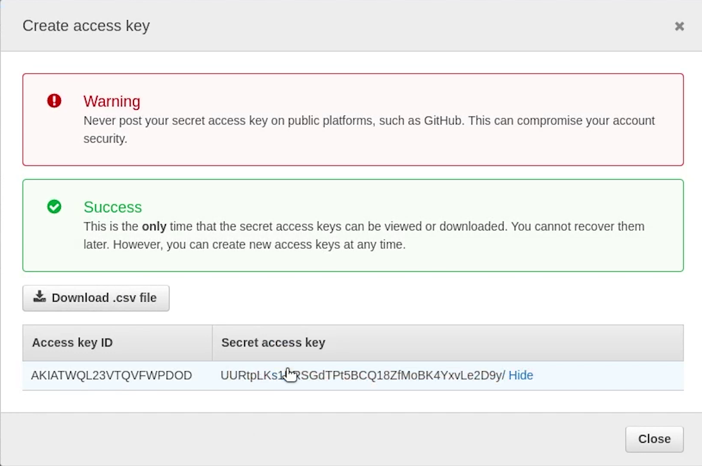

Let me re-test once more.

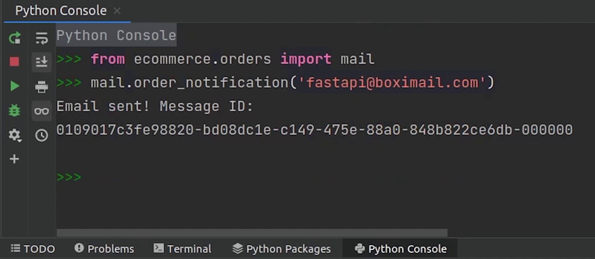

Yes, the email has been sent successfully, and we have successfully received the email as well.

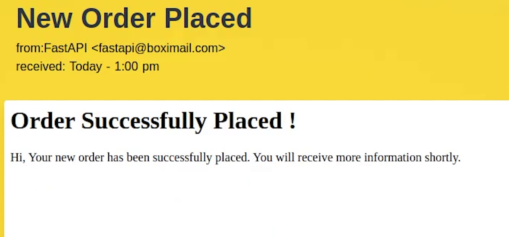

I will restart Celery to pick up the new changes.

Now, I will try to place an order from swagger UI and expect that once the order has been placed, we will receive an email.

Again I am going to purchase an IPhone 13 whose product id is 1.

I need to do some code modification in my order function.

I need to replace this line with our task.

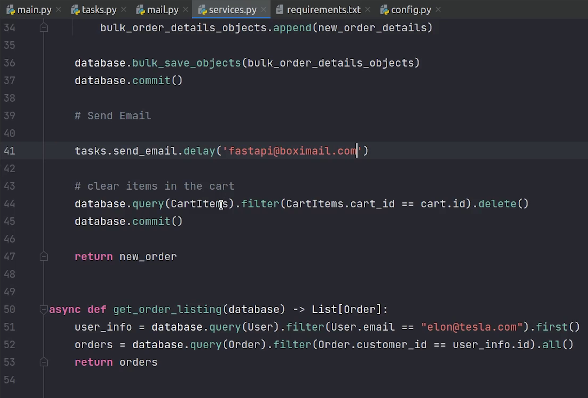

```python
from . import tasks

tasks.send_email.delay('fastapi@boximail.com')
```

Delay is a shortcut to send a task message to the background.

Now, I will come back and try to execute the order.

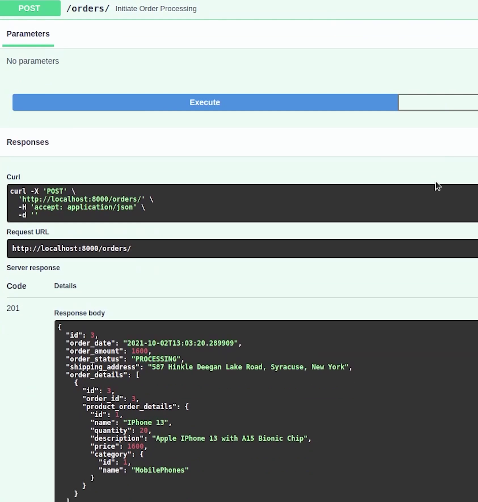

As you can see, Celery has picked up the task, and we got the response as **“Email Sent”** with the message ID.

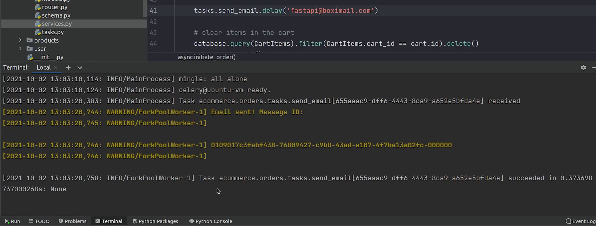

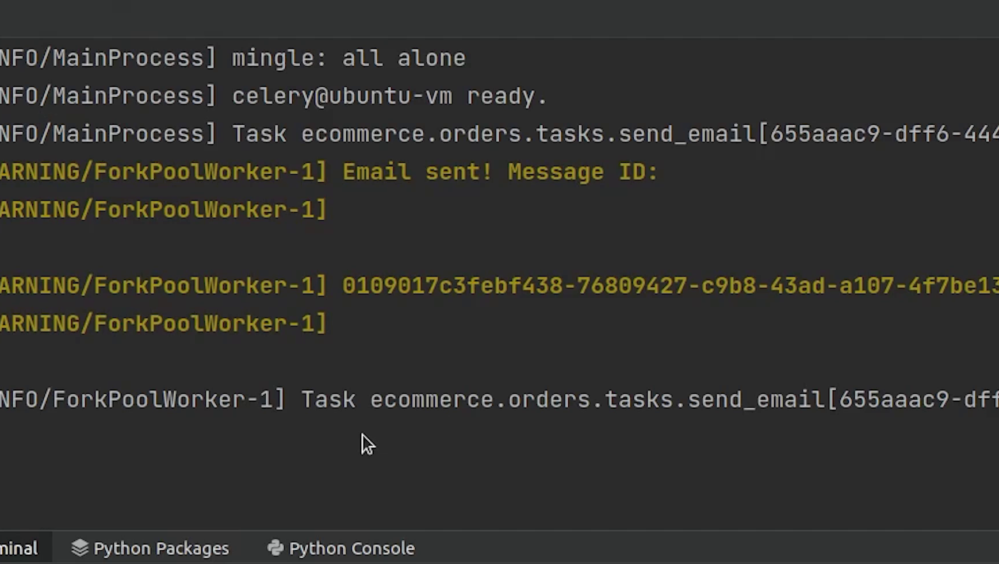

We have also received the new mail.

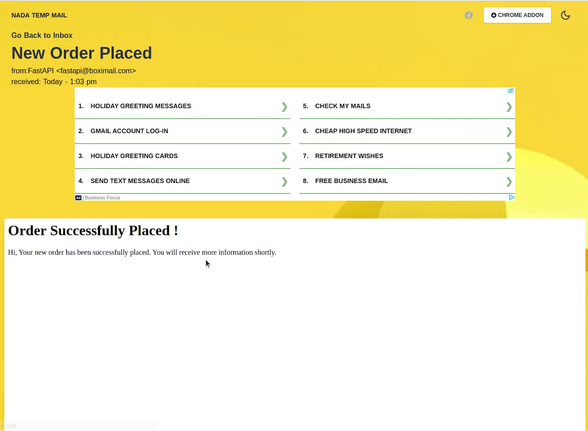

So, I hope you got a basic understanding of how things are working behind the scenes.

If you have more interest, please check the Celery [documentation](https://docs.celeryproject.org/en/stable/).

You can now clearly visualize the entire flow of adding products and then pushing to cart and finally placing order and getting the order confirmation over the mail.

I will see you in the next tutorial, where we will be focusing on Authentication & JWT.
