Hello everyone! Welcome to the PyCharm FastAPI Tutorial Series.

We have successfully completed the user module, let’s now move to products where we are going to do the same kind of operations creating models, apis,
schema etc.

# Creating Models

I am going to create `models.py` file under products.


I will be doing necessary imports.

I am going to create a Category model which inherits from Base.

Every product comes under a category. I will define two columns `id` and `name`.

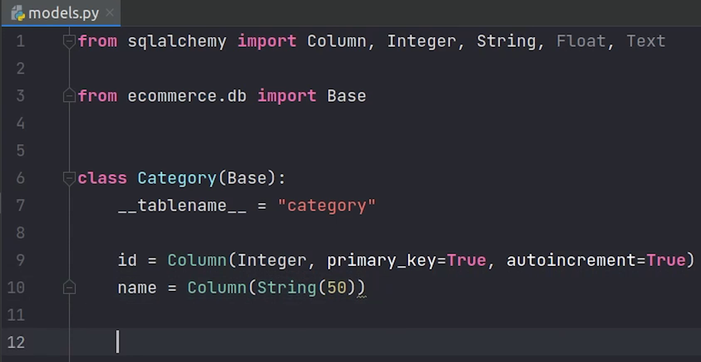

Next, I am going to create a Product model.

The columns which I will be defining will be :

- id
- name of the product
- quantity basically referring to items in stock
- description about the product
- price

I will create a relationship between category and product, as you know every product comes under a category.

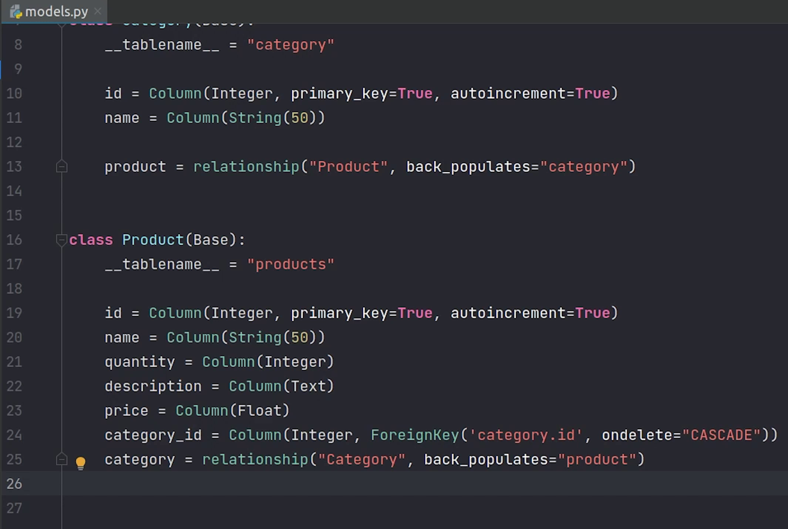

I will do an import from `sqlalchemy.orm` import `relationship`.

I will define relationships for products. The `back_populates` argument tells SQLAlchemy which column to link with when it joins the two tables

In Product model, I will be defining `category_id` which is a ForeignKey referencing to `category.id`

Basically, a foreign key is a set of attributes in a table that refers to the primary key of another table.

`models.py`

```python
from sqlalchemy import Column, Integer, String, Float, ForeignKey, Text
from sqlalchemy.orm import relationship

from ecommerce.db import Base


class Category(Base):
    __tablename__ = "category"

    id = Column(Integer, primary_key=True, autoincrement=True)
    name = Column(String(50))

    product = relationship("Product", back_populates="category")


class Product(Base):
    __tablename__ = "products"

    id = Column(Integer, primary_key=True, autoincrement=True)
    name = Column(String(50))
    quantity = Column(Integer)
    description = Column(Text)
    price = Column(Float)
    category_id = Column(Integer, ForeignKey('category.id', ondelete="CASCADE"), )
    category = relationship("Category", back_populates="product")
    order_details = relationship("OrderDetails", back_populates="product_order_details")
    cart_items = relationship("CartItems", back_populates="products")
```

We are done with the model part.

Just to give an example, a category can have multiple products, like you can take electronics as a category under which multiple products like Television,
Laptops, Mobile Phones will fall under that.

You can even do deep nesting like Television as category and products like LCD, LED, OLED TVs etc.

# Schema Migration

I need to register this model in alembic and then generate the schema.

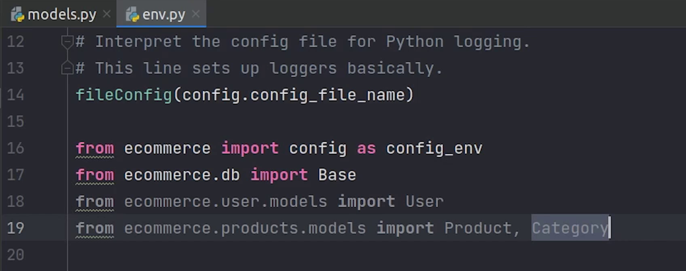

I will type _alembic revision --autogenerate_ to generate the schema file.

To migrate I am going to type _alembic upgrade head_.

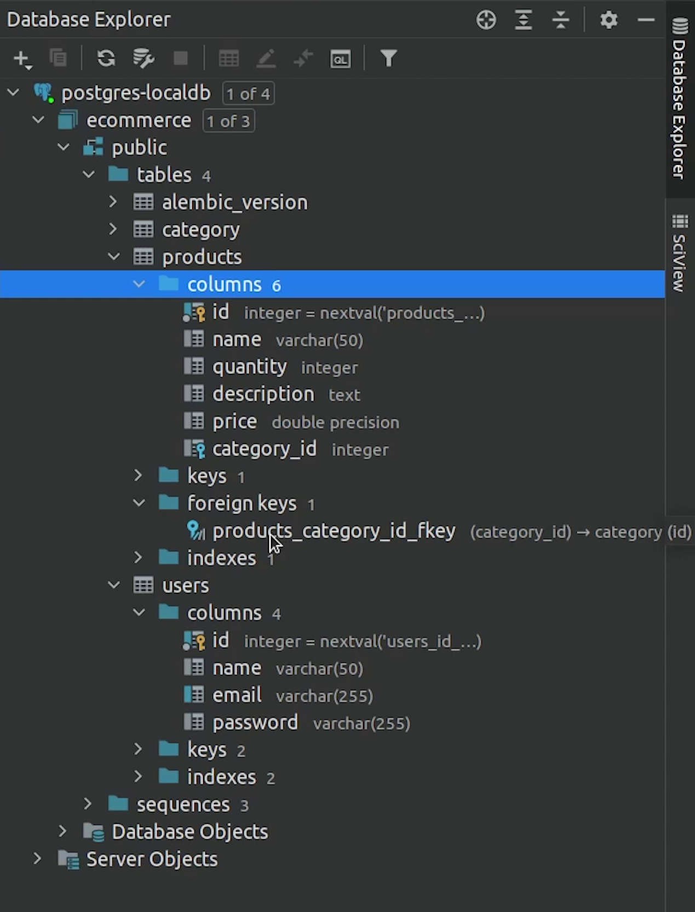

The tables are reflecting in the _Database Explorer_. It’s clearly visible, and you can see the foreign key relationship attached with the category.

# Router & Services

Let’s begin by creating the router, schema and services. As usual what we did previously for the user module, the same approach we are going to follow here.

I am going to do the necessary imports.

We need to initialize the _APIRouter_ and I will provide the tag name as _products_ and prefix will be _/products_.

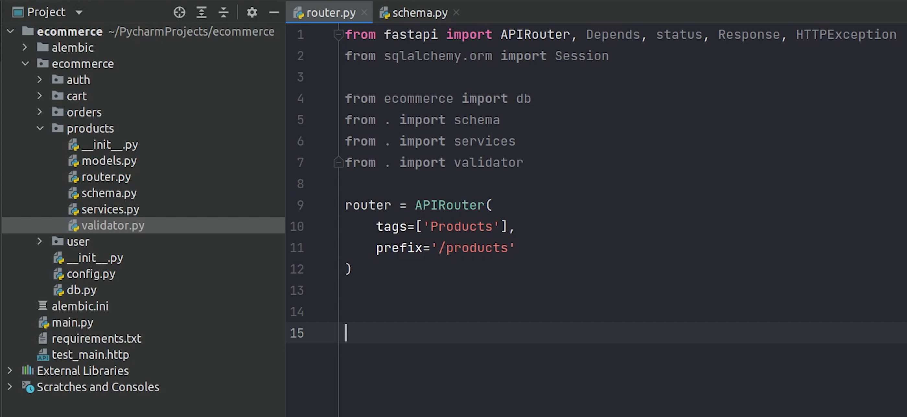

Let’s begin by creating our API for Category model. But before that we need to define the pydantic schema.

I will quickly move to the schema.py file.

I will do the necessary imports like BaseModal and `constr` from Pydantic.

_constr_ comes under _Constrained Types_. It’s possible to define primitive types that have more constraints on their values. I will show the use case in a
while.

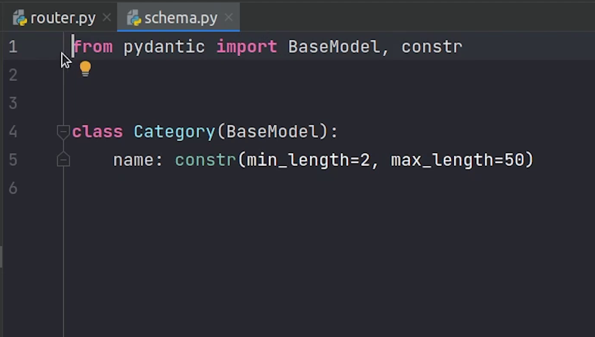

I am going to create a Category Schema which inherits from BaseModal.

We need to accept names whose minimum length needs to be 2 characters to max length up to 50.

To know more about the Field Types, visit the pydantic documentation : [https://pydantic-docs.helpmanual.io/usage/types/](https://pydantic-docs.helpmanual.io/usage/types/).

# Create New Category

Let’s begin with our Create Category API.

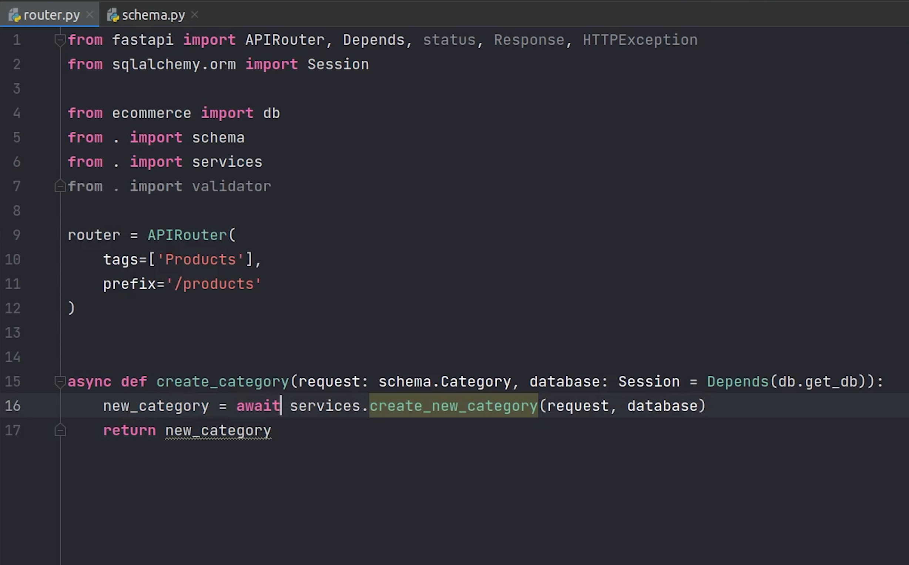

The `create_category` function accepts two parameters: `request` and `database`, whatever is coming in the request pydantic is going to take care of it. After getting the information, we will be committing this information into the database.

I will create a new function : `create_new_category` where I will be writing the business logic.

I will do the necessary imports.

Once the data is stored in the db, we will be returning the category object to the user.

We will be adding the new category to the database session and finally committing it.

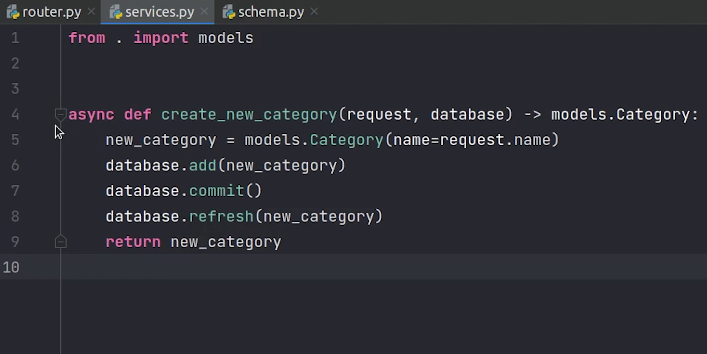

We will also do `database.refresh`, which basically means to expire and then immediately get the latest data for the object from the database. It involves
an immediate database query, which you may consider expensive.

We are done with the service, now let’s register the route.

It’s going to be a `POST` method with status code _201_.

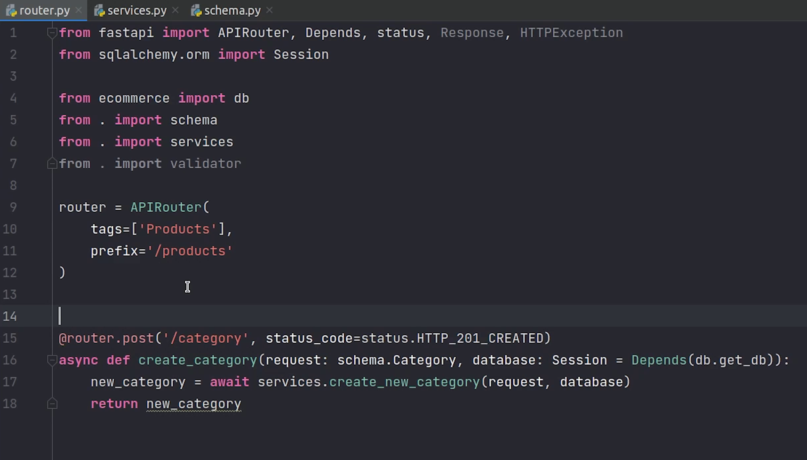

Now, we are going to include the router in `main.py`.

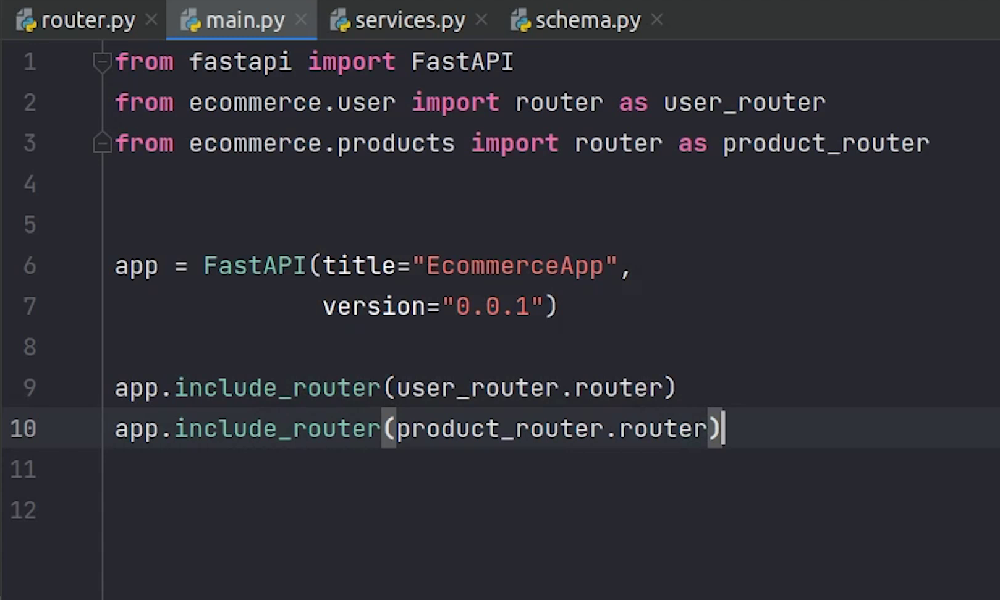

If you don’t do that then the product routes is not going to show up.


You can see product routes is reflecting in Swagger UI. Let's try it out quickly.

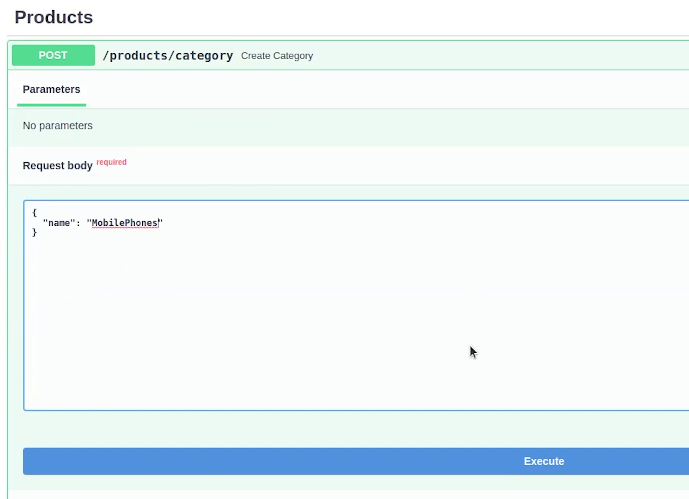

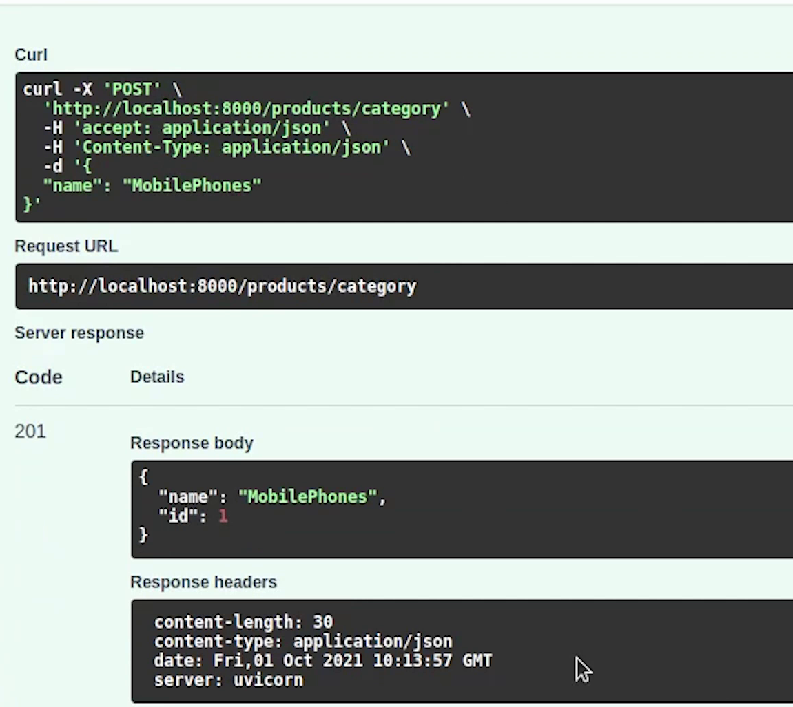

Our category was successfully created with id of 1.

I will create one more with the name _Electronics_.


Let’s move back and complete the remaining apis for our category module.

# Listing All Categories

Now, I am going to define and return all categories present in the database.

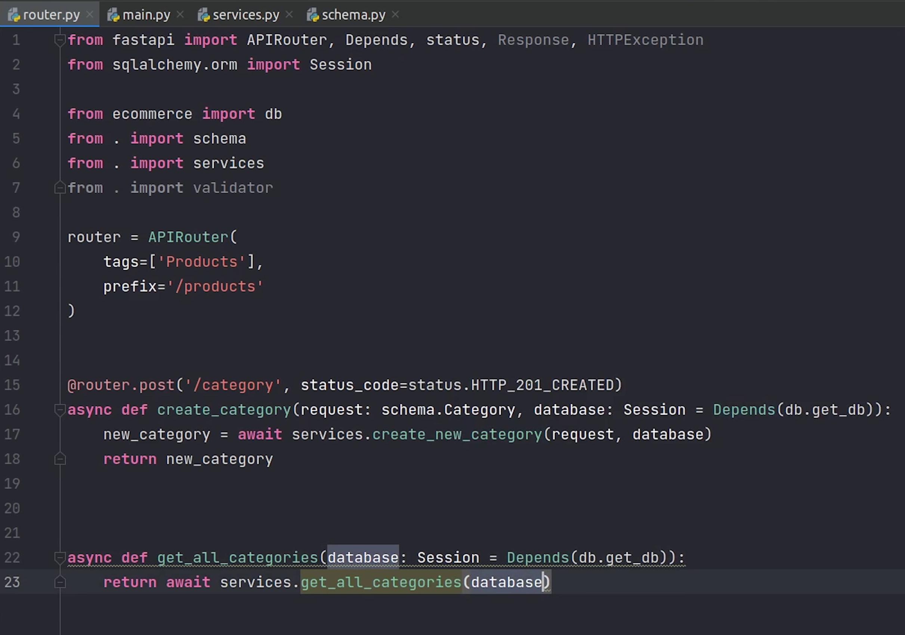

`services.py`


I will register the route which is a GET request and the response model
will be returning a list of categories.

`schema.py`


`router.py`

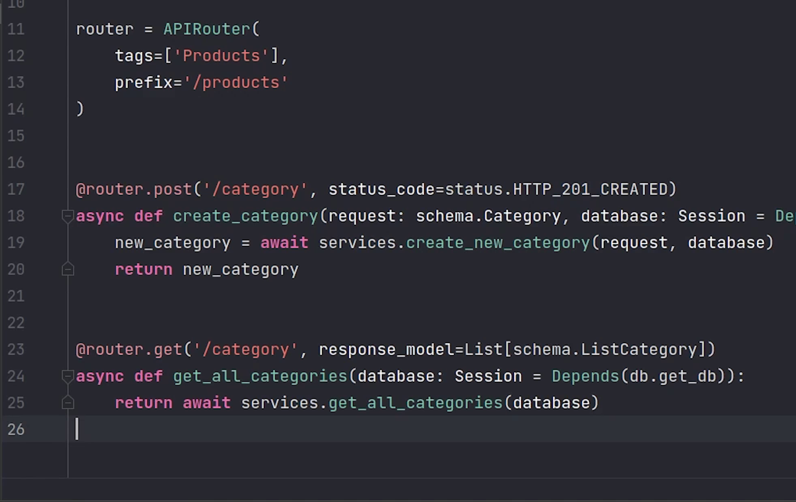

Once the routes have been registered, we will check in the Swagger UI.

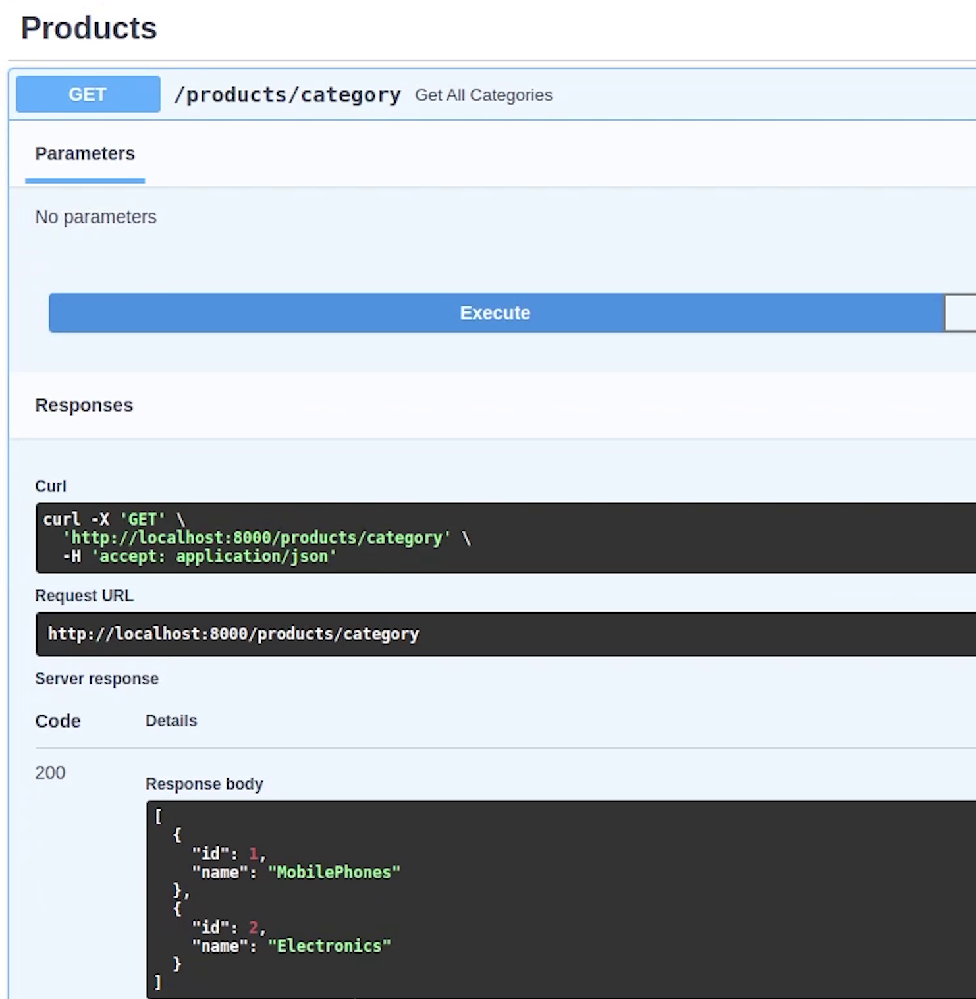

As you can see the two categories : **Electronics** & **MobilePhones** are clearly visible,
it’s returning a list.

# Retrieving Category by ID

Now, let's create our third api to retrieve category by id.

The `get_category_by_id` will return a Category object from the database, it can be `Optional` as well. But I am leaving up to you.

`router.py`

```python
@router.get('/category/{category_id}', response_model=schema.ListCategory)
async def get_category_by_id(category_id: int, database: Session = Depends(db.get_db)):
    return await services.get_category_by_id(category_id, database)
```

`services.py`

```python
async def get_category_by_id(category_id, database) -> models.Category:
    category_info = database.query(models.Category).get(category_id)
    if not category_info:
        raise HTTPException(status_code=status.HTTP_404_NOT_FOUND, detail="Data Not Found !")
    return category_info
```

Once done, I will try to reload the docs again.

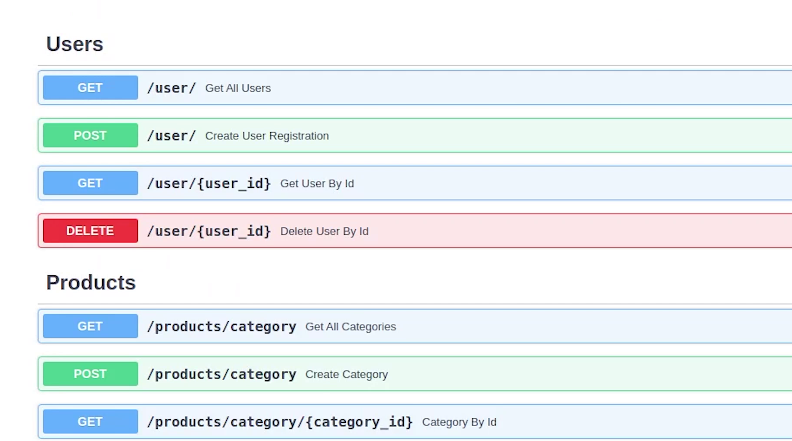

We are getting a category by id.

Let me give the category id 1, and it should return MobilePhones.


All the scenarios are working fine. Let’s move with our last api for category, that is, to delete the category by id.

# Removing Category by Id

We will be deleting the object from the database. The function won’t return anything.

You can define the type annotation as `None` or else it’s not required. I am leaving up to you, whatever you feel good, better to follow the type annotation.

`router.py`

```python
@router.delete('/category/{category_id}', status_code=status.HTTP_204_NO_CONTENT, response_class=Response)
async def delete_category_by_id(category_id: int, database: Session = Depends(db.get_db)):
    return await services.delete_category_by_id(category_id, database)
```

`services.py`

```python
async def delete_category_by_id(category_id, database):
    database.query(models.Category).filter(models.Category.id == category_id).delete()
    database.commit()
```

We are done, let’s test it out.

I want to delete the category : **Electronics** whose ID is basically **2**.

As you can see there is no response. The status returned is 204


I will re-verify by checking the category by id api.

Yes, the data does not exist. As you can see only the mobile phone category is present.

Our electronics category has been successfully deleted.


We are completely done with the category, now we will be writing APIs for our products, same kind of operations that we did earlier.

If you want to break this router, then can you go forward with that. One for products and second one for category separately. Completely up to you how you feel comfortable.

# Creating New Product

Let’s begin by creating our product API, but before that we need to create the pydantic schema.

I will create a `ProductBase` class which will be reused later.

- Id is going to be int but optional.
- Name will be string.
- Quantity will be integer.
- Description will be string.
- Price will be float.

`schema.py`

```python
class ProductBase(BaseModel):
    id: Optional[int]
    name: str
    quantity: int
    description: str
    price: float

    class Config:
        orm_mode = True

class Product(ProductBase):
    category_id: int
```

I will create one more class `Product` which is going to
inherit `ProductBase`, in which I will have `category_id` as integer.

Coming back to the router, I will resume working on the `create_product` function.

`router.py`

```python
@router.post('/', status_code=status.HTTP_201_CREATED)
async def create_product(request: schema.Product, database: Session = Depends(db.get_db)):
    category = await validator.verify_category_exist(request.category_id, database)
    if not category:
        raise HTTPException(
            status_code=400,
            detail="You have provided invalid category id.",
        )

    product = await services.create_new_product(request, database)
    return product
```

It’s going to be a POST method, and it is going to return 201 status code.

I will raise an exception if there is no category present else we will create our new product.

Before inserting the product in the database, we need to make sure whether the specific category exists in the database or not. So, we are going to write a small validation for it.

I am going to write a validator: `verify_category_exist` which will return the
category object or None if not present.

`validator.py`

```python
from typing import Optional

from sqlalchemy.orm import Session

from .models import Category


async def verify_category_exist(category_id: int, db_session: Session) -> Optional[Category]:
    return db_session.query(Category).filter(Category.id == category_id).first()
```

Let’s go to services and write our business logic where we will be inserting a new product into our database.


`services.py`

```python
async def create_new_product(request, database) -> models.Product:
    new_product = models.Product(name=request.name, quantity=request.quantity,
                                 description=request.description, price=request.price,
                                 category_id=request.category_id)
    database.add(new_product)
    database.commit()
    database.refresh(new_product)
    return new_product
```

Let’s go back to Swagger UI and verify over there.

I am going to try out first with an invalid category id and check what happens.


Yes, the validation is working fine.

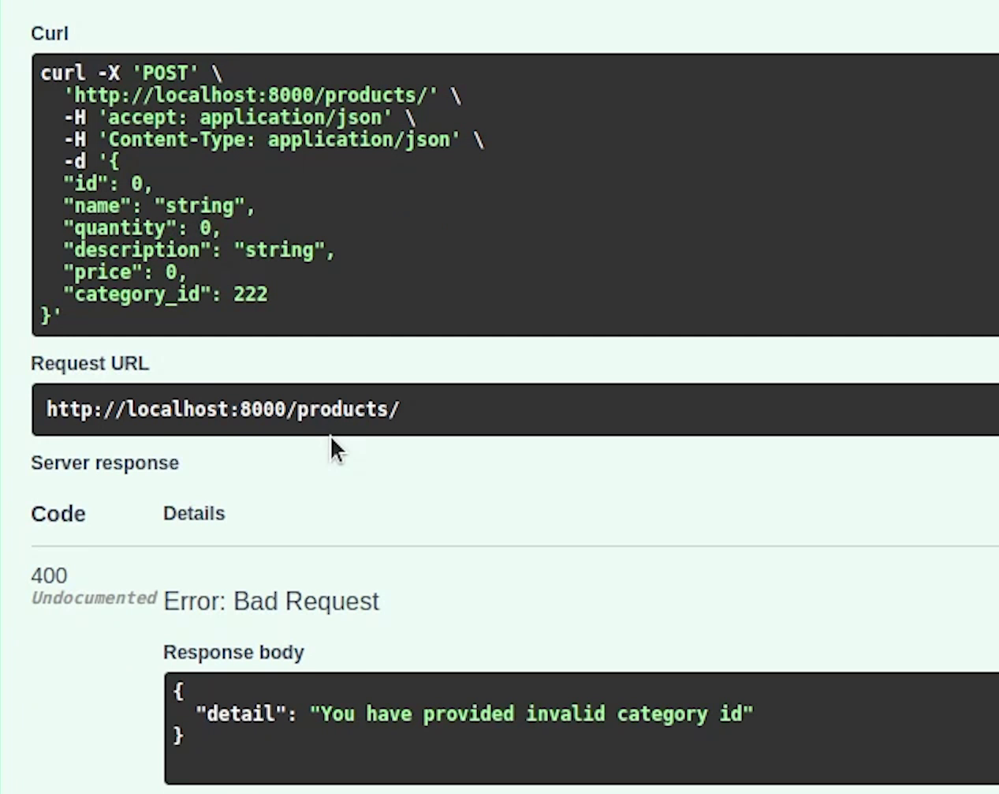

Id is optional, let me now give proper information for name, quantity, description and price.

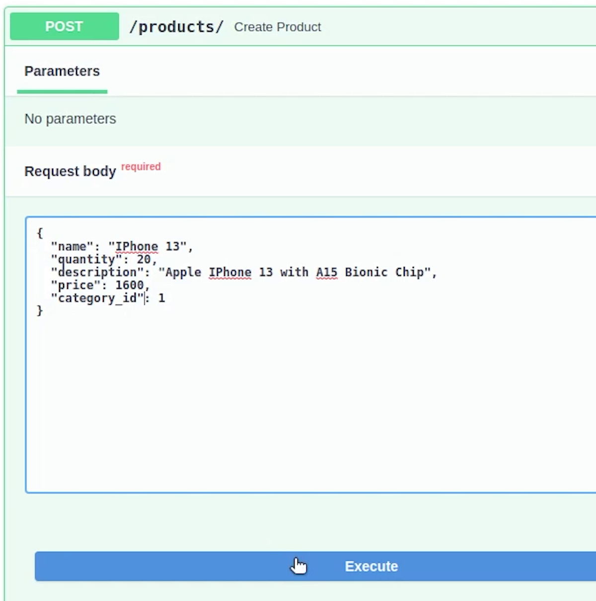

You can see our new product Apple IPhone 13 has been successfully created. There are currently 20 items in stock and the price is 1600 dollars.

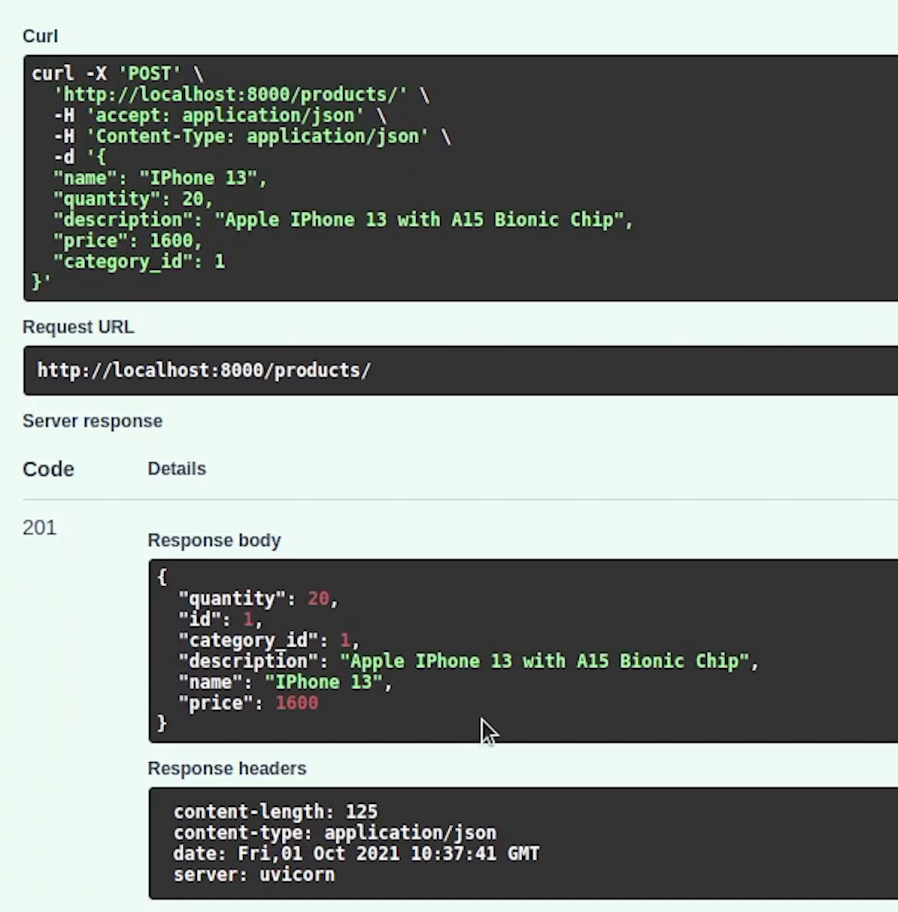

I will create one more product and name it IPhone 12 with less quantity and price.


Great! two products have been successfully created.

# Listing Products

Next, I will be creating an API for listing the products which are present in our database. I won’t be creating more api like get or delete product by id. I am completely leaving it up to you, if you are interested you can go ahead and create those functionalities based upon your use case.

I hope by now you must have got a basic understanding of how easy it is to develop an API when working with FastAPI.

So, now I am going to create a pydantic schema for product listing. It will be a combination of products and categories.

I will create a `ProductListing` class which inherits from `ProductBase`.

`schema.py`

```python
from typing import Optional

from pydantic import BaseModel, constr


class Category(BaseModel):
    name: constr(min_length=2, max_length=50)


class ListCategory(BaseModel):
    id: int
    name: str

    class Config:
        orm_mode = True


class ProductBase(BaseModel):
    id: Optional[int]
    name: str
    quantity: int
    description: str
    price: float

    class Config:
        orm_mode = True


class Product(ProductBase):
    category_id: int


class ProductListing(ProductBase):
    category: ListCategory

    class Config:
        orm_mode = True
```

Category information will be coming from `ListCategory` class.

Response model is going to return schema `ProductListing`.

`router.py`

```python
@router.get('/', response_model=List[schema.ProductListing])
async def get_all_products(database: Session = Depends(db.get_db)):
    return await services.get_all_products(database)
```

`services.py`

```python
async def get_all_products(database) -> List[models.Product]:
    products = database.query(models.Product).all()
    return products
```

Ok, our product functionality is complete, let me check what response we are getting in the Swagger UI.

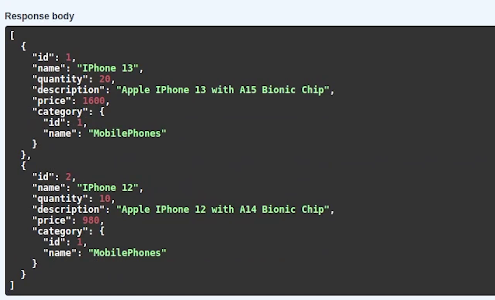

As you can observe the response, we are getting the product information along with category information from our pydantic class. So, how smoothly
the nested modelling has been done over here.

I hope by now you have got the understanding how we are creating apis, pydantic, validation etc.

In the next tutorial, we will be working on order and cart modules.
