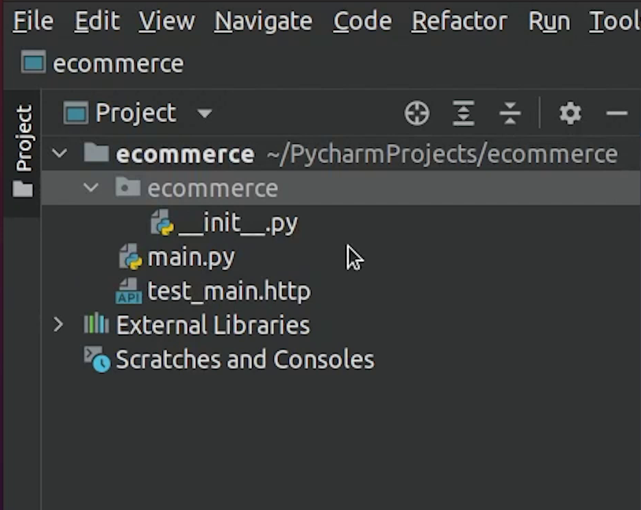
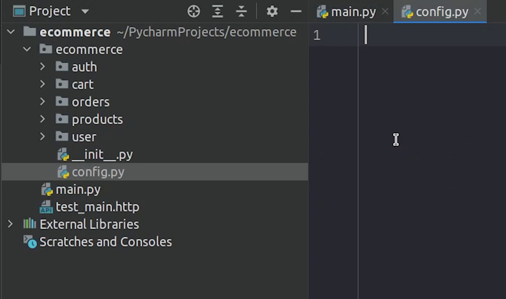
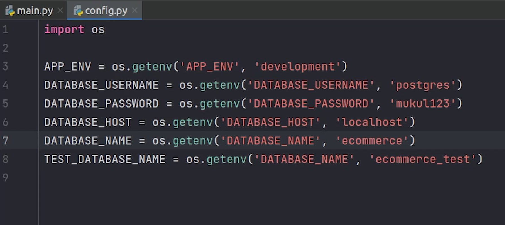
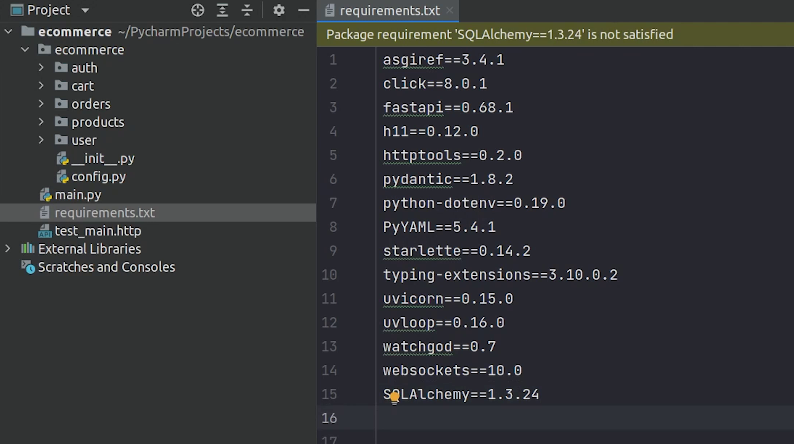
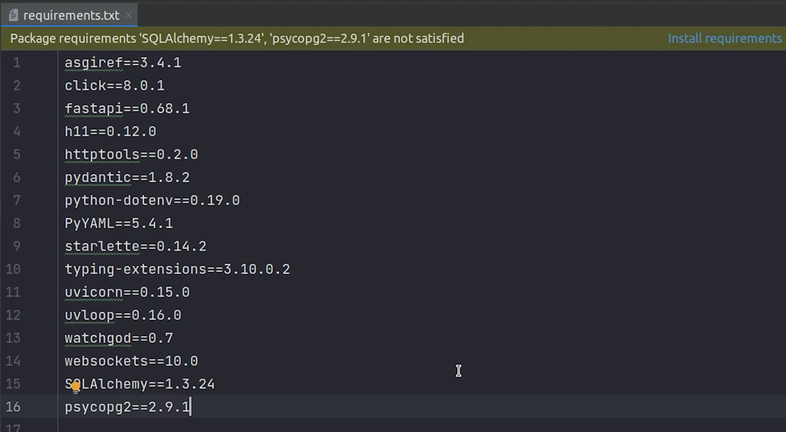

Hello everyone! Welcome to the PyCharm FastAPI Tutorial Series.

In this tutorial we are going to create an ecommerce application. So, as you know, what we normally see in an ecommerce store, we have users, products, cart items, orders, authentication etc.


Image Credit: [Freepik](https://www.freepik.com/)

We will be building APIs for all the known features, like the:

- Users can log in or register.
- Add Products, Order Products as well add products to the cart.

We are not going to build any UI for this tutorial, our core idea is only to develop the apis.

APIs will help you understand how the backend gets integrated with the modern frontend frameworks.

# Installing Postgres

Before moving ahead, make sure you have installed Postgres in your system.

There are lots of references already available in the internet for free.
I am mentioning some of them.

- <https://www.digitalocean.com/community/tutorials/how-to-install-postgresql-on-ubuntu-20-04-quickstart>
- <https://linuxize.com/post/how-to-install-postgresql-on-ubuntu-20-04/>
- <https://tecadmin.net/how-to-install-postgresql-in-ubuntu-20-04/>

# Creating Directories

Once you have successfully installed Postgres then move to PyCharm and create an **ecommerce** package
in the root folder.



I will create more subdirectories under ecommerce which I will explain in the later tutorials.

This is how the app structure is going to look.


Next, I will create a `config.py` file which contains necessary credentials as
environment variables related to database name, password etc.



We also require the test database, it will be
required later when we will be working on unit tests.



# Installing Requirements

Let me get the fresh copy of **requirements.txt** file.

Run the below command in the terminal :

```
pip freeze > requirements.txt
```

We are going to install [SQLAlchemy](https://www.sqlalchemy.org/),
which is an object relational mapper for Python and helps to communicate with databases.



We will be also installing _psycopg2_ which is a database connector for python and postgres. You may have seen that we did not use the SQLAlchemy 1.4.0 or [psycopg3](https://www.psycopg.org/psycopg3/) package which supports the asyncio feature, which indeed definitely is going to be faster. During the time of recording, the [psycopg3](https://www.psycopg.org/psycopg3/) project was still under active development and the asyncio extension of SQLAlchemy 1.4.3 is considered to be in **beta** level.

Maybe within a few months we can expect a stable release. But you are completely free to explore these projects.

If I am not wrong [Michael Kennedy](https://twitter.com/mkennedy) has already covered this feature in his [FastAPI Course](https://training.talkpython.fm/courses/full-html-web-applications-with-fastapi) with Async SQLAlchemy.



As you can see I am using PyCharm, so it’s able to auto-detect the missing packages in my system.

# System Dependencies

Make sure before installing _psycopg2_ package you have installed the system dependencies.

```bash
sudo apt-get install libpq-dev python-dev
sudo apt-get install build-essential
```

I am going to see you in the next tutorial, where I will be connecting to our database from FastAPI as well as from [DataGrip](https://www.jetbrains.com/datagrip/).
