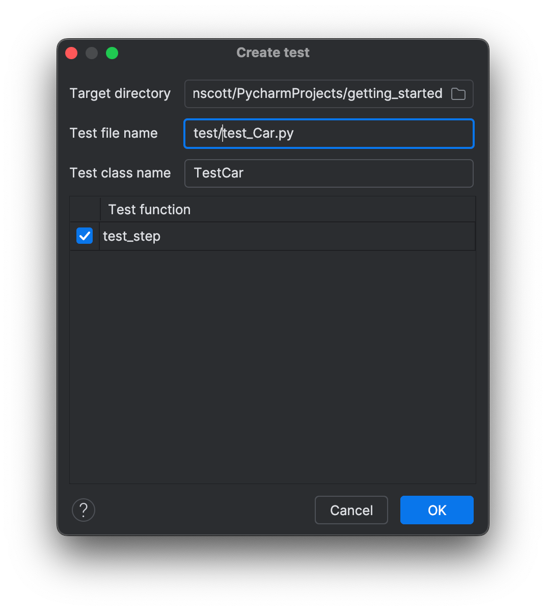
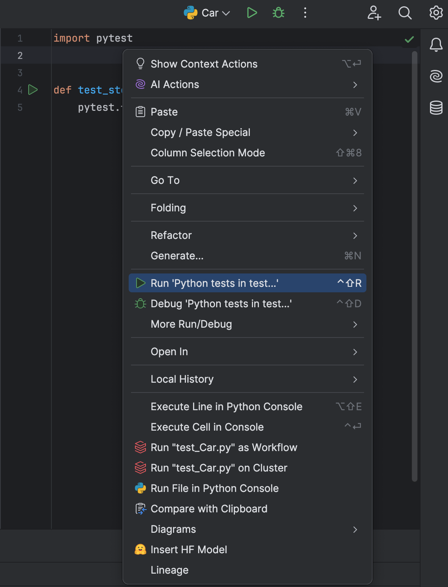
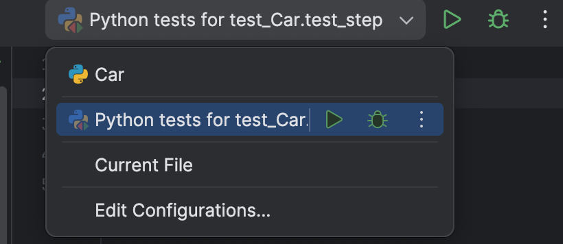
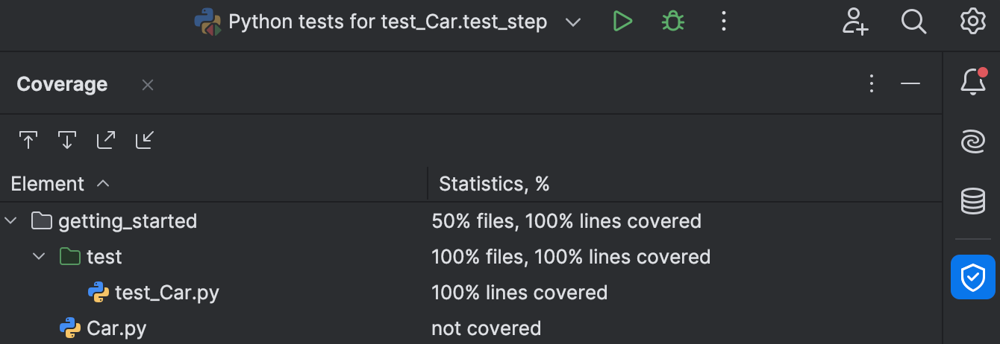

In the previous step, we saw how PyCharm can help you to debug your code efficiently. In this step, we are going to talk about how you can test your code.

## Setting up your Test Environment

We’re going to use the `pytest` framework for this demo so we need to install that first. In our Package tool window, we can search for `pytest` and install it.

When you select a Python interpreter, PyCharm will auto-detect any test runner that is installed, and it will default to `unittest` if nothing is found so we need to tell PyCharm that I want it to use pytest instead of the built-in test framework.

If you want to read up on this area then you can find more details in [our documentation](https://www.jetbrains.com/help/pycharm/testing-your-first-python-application.html#choose-test-runner).

## Creating Tests

Let’s get PyCharm to create our test class, our test directory and then set up our interface so we can see both the code that we’re testing and the tests we’re going to write.

We can create our test file and get PyCharm to create our Test Source Root at the same time by invoking Go To Test <kbd>⌘⇧T</kbd> (macOS) / <kbd>Ctrl+Shift+T</kbd> (Windows/Linux) and selecting Create New Test which we will call `test/test_car`.

You can also tell PyCharm that this new folder is the root for all your tests in this project by right-clicking on the newly created `test` folder and selecting **Mark Directory as | Test Sources Root**.

PyCharm will generate the test file for us with a test in, but let’s open it in the right split so we can see both our class and our test. You can do that by selecting the file and then using <kbd>⇧⏎</kbd> (macOS) / <kbd>Shift+Enter</kbd> (Windows/Linux).

We’re not going to focus on writing the tests here so let’s move to the next step where we will see how to run your tests.

## Running Tests

To run the entire file you can right-click and select `Run Python tests...`

You can also select the current file from the run configurations dropdown.

Of course, you can also access all your Run Configurations with <kbd>⌥⌘R</kbd> (macOS) / <kbd>F9</kbd> (Windows/Linux) and then select the one that you want.

Your Run tool window will open indicating how many tests have passed or failed. In our case, all tests are failing which is by design.

We can change our test to pass:

You can also use your gutter icons to run individual test cases.

Of course, you can also run your tests with the debugger in all the same ways.

## Testing Tool Window

Passing tests are great, but let's see what the Testing tool window looks like when some tests aren't passing. Let's change some assert statement back to assert false so our tests fail:

When we look at the output we can see exactly where we went wrong. First PyCharm shows us the value the test expected and then the actual value generated by our code. It also displays a link that you can click and PyCharm will jump to the line where the failure happened.

This is just a demo project but for bigger projects, it’s also useful to have an overview of your failing tests on the left-hand side so you can click it and PyCharm will jump to the test output.

## Auto-Testing

Let’s talk briefly about auto-testing because it’s often easier to have your tests run in a continuous fashion, especially if you’re working with TDD.

You can do that by enabling the auto-test feature meaning PyCharm will run your tests every 3 seconds, by default.

When you change your code, PyCharm will automatically run your tests every 3 seconds. You can increase or reduce the time accordingly.

## Running Tests with Coverage

Coverage is available in PyCharm Professional and you can enable it in the Run Configuration toolbar.

If Coverage hasn't been installed for this project, PyCharm will notify you with a popup. You can click the **Install** link to proceed. Now, PyCharm can run all your tests with coverage.

You can click the file name to open the file you can also see which lines are covered by checking the colouring in the gutter.

A green bar in the gutter means that this line was covered while red means it was not.

You can also run individual tests with coverage from the gutter icons and access the functionality from the right-click context menu.

## Conclusion

Congratulations! You just saw how to use PyCharm to help you write your tests.

In the next step we'll take a look at how you can increase your productivity in PyCharm!

## Video

You can also check out the video for this step from our Getting Started series on YouTube:
