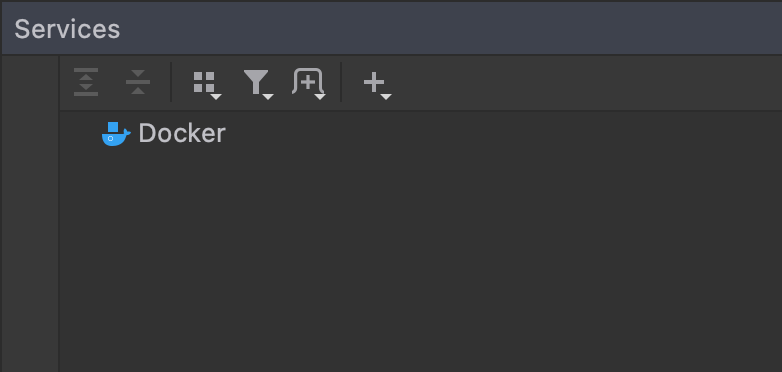
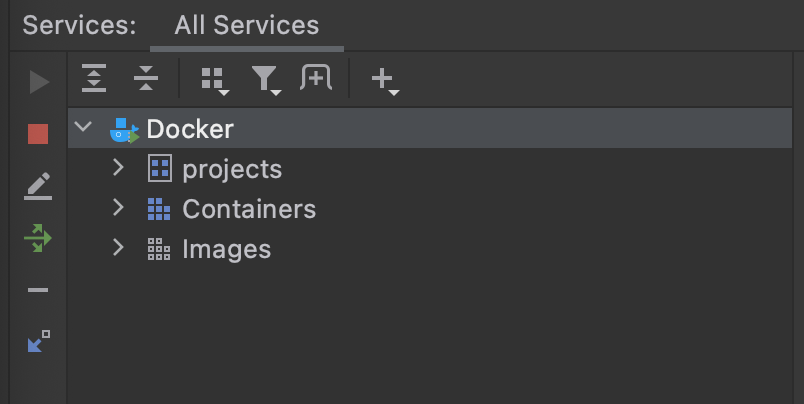
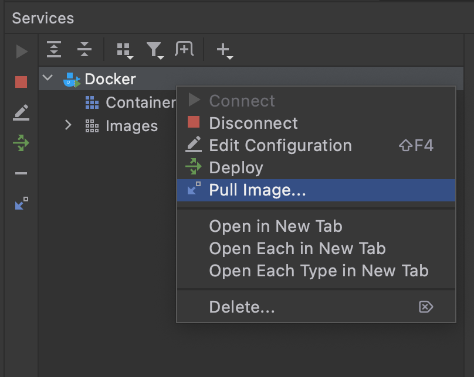
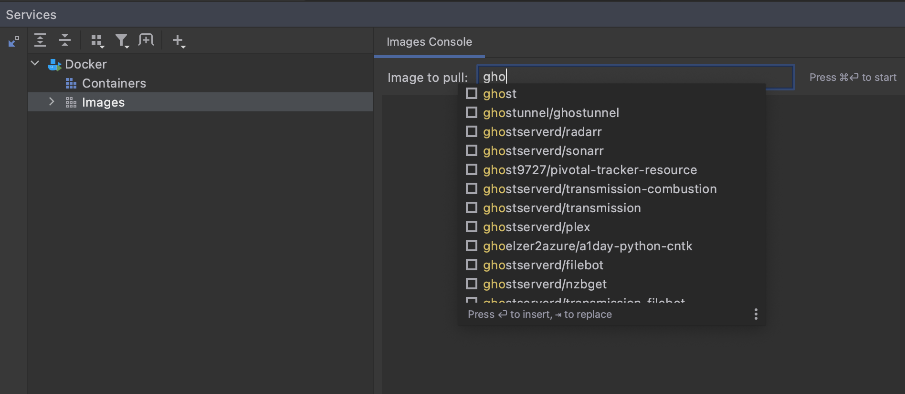
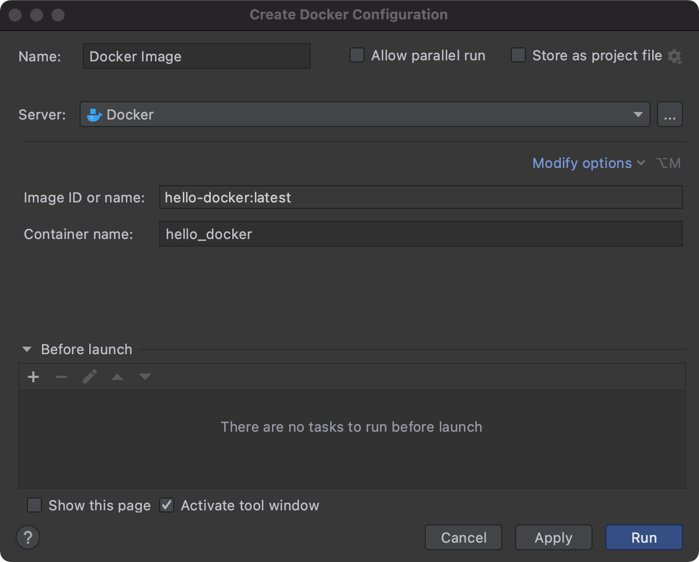
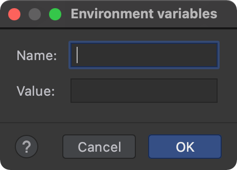
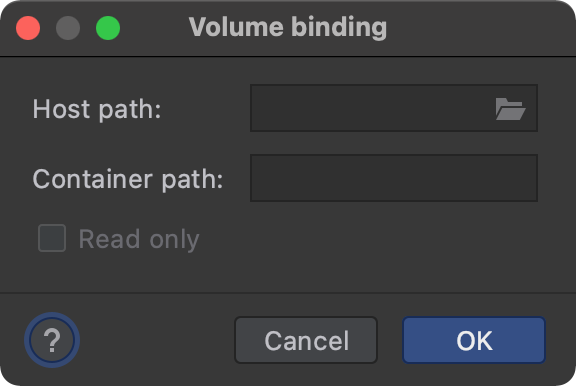
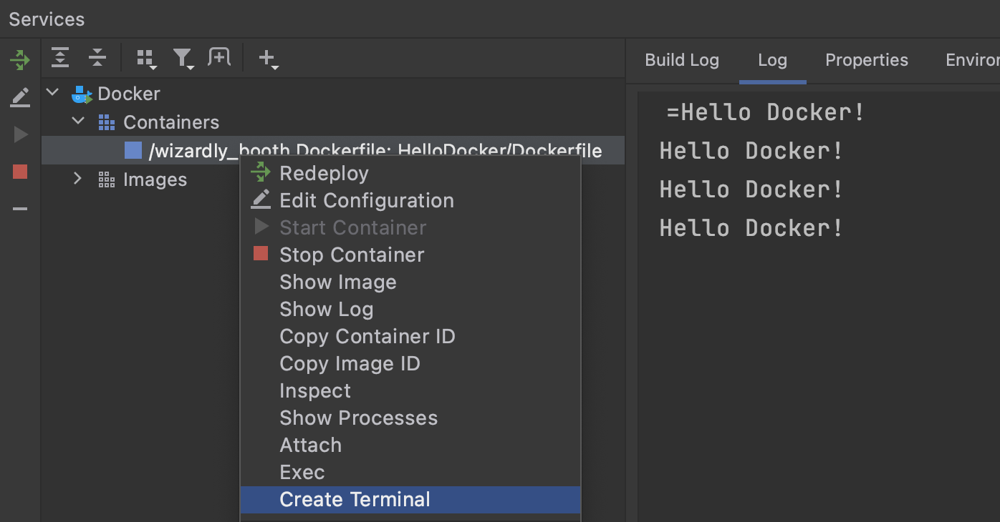

When working with Docker in JetBrains Rider, developers will likely spend some of their time looking at the **Services** window. We'll walk through all the standard Docker features and settings we may want to modify.

### Docker Connection

Rider will recognize that we have Docker desktop installed and show a Docker icon in our **Services** tree. We can modify the connection to connect to any docker execution engine, but we want to connect to our local instance in most cases.



Double-clicking the icon will connect us to our host and display any running applications, containers, and images located on the host.



Now we're ready to explore what actions we can take on our host.

### Pull an Image

We mentioned that images are at the heart of the Docker ecosystem. While we can build our images, we'll likely use images constructed by other individuals and communities as a foundation for our work. We can pull any community image from **Dockerhub** by triggering the context menu on the Docker icon and selecting the `Pull image...` icon.



From the **Images Console**, we can use the `Image to pull` search bar to find and pull any image.



Additionally, if we're using a private registry, we can add those locations by adding the location to the `Docker Registry` settings in Rider.


### Creating A New Container

We can run any existing images as a new container. If we right-click an image located in the **Images** section, we will pick the **Create Container** option.


If it is our first time running an image as a container, we'll receive a **Create Docker Configuration** dialog.



Here we can set any run arguments along with setting the container name explicitly. Like before, once we create a running container, we'll see the output of our .NET application in the **Log** tab.

### Environment Variables

Environment variables are essential for running containers, especially with .NET applications that support reading variables from the environment or through a configuration provider. We can see all the defined variables in the **Environment Variables** tab for a running container.


We can add new variables and edit existing ones as well.



Depending on how we access our environment variables, we may need to restart our container.

### Port Bindings

As we'll see in our next demo, publishing ports is essential to communicating with our containers. For web applications built on ASP.NET, we will need to expose at least the HTTP port, but since our **Hello Docker** project is a console application, we don't need to publish any ports.


From the **Port Bindings** tab, we can map an internal port to a host machine port or choose to **Publish all ports**. Rider's UI clearly labels the `Container port` and the `Host port`.

### Volume Management

As we learned in the **Common Terminology** section of this tutorial, volumes are persistent storage on the host. Even when deleting an existing container, the data stored in these volumes will carry on. We can attach new or existing volumes from the **Volume Bindings** tab.

 

### File Explorer

All containers have an internal filesystem that can seem difficult to access and explore. One option is to attach to the container from the command-line.

```shell
docker exec -it <mycontainer> bash
```

When pointed to a running container instance, we can place ourselves in a separate terminal to run the `ls` command.

```shell
➜ docker exec -it hello_docker bash
root@ace5e01aa61c:/app# ls
HelloDocker  HelloDocker.deps.json  HelloDocker.dll  HelloDocker.pdb  HelloDocker.runtimeconfig.json
```

While this works, it's less than convenient, especially when we don't have a good understanding of the file structure within the container. JetBrains Rider users can use the **Files** tab to get a directory listing of our container's content.


The file explorer also gives us the option to download binary files from a running container, and to view text files directly in the editor.

### Attaching A Terminal

In the previous **Files** section, we saw how we could start a new terminal process on our running container. Right-clicking on a running container in our **Services** pane allows us to choose the **Create Terminal** option.



Once we create the terminal instance, we can run any command supported by the container's image.


## Rider and the Docker CLI

While Rider's **Services** window has many of the features developers will need to work with Docker, Rider's features don't cover all the Docker CLI tooling features. The JetBrains team continues to work hard in bringing all the elements to developers. If developers find any component missing and necessary for their workflow, we encourage them to file an issue in our issue tracker.

For this reason, it is necessary to be comfortable with the Docker CLI commands and not entirely rely on Rider integration with Docker.

### See Also

- [Docker Docs](https://docs.docker.com/)
- [.NET](https://dot.net)
- [JetBrains Rider](https://jetbrains.com/rider)
- [Rider Services Tool Window](https://www.jetbrains.com/help/rider/Services_Tool_Window.html)
- [Use the Docker command line](https://docs.docker.com/engine/reference/commandline/cli/)