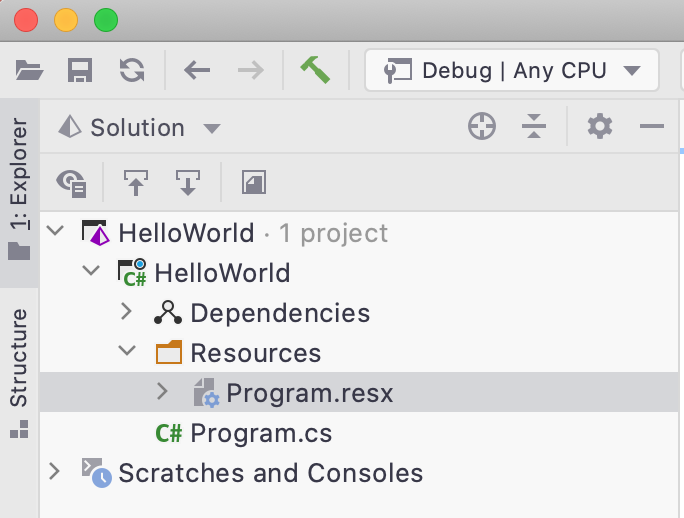
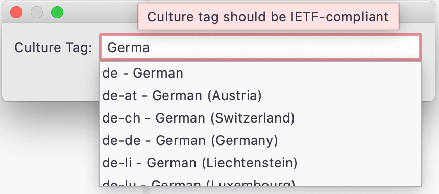

Localization is the process of modifying our application to fit within a particular culture. We can think of culture as the customs, language, and social constructs of a specific nation, people, or social group. When attempting to localize an application, we should keep in mind all the presentational elements: language, images, and colors are a few examples. Language, the way we communicate thoughts, is ideally where most folks would start.

This tutorial will show how to localize a **Hello, World** console application utilizing **Rider's Localization Manager**.  Let's aim to _keep it simple_. Many of the steps it takes to localize for one culture we can apply to all cultures.

Before we delve into the code, let's talk about the main components of .NET localization. These building blocks have existed since .NET 1.1 and continue to be relevant in the latest versions of .NET Core.

## CultureInfo

The [`CultureInfo` class](https://docs.microsoft.com/en-us/dotnet/api/system.globalization.cultureinfo) provides the rules specific to a particular culture. 

> The information includes the names for the culture, the writing system, the calendar used, the sort order of strings, and formatting for dates and numbers. [-- Microsoft](https://docs.microsoft.com/en-us/dotnet/api/system.globalization.cultureinfo)

Using a unique culture can dramatically impact a user's experience, and we should always store our information in [the invariant culture format](https://docs.microsoft.com/en-us/dotnet/api/system.globalization.cultureinfo.invariantculture?view=netcore-3.1) to avoid conversion issues.

## Resource Files

The first essential element of localization is the resource file, commonly recognized by its unique file extension of `resx`. Resource files are XML based and contain key/value pairs. Typically the key is the identifier used within our code to access the value we present to the user. Below, we'll see a resource item with a key of `HelloWorld` and a string value of `Hello World!`.

```shell
<data name="HelloWorld" xml:space="preserve">
    <value>Hello World!</value>
</data>
```

Resource values are usually `string` values, but there are no restrictions on what we can store in our resource files. We can choose to store images and any other serializable data in a `resx` file. The .NET compilation process embeds our resources into our final assembly artifacts using a `ResXFileCodeGenerator` custom tool. When creating resource files in Rider and Visual Studio with ReSharper, the tool will be automatically set and run when changes to the resource file are detected.

## Resource Manager

The .NET framework provides a [`ResourceManager` class](https://docs.microsoft.com/en-us/dotnet/api/system.resources.resourcemanager) that enables us to access any resource value at runtime. We can use the `ResourceManager` directly, but .NET can also process `resx` files and generate strongly-typed interfaces for more straightforward usage. The `ResxFileCodeGenerator` tool generates a C# object with explicit properties that utilize an internal `ResourceManager` instance. Here is our same `HelloWorld` resource value converted into a C# property.

```csharp
internal static string HelloWorld {
    get {
        return ResourceManager.GetString("HelloWorld", resourceCulture);
    }
}
```

One downside of using the generated class is its ties to early .NET development. While it can be useful in client application scenarios, such as desktop and mobile, its use of `static` makes it difficult to use in ASP.NET systems.

## Localizing "Hello World"

Let's start by creating a brand new **Console Application**. Once Rider has our project loaded, we should see a typical **Hello World** console application in `Program.cs`.

```csharp
using System;

namespace HelloWorld
{
    class Program
    {
        static void Main(string[] args)
        {
            Console.WriteLine("Hello World!");
        }
    }
}
```

We can see that the string **"Hello World!"** is hard-coded in our application. **Our goal is to move the `string` value into a resource file and localize for the German culture.**

Our first step is to create a new resource file. We can start by creating a folder named `Resources` at the root of our console application. Within the folder, let's make a new file called `Program.resx`. Naming files based on the elements we're localizing is an excellent practice to get into the habit of doing. It becomes essential as our application grows in size and complexity.



In our editor, we'll notice that our `"Hello, World!"` string know shows a hint. Using Rider, we can now move this value to our newly created resource file using the "Quick Fix" menu.


We'll see a **"Move to Resource"** dialog to set the options for our new resource value item. Let's change the name to `HelloWorld` to be more in line with C# idioms. When done, we should see our value in Rider's Localization Manager. 


We can also see that our `Program` class is accessing our value using the generated interface.

```csharp
using System;

namespace HelloWorld
{
    class Program
    {
        static void Main(string[] args)
        {
            Console.WriteLine(Resources.Program.HelloWorld);
        }
    }
}
```

Let's get to some German. In the **Localization Manager**, we need to click the plus (+) symbol located over the left-hand pane. It is to the left of the phrase **"Group by"**. Clicking the icon, we see a dialog box with a text input. 


Let's type **German** or **de**, the culture code, and hit **OK**. The **Localization Manager** now has a **German** column. Let's add a translation of **"Hallo Welt"**.



We'll also notice that we now have a new resource file named `Program.de.resx` in the solution explorer. The naming of files based on culture is a necessary mechanism for selecting the correct culture.


Great! We're so close to the end. Let's start changing the culture in our `Program`. Our generated interface has a `Culture` static property that we'll set using a new `CultureInfo` instance with a value of **"de"**.

```csharp
using System;
using System.Globalization;

namespace HelloWorld
{
    class Program
    {
        static void Main(string[] args)
        {
            Resources.Program.Culture = new CultureInfo("de");
            Console.WriteLine(Resources.Program.HelloWorld);
        }
    }
}
```

Running our application, we see the following output in the console window.

```shell
Hallo Welt
```

We did it! We've localized our console application for our German friends.

## Conclusion

Localization has some essential mechanical parts in .NET, from `CultureInfo`, resource files, and `ResourceManager`. Rider's localization manager can make the process of managing multiple cultures more straightforward. Ultimately, the process of localizing a client application for a single user scenario is the easiest to grasp. Many of the steps necessary for localizing are tedious, but with great tooling, a systematic approach, and a few translators, any application is ready to be localized.
