For developers working with ASP.NET and ASP.NET Core, Internet Information Services (IIS) is an essential part of the web development workflow. IIS comes in two different variants, IIS and IIS Express, with the latter being the most commonly used by developers in their daily work. The building, running, and debugging of web applications are necessary components of the ASP.NET development lifecycle. Visual Studio users are familiar with hitting the play button and having everything "just work".

## IIS Express

Let's start with the more common IIS Express experience from Visual Studio, and how it compares to Rider's experience. Beginning with a new ASP.NET Core web application, we can see our solution structure, which includes C# files, JSON setting files, and launch settings.

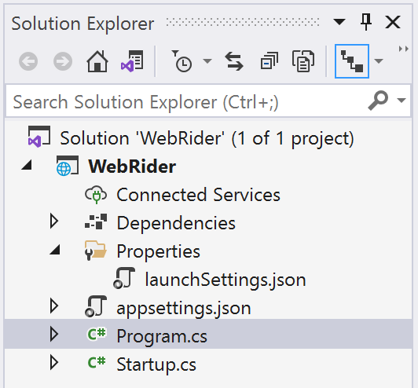

Visual Studio will read the `launchSettings.json` found under the `Properties` folder. Here we can see the run configurations for our web application. One entry defines the IIS Express run configuration and its settings, and the other establishes the run configuration for ASP.NET Core running within the Kestrel server.

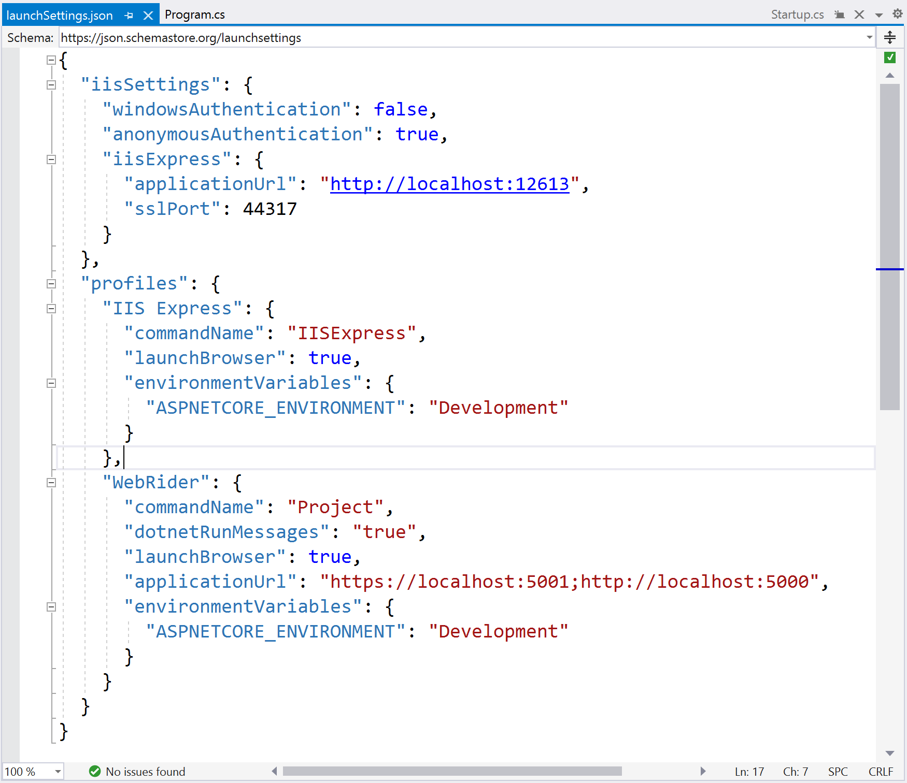

```json
{
 "iisSettings": {
  "windowsAuthentication": false,
  "anonymousAuthentication": true,
  "iisExpress": {
   "applicationUrl": "http://localhost:12613",
   "sslPort": 44317
  }
 },
 "profiles": {
  "IIS Express": {
   "commandName": "IISExpress",
   "launchBrowser": true,
   "environmentVariables": {
    "ASPNETCORE_ENVIRONMENT": "Development"
   }
  },
  "WebRider": {
   "commandName": "Project",
   "dotnetRunMessages": "true",
   "launchBrowser": true,
   "applicationUrl": "https://localhost:5001;http://localhost:5000",
   "environmentVariables": {
    "ASPNETCORE_ENVIRONMENT": "Development"
   }
  }
 }
}
```

We can choose to run either configuration using Visual Studio's run button.

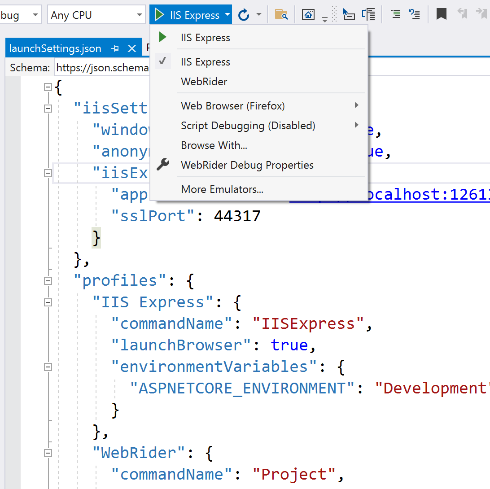

From here, the running and debugging experience is what most developers would expect. Set a few breakpoints, step through code, and investigate in-memory values.

Developers moving to Rider will have an equivalent experience with IIS Express. From the same solution, we can see that Rider understands the `launchSettings.json` file. 


Additionally, we can see that Rider will let us run any of the defined configurations within the editor.

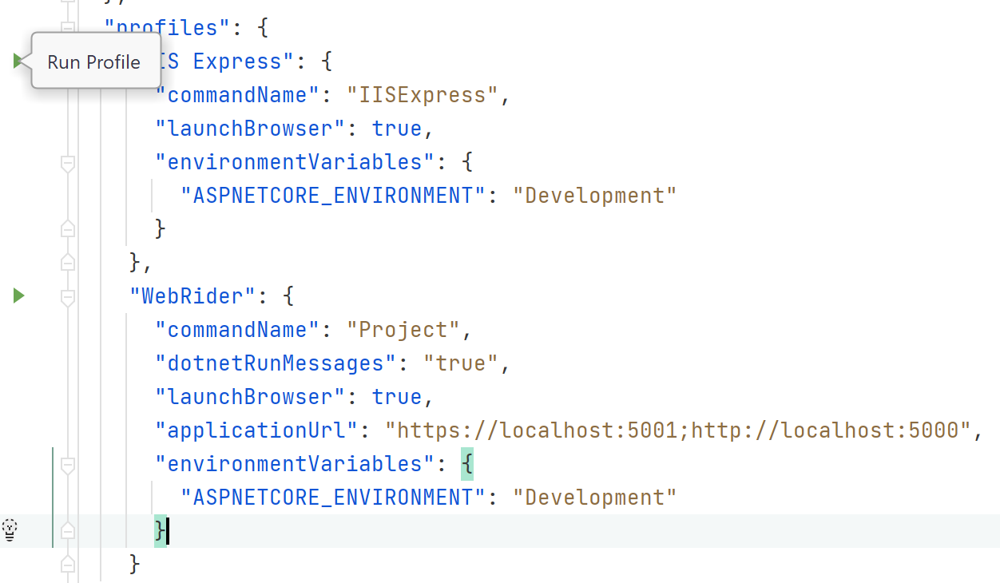

From the **Run Configuration** dropdown, we'll notice Rider has discovered all the run configurations from our `launchSettings.json` file. From this point, we can select the **IIS Express** configuration and either **run** or **debug** our web application running within IIS Express.

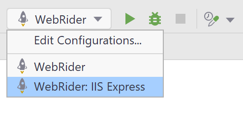

We can also use Rider's UI to inspect the settings read from the `launchSettings.json`. Rider's UI can help us confirm our JSON is well structured and that all the settings are the expected values.

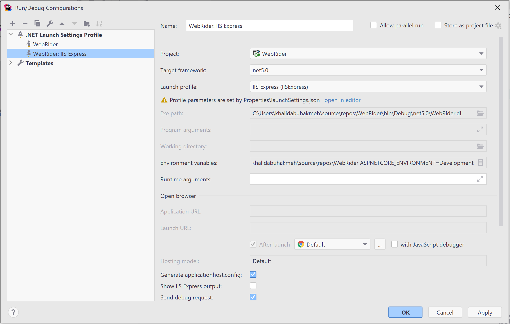

## IIS

There are instances where developers would prefer to run a full IIS instance rather than relying on IIS Express. This situation is possible in both IDEs but adds a layer of additional complexity. The first step is to publish our web application to our IIS instance. In both Visual Studio and Rider's cases, we'll need to be sure we are running our IDE process under escalated privileges.

From Visual Studio, we'll likely right-click and select the **Publish** option. From the publish dialog, we can choose **IIS** and follow the instructions.

From Rider, we can right-click the same project and select **Publish to IIS** or **Publish to folder**. 

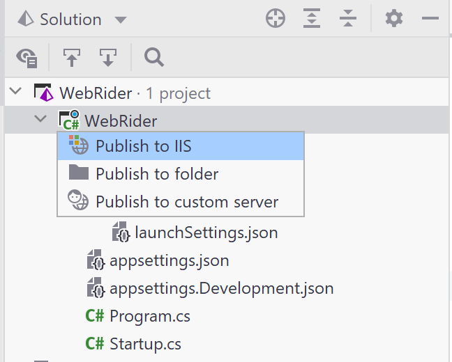

Rider can also use any publish profiles already defined from Visual Studio, which generally end with the `.pubxml` extension.

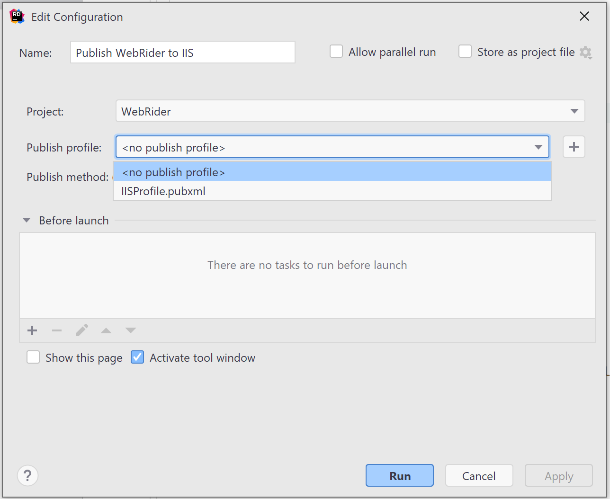

**For ASP.NET Core web applications, our target site's application pool must have its `.NET CLR Version` set to `No Managed Code`.** If the setting is incorrect, we will fail to attach the debugger in the next step.

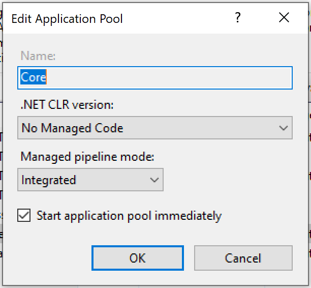

Once our application is published, we can see the process running by visiting the configured IIS website. To debug the new IIS process, we need to use Rider's **Attach To Process** action, which we can find under the **Run** menu or using the <kbd>Ctrl+Alt+P</kbd> command.

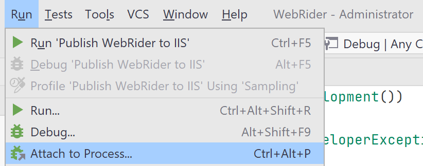

We can find our web application process under the **.NET Core Processess** section. Rider will also remember recent processes and list them at the top of the selection dialog.


From here, we should be able to step into our code as if we were running our application in IIS Express or Kestrel.

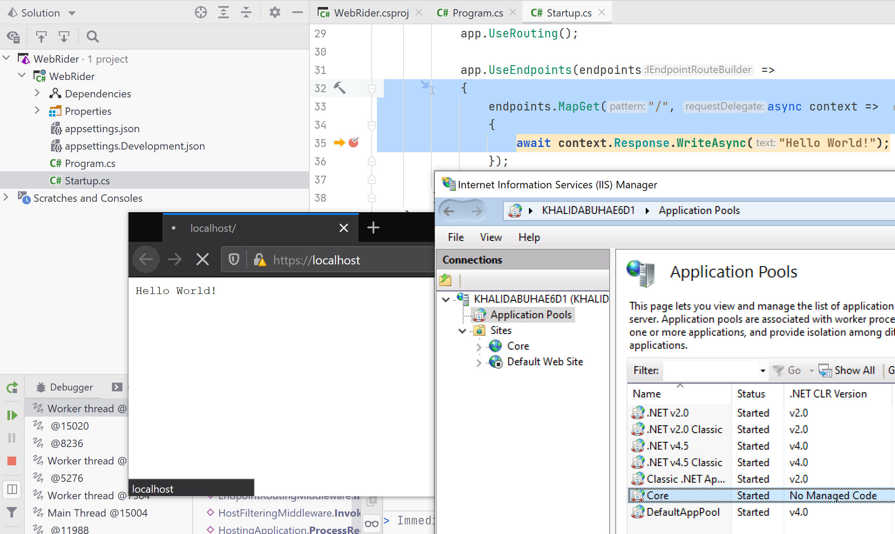

## Conclusion

Regardless of the hosting platform, Rider allows developers to write, deploy, and debug ASP.NET web applications with ease. Developers can find many of the concepts they've learned in Visual Studio within Rider's user interface.


 
