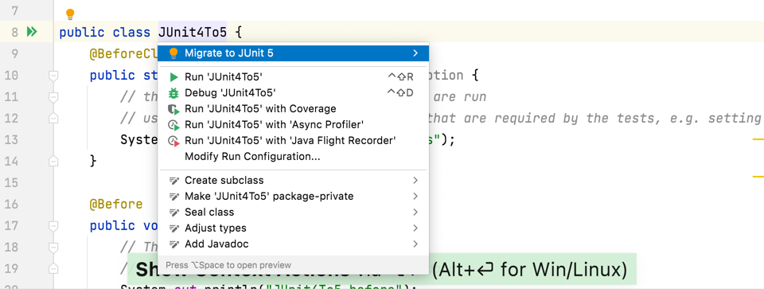
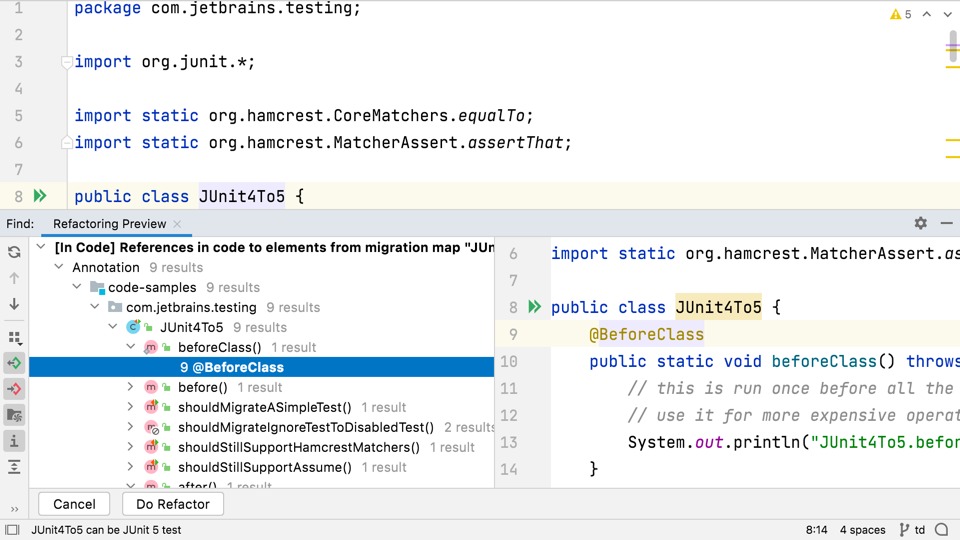

Use **⌘,** (macOS), or **Ctrl+Alt+S** (Windows/Linux) to load IntelliJ IDEA preferences and type in 'inspections'. [IntelliJ IDEA's inspections](https://www.jetbrains.com/help/idea/code-inspection.html#access-inspections-and-settings) can be very helpful for migrating code. In particular there are a number of inspections for JUnit tests.

To help with the migration, turn on 'JUnit 4 test can be JUnit 5' inspection.  You can only turn this on if you're using at least Java 8 and have JUnit 5 dependencies set up.


Let's open the test class to see this in action:

```java
public class JUnit4To5 {
   @BeforeClass
   public static void beforeClass() throws Exception {
         System.out.println("JUnit4To5.beforeClass");
   }

   @Before
   public void before() throws Exception {
       System.out.println("JUnit4To5.before");
   }

   @Test
   public void shouldMigrateASimpleTest() {
       Assert.assertEquals("expected", "expected");
   }

   @Test
   @Ignore
   public void shouldMigrateIgnoreTestToDisabledTest() {
   }

   @Test
   public void shouldStillSupportHamcrestMatchers() {
       assertThat(1, equalTo(1));
   }

   @Test
   public void shouldStillSupportAssume() {
       Assume.assumeTrue(javaVersion() > 8);
   }

   @After
   public void after() throws Exception {
       System.out.println("JUnit4To5.after");
   }

   @AfterClass
   public static void afterClass() throws Exception {
       System.out.println("JUnit4To5.afterClass");
   }

   private int javaVersion() {
       return 14;
   }
}
```

With this inspection turned on, JUnit 4 tests that are currently running using the JUnit 5 vintage engine are flagged to show you that they can be migrated. Press **⌥⏎** (macOS), or **Alt+Enter** (Windows/Linux), in the class name and IntelliJ IDEA offers to migrate the test class to JUnit 5.



The [refactoring preview](https://www.jetbrains.com/help/idea/refactoring-source-code.html#refactoring_preview) window will show the places where changes will be made, in this case a number of annotations will be changed to the new JUnit 5 annotations.



If you want to exclude any of the tests from the refactor you can click **⌫**, or **Delete**. To include them again click **⇧⌫**, or **Shift+Delete**.   Press **Do Refactor** and let's see what the new code looks like.

```java
public class JUnit4To5 {
  @BeforeAll
  public static void beforeClass() throws Exception {
    System.out.println("JUnit4To5.beforeClass");
  }

  @BeforeEach
  public void before() throws Exception {
    System.out.println("JUnit4To5.before");
  }

  @Test
  public void shouldMigrateASimpleTest() {
    Assertions.assertEquals("expected", "expected");
  }

  @Test
  @Disabled
  public void shouldMigrateIgnoreTestToDisabledTest() {
  }

  @Test
  public void shouldStillSupportHamcrestMatchers() {
    assertThat(1, equalTo(1));
  }

  @Test
  public void shouldStillSupportAssume() {
    Assumptions.assumeTrue(javaVersion() > 8);
    // then go ahead and run the rest of the test
  }

  @AfterEach
  public void after() throws Exception {
    System.out.println("JUnit4To5.after");
  }

  @AfterAll
  public static void afterClass() throws Exception {
    System.out.println("JUnit4To5.afterClass");
  }

  private int javaVersion() {
    // stub method. just used for the example
    return 14;
  }

}
```

Use [Local History](https://www.jetbrains.com/help/idea/local-history.html#view-local-history), or [Show Diff](https://www.jetbrains.com/help/idea/differences-viewer.html) if you're using a VCS like Git, to see the changes side-by-side. The section on the left shows you the old JUnit 4 file. The changes from the refactor are shown on the right. The main change is that instead of importing `org.junit`, which is the JUnit 4 package, the class will import `org.junit.jupiter`, which is the JUnit 5 package structure.


We'll see that the before and after annotation names have been changed to the new, more descriptive, ones: `BeforeClass` becomes `BeforeAll`, `Before` becomes `BeforeEach`.

The test annotation doesn't change, because the name is still the same. Changing the import means this will now use the new `@Test` annotation. Assert statements now use methods on the `Assertions` class, instead of the old `Assert`.

The JUnit 4 `@Ignore` annotation has been replaced with the JUnit 5 `@Disabled` annotation.

Any tests that used Hamcrest matchers should still work as before.

JUnit 4.4 introduced the idea of assumptions, if these assumptions are met the test is run. JUnit 5 provides an `Assumptions` class instead of `Assume`.

Like the `Before` annotations, `After` is replaced with `AfterEach`, and `AfterClass` is replaced with `AfterAll`.

IntelliJ IDEA makes all of these changes automatically. Like any IntelliJ IDEA refactoring, you can see the class still compiles after you've done the refactoring by using **⌘F9** (macOS), or **Ctrl+F9** (Windows/Linux). Let's use **⌃⇧R** (macOS), or **Ctrl+Shift+F10** (Windows/Linux) to run the tests to make sure everything behaves the way we expect.

The `beforeClass` method is run once, each before and after method is run once per test, and the `afterClass` method is run once at the end, so the overall setup works as it did under JUnit 4. The  disabled test is still not run, and there are three passing tests, the same as before.

Now we've made this small change and checked that the code behaves as expected we can check in these changes too. 


