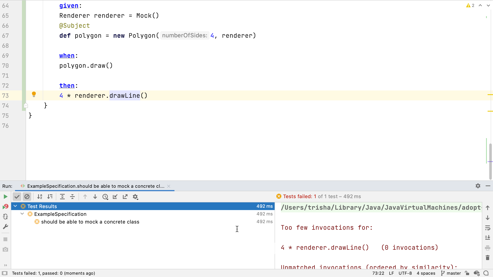

Sometimes we need to mock out classes or APIs to assert the expected behaviour. [Mocking is built in to Spock](https://spockframework.org/spock/docs/2.0/all_in_one.html#interaction-based-testing), we don't need a separate library or framework for Mock support. It's also possible to mock concrete classes. If you're used to other Mocking frameworks you might expect to only be able to mock Java interfaces, but Spock lets us easily [create a mock](http://spockframework.org/spock/docs/2.0/all_in_one.html#_creating_mock_objects) from a concrete class.

The `given` block of a Spock test is the perfect place to set up mocks for our test. It's clear then that this is all code that's required to run the test, but is not the code that's being tested itself.

```groovy
def "should be able to mock a concrete class"() {
    given:
    Renderer renderer = Mock()
    def polygon = new Polygon(4, renderer)

    when:
    polygon.draw()

    then:
    4 * renderer.drawLine()
}
```

This test mocks a [Renderer](https://github.com/trishagee/spock-testing-demo/blob/16981a2a00ae52f13713d289e9829ac7ddd3a7fe/src/main/java/com/mechanitis/demo/spock/Renderer.java) class, which is a concrete Java class. We can do this either by declaring a variable with type Renderer, and calling Mock without any arguments:

```groovy
Renderer renderer = Mock()
```
...or if we prefer to use Groovy's `def` to define our variables, we'll need to pass the type in as an argument to the Mock method:

```groovy
def renderer = Mock(Renderer)
```

Bear in mind that if you declare it using "def", this variable is using Groovy's dynamic typing, and so isn't strongly recognised as a Renderer type by the IDE or by the code. This is fine if you're not doing much with the mock, but you might sometimes want to specify the type more clearly, this will certainly be more natural for Java developers.

The `given` block also sets up a Polygon with the given renderer, calling the constructor with the `numberOfSides` and the mocked `renderer`.

The `when` section defines the call that's actually the thing we're testing, in this test we want to see what happens when we call the `draw` method on this polygon. Make sure there's a `draw` method on the polygon, at this stage it can be empty because we're doing a bit of [TDD](https://en.wikipedia.org/wiki/Test-driven_development):

```java
public void draw() {
}
```

The `then` block defines the expectations. Spock has a [nice, clear syntax for defining the behaviour](http://spockframework.org/spock/docs/2.0/all_in_one.html#_mocking) we expect to see on the mock. In this test, we might expect to see four calls on the renderer's `drawLine` method, given that the polygon has four sides. The `then` block states we expect to see `renderer.drawLine` called 4 times.

Run this test now, it should fail. This is because the methods don't do anything yet. We expected to see this drawLine method called four times, but it wasn't called at all.



Go into the implementation of the `Polygon.draw` method and change it to call the renderer's drawLine method in here as many times as there are sides (note that this is an extremely over-simplified example to demonstrate the testing):

```java
public void draw() {
    for (int i = 0; i < numberOfSides; i++) {
        renderer.drawLine();
    }
}
```

Re-run the test, it should pass. The code is calling `drawLine` on the `renderer` mock four times.

Mocks are a powerful and useful tool to make sure that the code that we're testing is calling the APIs that we expect, in the way we expect.

Now you know how to create a mock and write a test that shows a particular method was called when the test was run. Next, let's look at how to stub objects and methods with Spock.
