Hello everyone, welcome to the Django tutorial series. In this tutorial step, we are going to work on Behavior-driven development (or BDD) testing. It is an agile software development technique that encourages collaboration between developers, QA and non-technical or business participants in a software project.

Let me give you a small difference between Acceptance Testing & Behavioral-Driven Development. 

According to BrowserStack : In the Acceptance Test-Driven Development (ATDD) technique, a single acceptance test is written from the user’s perspective.  It mainly focuses on satisfying the functional behavior of the system. 

Acceptance Test-Driven Development is very similar to Behavioral-Driven Development. However, a key difference between them is: BDD focuses more on the behavior of the feature, whereas Acceptance Test-Driven Development focuses on capturing the accurate requirements.


# Installing ChromeDriver

Before moving ahead, make sure you have installed **Google Chrome** & **ChromeDriver** on your machine.

The official website of ChromeDriver is being displayed on your screen, You can download it from [here](https://chromedriver.chromium.org/).

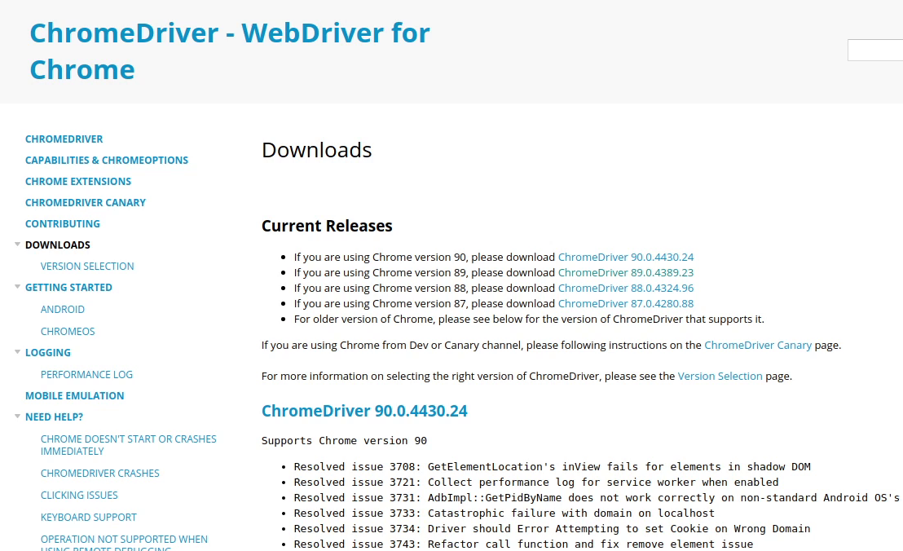

As of now I will be downloading the version **89** which is a stable release. Before installing ChromeDriver make sure to check your Google Chrome version, both need to be aligned.

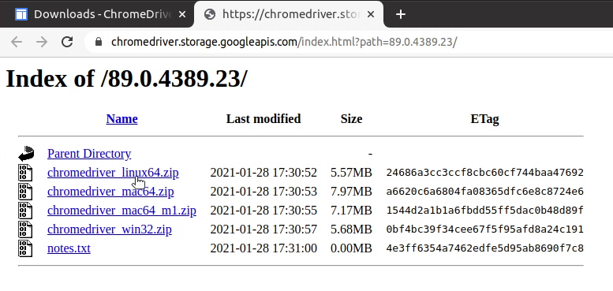

If you are doing it for first time make sure to run the below given command.

- ```sudo apt-get install unzip```

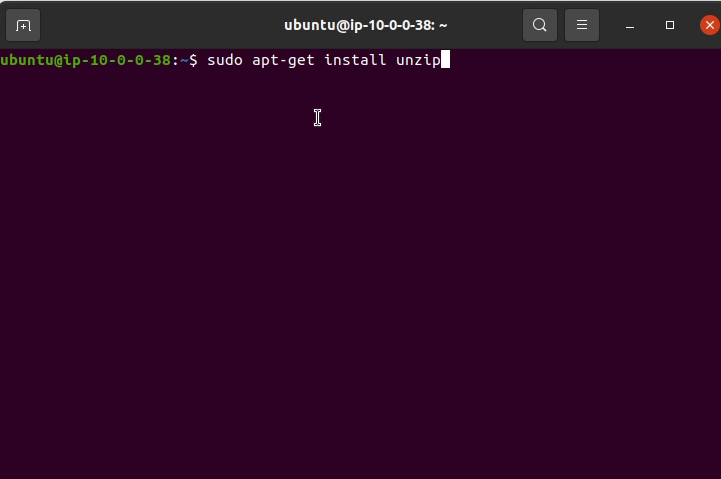

After downloading the chromedriver, I am going to **unzip** and move it to **/usr/local/share**.


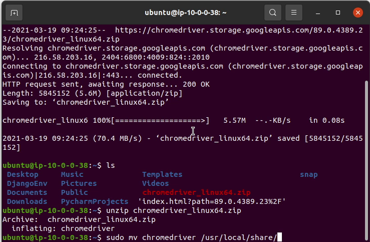

Next, I will make the chromedriver as executable along-with creating symbolic links.

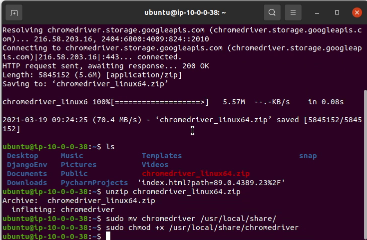

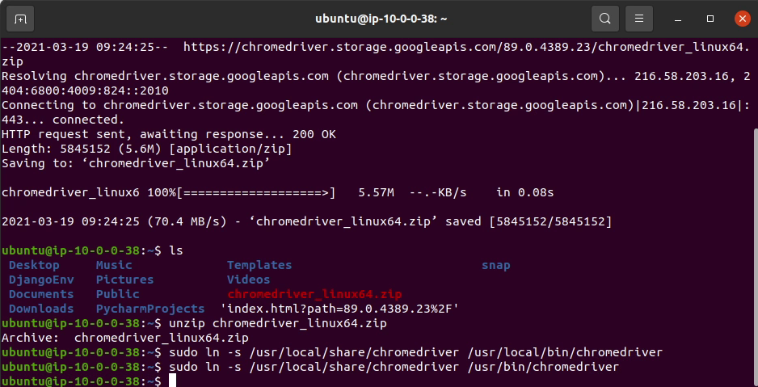

Okay, we have now successfully set up the ChromeDriver.

# Installing Behave

Now, I will be installing the **“behave django”** python package. Behave is a behavior-driven test framework that is
largely similar to other BDD test frameworks such as Cucumber, SpecFlow, Cucumber-JVM, etc.

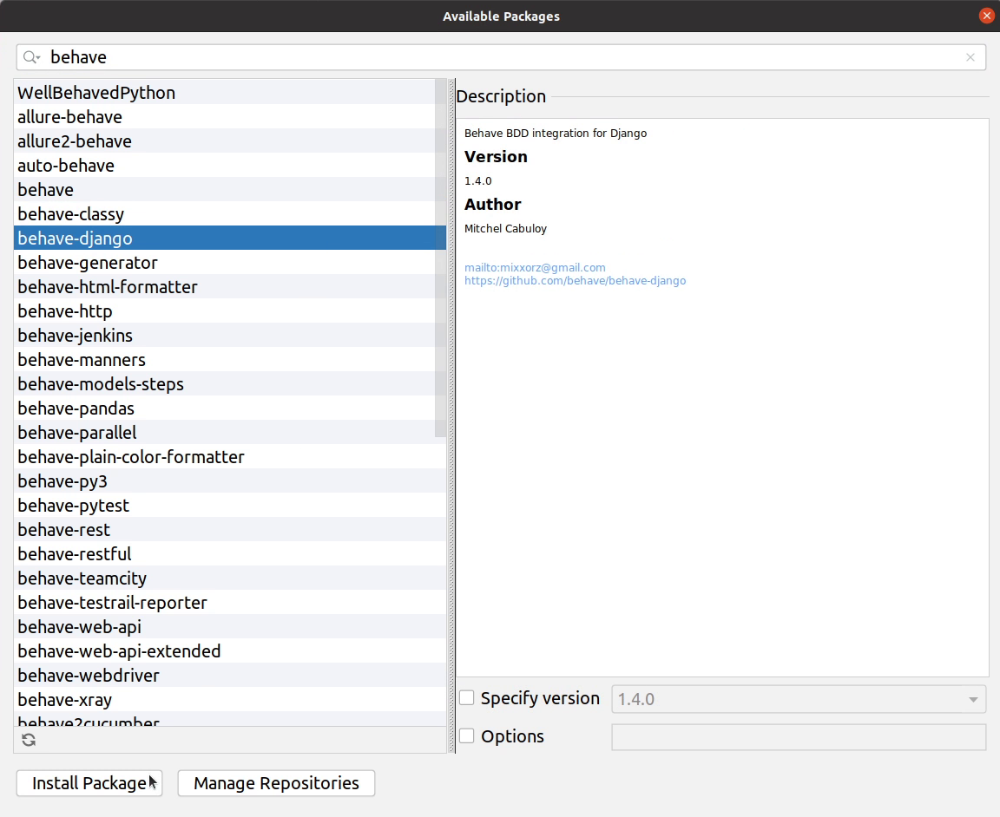

We will also install **Selenium WebDriver**. Selenium WebDriver is among one of the most popular tools
when it comes to Web UI automation. The Selenium framework can be used with a wide range of programming
languages such as Python, Java, C#, and more.

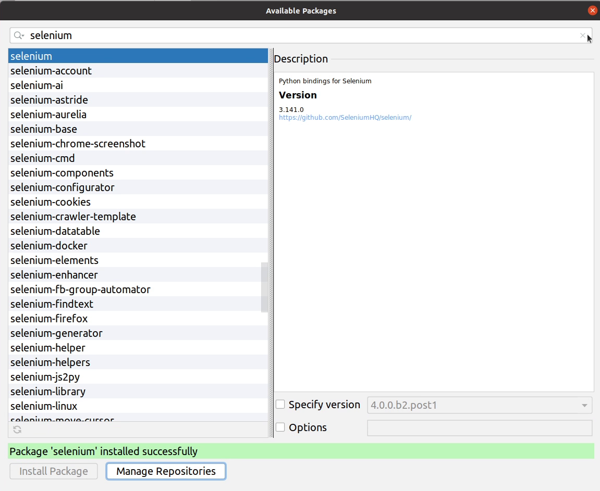

I will be creating a **.behaverc** file in the project root. I will pass the path where my 
acceptance tests are stored, so our test runner can pick up the tests.

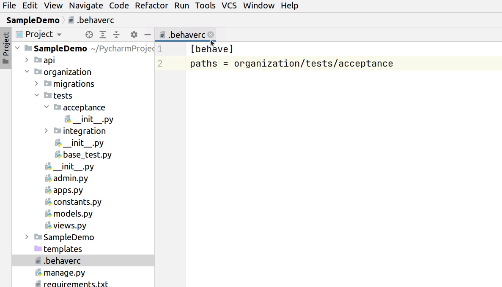

Next, I will create two directories and name them as **features** and **steps**. 

A feature file contain high level description of the test scenario in simple language known as **Gherkin**. 
Gherkin is a plain English text language.

Feature files consist of following components:
 - **Feature**: A feature would describe the current test script which has to be executed.
 - **Scenario**: Scenario describes the steps and expected outcome for a particular test case.
 - **Given**: It specifies the context of the text to be executed. 
 - **When**: "When" specifies the test action that has to performed
 - **Then**: The expected outcome of the test can be represented by "Then"

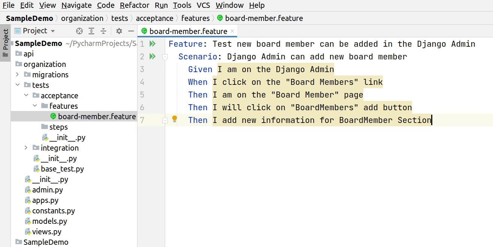

This will be the final code at the end.

```gherkin
Feature: Test new board member can be added in the Django Admin
  Scenario: Django Admin can add new board member
    Given I am on the Django Admin
    When I click on the "Board Members" link
    Then I am on the "Board Member" page
    Then I will click on "BoardMembers" add button
    Then I add new information for BoardMember Section
```

After we are done with the feature, we will move ahead with **steps**. A step definition maps the test-case steps in the
feature files (introduced by Given/When/Then). It executes the steps on the application Under Test and checks
the outcomes against expected results.

First, I am going to do the necessary imports. After that, I will begin implementing the step definition.

Behave uses ```step_impl``` as the function name by default and accepts context as an argument. We will be 
using context to pass selenium information. Keep following along with me, you are going to enjoy it. 

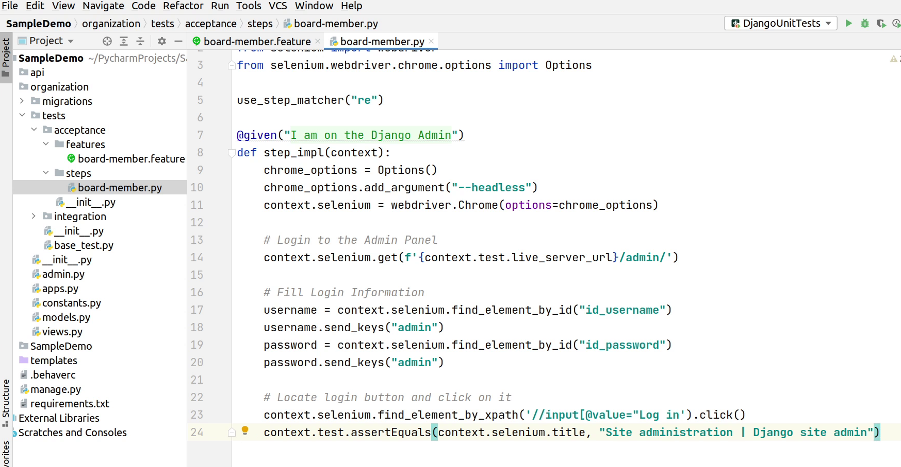

Okay, we have completed the first step **“I am on the Django Admin”**. Let me tell you what's going to happen. The Chrome 
application is going to open the Django Admin login page and will pass username and password in the input fields and
finally click on the Login button. This is what happens when a user tries to log in into Django Admin, we are 
automating the manual approach.

The final code at the end is going to look like this.

```python
from behave import *
from selenium import webdriver
from selenium.webdriver.chrome.options import Options

use_step_matcher("re")


@given("I am on the Django Admin")
def step_impl(context):
    chrome_options = Options()
    chrome_options.add_argument("--headless")
    context.selenium = webdriver.Chrome(options=chrome_options)

    # Login to the Admin Panel
    context.selenium.get(f'{context.test.live_server_url}/admin/')

    # Fill Login Information
    username = context.selenium.find_element_by_id("id_username")
    username.send_keys("admin")
    password = context.selenium.find_element_by_id("id_password")
    password.send_keys("admin")

    # Locate login button and click on it
    context.selenium.find_element_by_xpath('//input[@value="Log in"]').click()
    context.test.assertEquals(context.selenium.title, "Site administration | Django site admin")


@when('I click on the "(.*)" link')
def step_impl(context, name):
    context.selenium.find_element_by_link_text(f"{name}").click()

@then('I am on the "(.*)" page')
def step_impl(context, name):
    context.test.assertEquals(f"Select {name} to change | Django site admin", context.selenium.title)


@then('I will click on "(.*)" add button')
def step_impl(context, name):
    name = str(name).lower()
    context.selenium.refresh()
    context.selenium.find_element_by_xpath(f"//a[@href='/admin/organization/{name}/add/']").click()
    context.test.assertEquals("Add Board Member | Django site admin", context.selenium.title)


@then('I add new information for BoardMember Section')
def step_impl(context):
    context.selenium.find_element_by_xpath("//select[@name='user']/option[text()='Bill']").click()
    context.selenium.find_element_by_xpath("//select[@name='organization']/option[text()='Microsoft']").click()
    context.selenium.find_element_by_xpath("//select[@name='designation']/option[text()='Founder']").click()
    context.selenium.find_element_by_name('_save').click()
    context.test.assertEquals("Select Board Member to change | Django site admin", context.selenium.title)

```

Next, I will be installing a XPath plugin from Google WebStore. XPath stands for XML Path Language.

XPath uses "path like" syntax to identify and navigate nodes in an XML document. This plugin will be very helpful in
finding elements in our HTML page, and those are not having too much experience working with XPath.


As you can see on line number 3 we are directly passing the value in Django Settings Module, make sure in future you try to pass information through the environment variable.
We are done with our step definition along-with install xpath plugin. Next, we need to set up our test 
environment before running the application. 

For your reference, if you want to dig deeper into this configuration please visit the below given link.

- [https://behave.readthedocs.io/en/stable/usecase_django.html](https://behave.readthedocs.io/en/stable/usecase_django.html)

As you can see on line number 3 we are directly passing the value in **DJANGO_SETTINGS_MODULE**, make sure in future you
try to pass information through the environment variable.

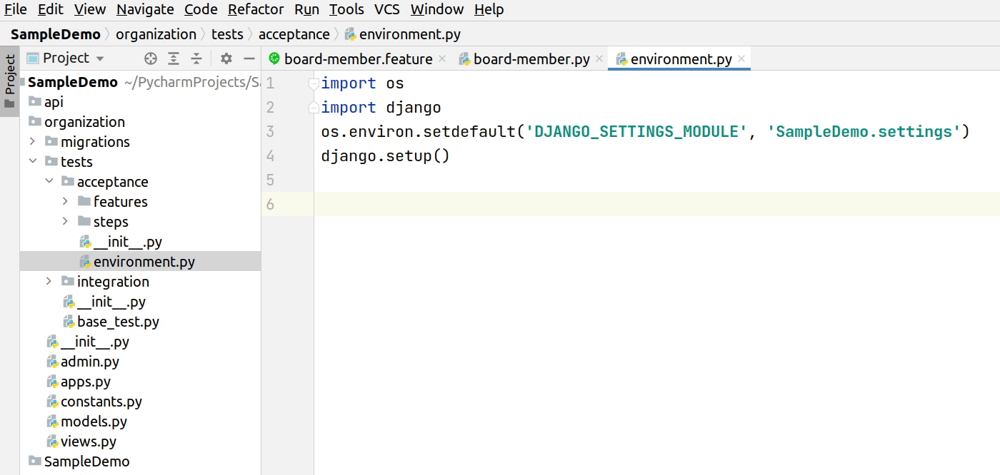

Next, I am going to paste some settings which I have used earlier in my previous projects. 

Don’t worry the entire source will be available on [GitHub](https://github.com/mukulmantosh/SampleDemo).

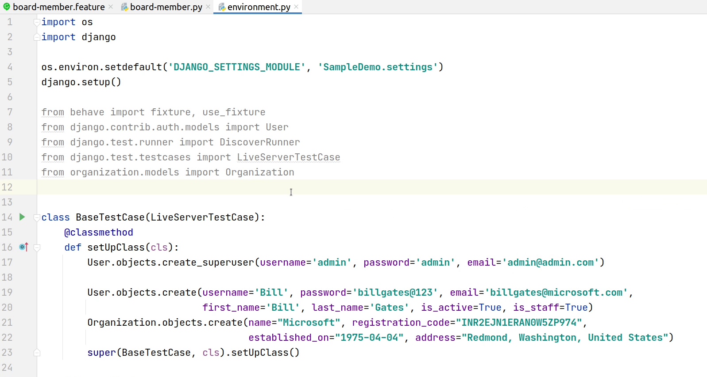

This is the final code at the end.

```python
import os
import django

os.environ.setdefault('DJANGO_SETTINGS_MODULE', 'SampleDemo.settings')
django.setup()

from behave import fixture, use_fixture
from django.contrib.auth.models import User
from django.test.runner import DiscoverRunner
from django.test.testcases import LiveServerTestCase
from organization.models import Organization


class BaseTestCase(LiveServerTestCase):
    @classmethod
    def setUpClass(cls):
        User.objects.create_superuser(username='admin', password='admin', email='admin@admin.com')

        User.objects.create(username='Bill', password='billgates@123', email='billgates@microsoft.com',
                            first_name='Bill', last_name='Gates', is_active=True, is_staff=True)
        Organization.objects.create(name="Microsoft", registration_code="INR2EJN1ERAN0W5ZP974",
                                    established_on="1975-04-04", address="Redmond, Washington, United States")
        super(BaseTestCase, cls).setUpClass()

    @classmethod
    def tearDownClass(cls):
        User.objects.filter().delete()
        super(BaseTestCase, cls).tearDownClass()


@fixture
def django_test_case(context):
    context.test_case = BaseTestCase
    context.test_case.setUpClass()
    yield
    context.test_case.tearDownClass()
    context.selenium.quit()
    del context.test_case


def before_all(context):
    django.setup()
    context.test_runner = DiscoverRunner()
    context.test_runner.setup_test_environment()
    context.old_db_config = context.test_runner.setup_databases()
    yield
    context.test_runner.teardown_databases(context.old_db_config)
    context.test_runner.teardown_test_environment()


def before_scenario(context, scenario):
    use_fixture(django_test_case, context)
```


As you can the above code, whenever the test runner is initiated, the BaseTest class is going to create a sample user
and an organization in our test database.


Before running tests, make sure you have added **behave_django** in the **INSTALLED_APPS**.


Restart your server if required, then I will click on **Tools** and **Run manage.py Task**


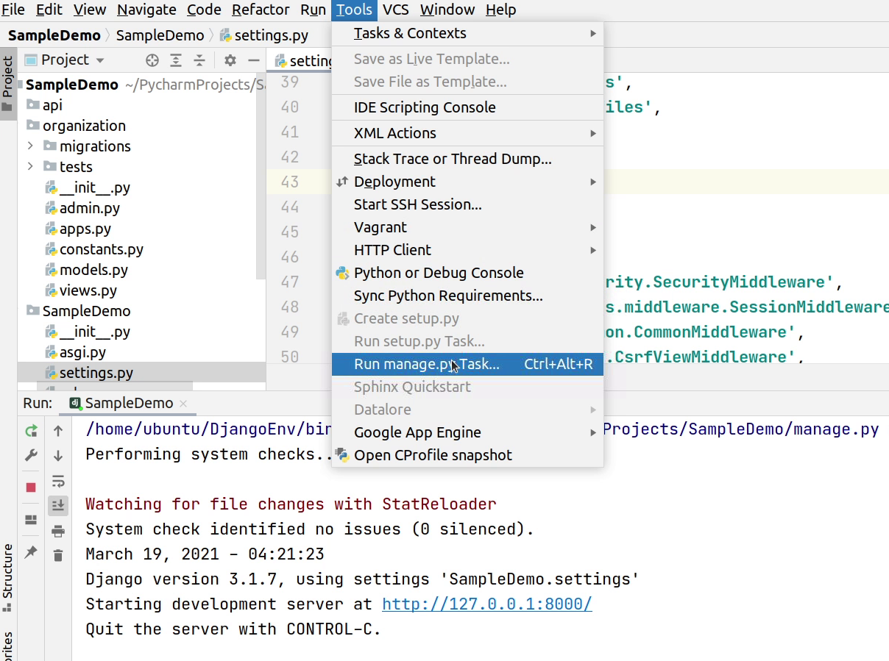

I will type, **behave** and press enter.

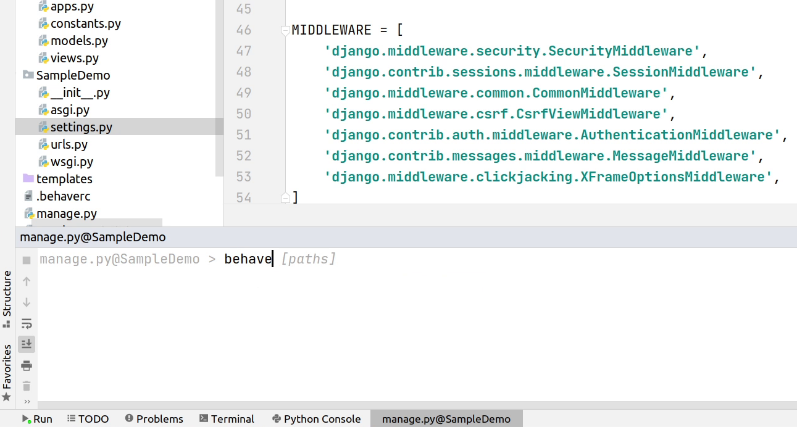


Looks like our test case has failed, let me fix it.

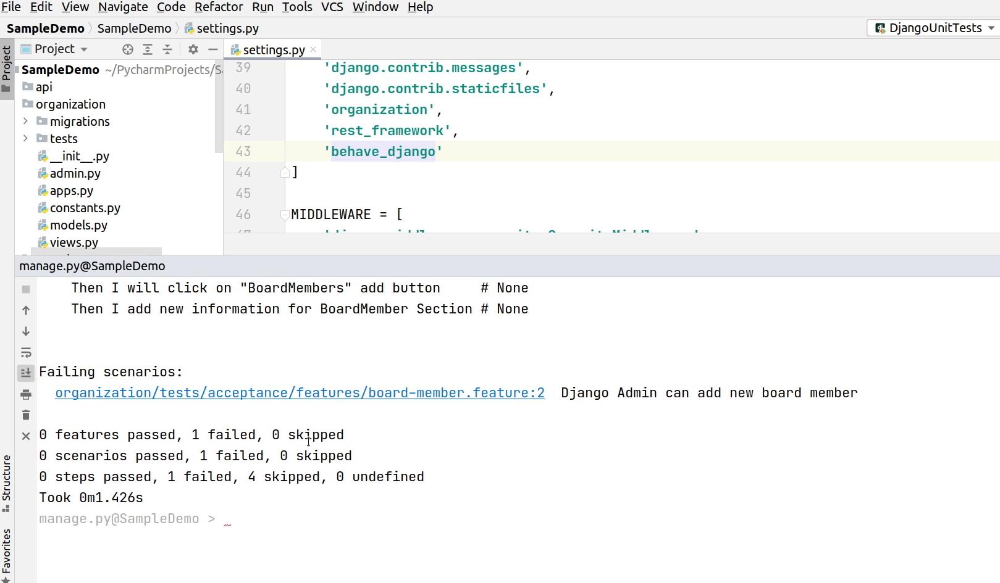


There are two issues I have identified.
- First, I missed the ending square bracket at line number 24.
- Second, our models are not registered in **admin.py** 

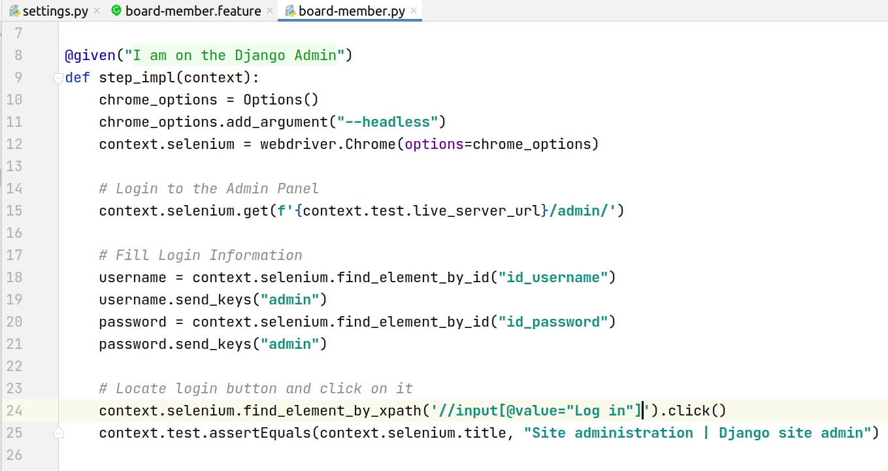


Make sure to add to **verbose_name** and **verbose_name_plural** in your model class meta, 
otherwise selenium won't be able to identify the text. I recommend watching the video, if you are getting stuck in between.

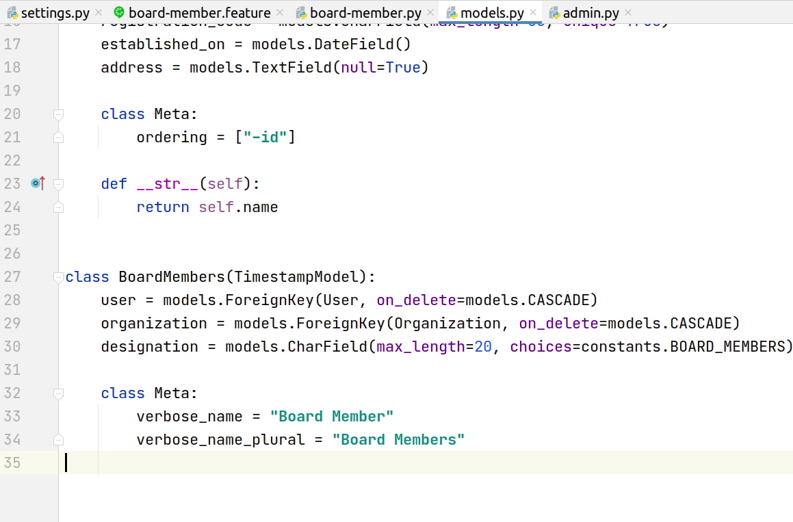


So, finally we have fixed all the issues. Let's retest again.

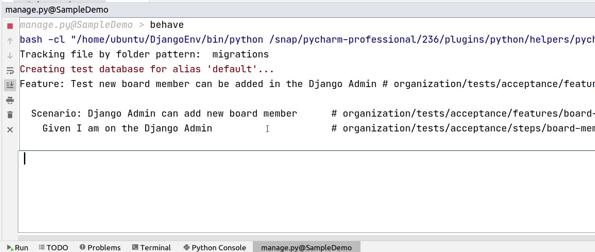


The test scenarios has successfully passed. You can see the below image that a notification is appearing **“Sentry is appearing to send 35 pending error messages”**. These are the errors 
which got raised during the test execution. You can disable sentry while your tests are being executed in a CI/CD pipeline.

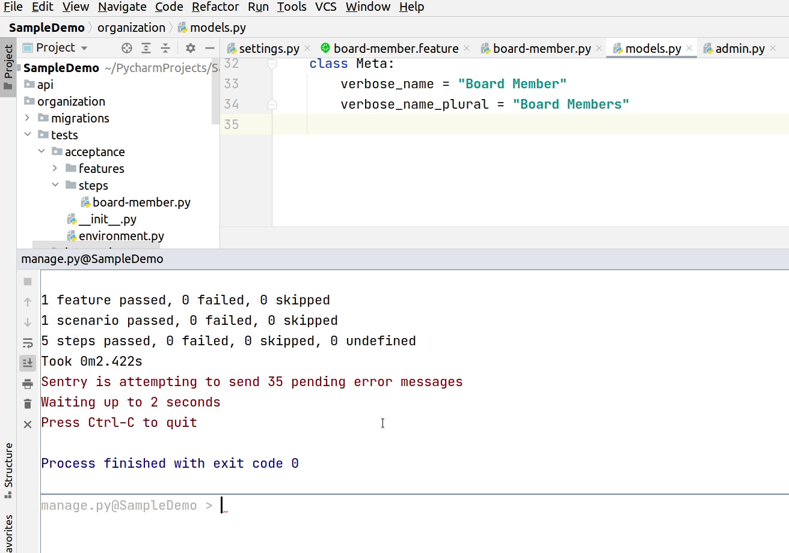

I hope you got a basic understanding of Behavior Driven Development. This was a short introduction to BDD and if you are
interested to know more about BDD, then follow the link given below.

- [Behave Documentation](https://behave.readthedocs.io/en/stable/)
- [Getting Started with Behavior Testing in Python with Behave](https://semaphoreci.com/community/tutorials/getting-started-with-behavior-testing-in-python-with-behave)

In the upcoming video I will show you how to deploy the application inside a Docker container.


