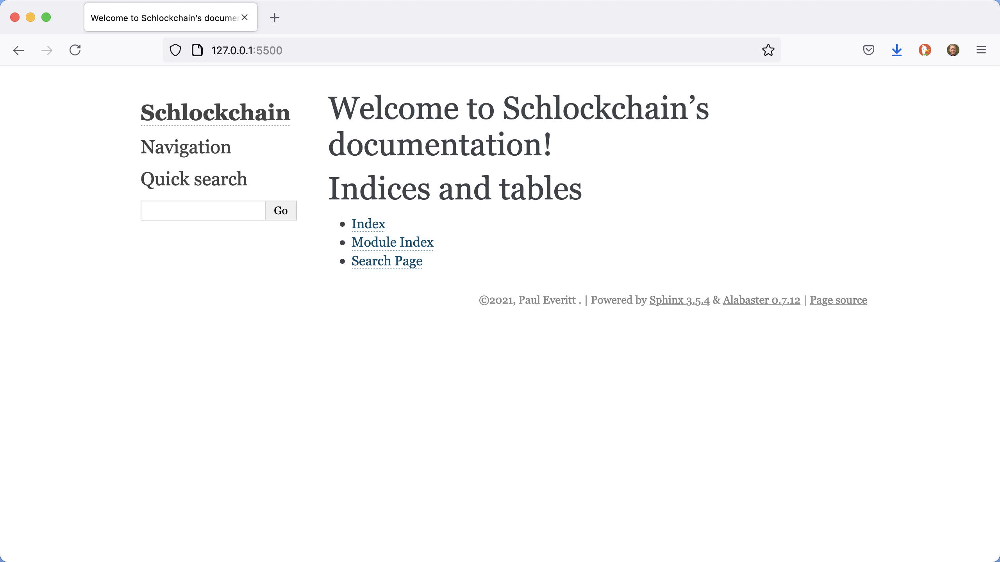
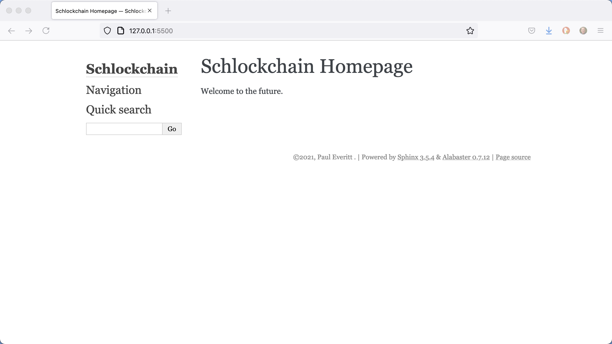
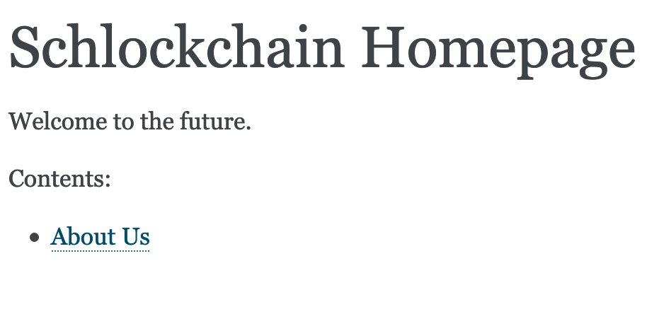

Sphinx can be added to an existing Python application or library to provide documentation.
But it can also be used as the project itself -- for example, a website.
In this tutorial step we start a new *website* as a new Python project, using Sphinx.

# Scenario

This tutorial will simulate building the website for a fictional company named "Schlockchain".
The company has -- obviously -- a lot of marketing it wants to do.
It also has some code with -- obviously -- patents that it wants to show.
The venture capitalists want a website, the founders aren't really technical, so they want to use Markdown.

# New Project

Let's start from...well, the beginning: an empty directory, into which we will slowly build a website.

First, let's make a new directory and change into it:

```bash
$ mkdir schlockchain
$ cd schlockchain
```

*Note: We're using macOS/Linux/WSL command shell syntax in this tutorial.*

Python recommends that projects use a [virtual environment](https://packaging.python.org/guides/installing-using-pip-and-virtual-environments/) for isolation.
Real Python has a [nice primer on virtual environments](https://realpython.com/python-virtual-environments-a-primer/) with the why, what, and how.
Let's make a new virtual environment, stored inside our project in the `.venv` directory.
We'll then "activate" it, which changes our command path to first look in this virtual environment's `bin`:

```bash
$ python3 -m venv .venv
$ source .venv/bin/activate
```

`pip` is Python's package installer.
It's always good to update your `pip`.
Note that in the following, thanks to the `source` line above, our shell is using `python3` from the virtual environment directory:

```bash
$ pip install --upgrade pip
```

Our new, blank Python project is now ready for a Sphinx installation.

## Installing Sphinx

Open this project directory in your favorite editor.
We'll install our packages by creating a `requirements.txt` file, to store our dependency listing.
For now, put the following line in this new file:

```
sphinx
```

We can now, using our activated shell, use `pip` to install our dependencies:

```bash
$ pip install -r requirements.txt
```

Sphinx has a number of dependencies itself, so this might take a while to get all the packages.
When done, let's confirm that Sphinx is installed and on our path:

```bash
$ which sphinx-quickstart
[some path prefix].venv/bin/sphinx-quickstart
```

Sphinx has a number of commands (implemented in Python.)
These are added to your virtual environments `bin` directory.
If you see `sphinx-quickstart`, you are in good shape.

# Make a Sphinx Site

We're all set up...time to make a site.
Sphinx ships with [a site generator command](https://www.sphinx-doc.org/en/master/usage/quickstart.html) called `sphinx-quickstart` which is now in the `bin` directory of your virtual environment.

Let's run it and answer some questions, accepting most of the defaults (note that `...` is to hide my directory path):

```bash
$ sphinx-quickstart 
Welcome to the Sphinx 3.2.1 quickstart utility.

Please enter values for the following settings (just press Enter to
accept a default value, if one is given in brackets).

Selected root path: .

You have two options for placing the build directory for Sphinx output.
Either, you use a directory "_build" within the root path, or you separate
"source" and "build" directories within the root path.
> Separate source and build directories (y/n) [n]: 

The project name will occur in several places in the built documentation.
> Project name: Schlockchain
> Author name(s): Paul Everitt <pauleveritt@me.com>
> Project release []: 

If the documents are to be written in a language other than English,
you can select a language here by its language code. Sphinx will then
translate text that it generates into that language.

For a list of supported codes, see
https://www.sphinx-doc.org/en/master/usage/configuration.html#confval-language.
> Project language [en]: 

Creating file /.../schlockchain/conf.py.
Creating file /.../schlockchain/index.rst.
Creating file /.../schlockchain/Makefile.
Creating file /.../schlockchain/make.bat.

Finished: An initial directory structure has been created.

You should now populate your master file /.../schlockchain/index.rst and create other documentation
source files. Use the Makefile to build the docs, like so:
   make builder
where "builder" is one of the supported builders, e.g. html, latex or linkcheck.
```

Here's how our directory looks after running this:

```shell
(.venv) schlockchain pauleveritt$ ls
Makefile		_templates		make.bat
_build			conf.py			requirements.txt
_static			index.rst
```
About some of these directory items:

- `conf.py` is the [Sphinx configuration file](https://www.sphinx-doc.org/en/master/usage/configuration.html)

- `index.rst` is the "home page" or document at the top of our site

- `Makefile` (and `make.bat` for Windows) is a simple command runner

- Empty directories exist for `_build` (generated files), `_static` (custom site assets), and `_templates` (custom templates).

*Note: If you are using an IDE such as PyCharm, mark the `_build` directory as ignored.*

## Building (and Rebuilding)

We are ready to build our site.

On macOS or Linux, run the following to generate the site using the `html` "builder":

```bash
$ make html
```

(As `sphinx-quickstart` noted at the end, Sphinx supports different builders for different kinds of output.)

Uh oh, our `.venv` was picked up as part of our site!
Easy fix, and one that introduces the [Sphinx configuration file](https://www.sphinx-doc.org/en/master/usage/configuration.html).
Open `conf.py` and make a change to `exclude_patterns`, adding `.venv` at the end of the list:

```python
exclude_patterns = ['_build', 'Thumbs.db', '.DS_Store', '.venv']
```

Before running `make html`, let's introduce the command `make clean` to remove the previous build.
We'll then run `make html`:

```bash
$ make clean
$ make html
```
This time, no complaints about the `.venv` virtual environment directory, as Sphinx now ignores it.

Just for fun, let's run the build again:

```bash
$ make clean
$ make html
```

Hmm, interesting, the second run's output says:

```
building [html]: targets for 0 source files that are out of date
```

That's because Sphinx keeps intermediate representations between runs to support incremental builds.
`make clean` removes the "build" artifacts -- in this case, `html` as it was the builder we used with `make html`.

# `livereload` Server

Other static site generators (SSGs) have nice authoring servers: you type in some stuff, a build happens, and the browser reloads automatically.
That helps during a tutorial, so let's do something similar for Python with the [livereload package](https://pypi.org/project/livereload/).

First, install `livereload` into your virtual environment.
We'll do so by adding `livereload` to `requirements.txt`:

```
sphinx
livereload
```

Then run `pip` which comes from our virtual environment because we did the `source` above:

```bash
$ pip install -r requirements.txt
```

With the package now installed, create a file such as `run_livereload.py`, in the same directory as `conf.py`:

```python
from livereload import Server, shell

if __name__ == '__main__':
    server = Server()
    server.watch('*.rst', shell('make html'), delay=1)
    server.watch('*.md', shell('make html'), delay=1)
    server.watch('*.py', shell('make html'), delay=1)
    server.watch('_static/*', shell('make html'), delay=1)
    server.watch('_templates/*', shell('make html'), delay=1)
    server.serve(root='_build/html')
```

When you execute this Python script, it starts a local web server at a URL:

```bash
$ python ./run_livereload.py 
[I 200910 13:47:15 server:335] Serving on http://127.0.0.1:5500
[I 200910 13:47:15 handlers:62] Start watching changes
[I 200910 13:47:15 handlers:64] Start detecting changes
```

If you go to the URL at `http://127.0.0.1:5500`, you should see the site:



Very good, we have a running (local) site!
Let's show the benefit of `livereload`.
Edit `index.rst` and start making it into more of a company homepage:

```
Schlockchain Homepage
=====================

Welcome to the future.

.. toctree::
   :maxdepth: 2
   :caption: Contents:
```

When you save, `livereload` tells Sphinx to rebuild, then tells the browser to reload, showing your new paragraph:



# Add Markdown

"Ah, but that's not Markdown, it's some alien Python "rst" thingy.
I want to write in Markdown!"

Thanks to the wonderful work by [The Executable Book Project](https://executablebooks.org/en/latest/), Markdown is now a first-class citizen in Sphinx.
What does that mean?
You can do the normal lightweight Markdown things, but you can also tap into the power that Sphinx gives.
Let's switch this site to use Markdown for writing documents.

First, install the [MyST Parser package](https://myst-parser.readthedocs.io/en/latest/).
We'll do so by editing the `requirements.txt`, which should now contain:

```
sphinx
livereload
myst-parser
```

With that in place, install it:

```bash
$ pip install -r requirements.txt
```

Since `MyST` is a Sphinx extension, we need to "mystify" (enable) it in `conf.py`, our Sphinx configuration file.
Change the value of `extensions` to include `myst-parser`:

```python
extensions = [
    "myst_parser",
]
```

Our site can now speak both RST and Markdown!
Let's put it to use by starting an "About Us" page.

# First Markdown Page

Let's add  `about_us.md` file alongside `index.rst`:

```
# About Us

We are Schlockchain, thought leaders in innovation.
```

When you save this file, our "livereload" script runs Sphinx.
But Sphinx is mad: it knows there is a file on disk which isn't included in the site:

```
[E 200910 14:03:24 server:94] b"/.../schlockchain/about_us.md: WARNING: 
document isn't included in any toctree"
```

Sphinx works by linking files into the [toctree](https://www.sphinx-doc.org/en/master/usage/restructuredtext/directives.html#table-of-contents), so edit the `toctree` directive in `index.rst` to include it in the table of contents for the root folder:

```
.. toctree::
   :maxdepth: 2
   :caption: Contents:

   about_us
```

*Note: Don't want to always make such manual entries? You can use globbing in the `toctree` directive, but this will result in an unordered content listing.*

Our browser now shows a link to `About Us`:



When we click on that link, we get a nicely formatted page, driven by Markdown.


# Clean Up

Let's do two cleanups as closeout: `conf.py` and `index.rst`.

The configuration file has lots of comments and stuff not needed for the tutorial.
The configuration file has lots of comments and stuff not needed for the tutorial.
Let's strip that baby down!

```python
project = "Schlockchain"
copyright = "2021, Paul Everitt <pauleveritt@me.com>"
author = "Paul Everitt <pauleveritt@me.com>"
extensions = [
    "myst_parser",
]
exclude_patterns = ["_build", "Thumbs.db", ".DS_Store", ".venv"]
html_static_path = ["_static"]
templates_path = ["_templates"]
```

Next, let's convert the `index.rst` page away from RST (reStructuredText) to Markdown.
Start by renaming the file to `index.md`.
Then replace its contents with the following:

~~~
# Schlockchain Homepage

Welcome to the future.

```{toctree}
:maxdepth: 2
:caption: "Contents:"
   
about_us
```
~~~

Two specific notes: `Contents` needs to be in quotes and the `toctree` options need to be de-dented.
Also, you might need to restart your `livereload` script and/or reload your browser.

If all goes well, you won't notice anything different in your browser, and you are now running a Sphinx site using Markdown.
